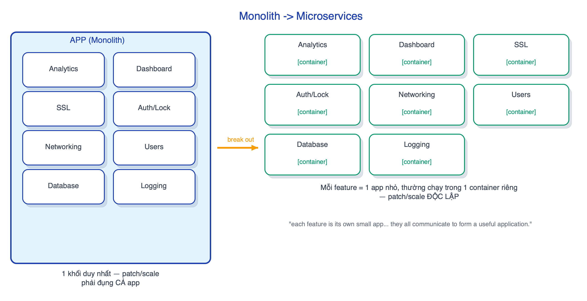
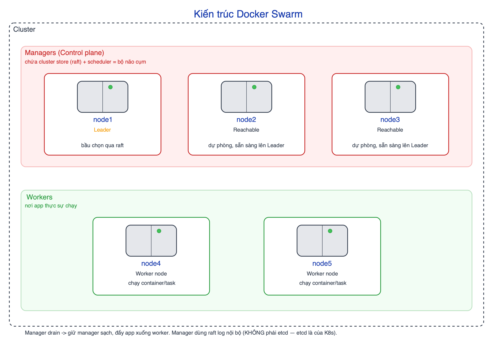
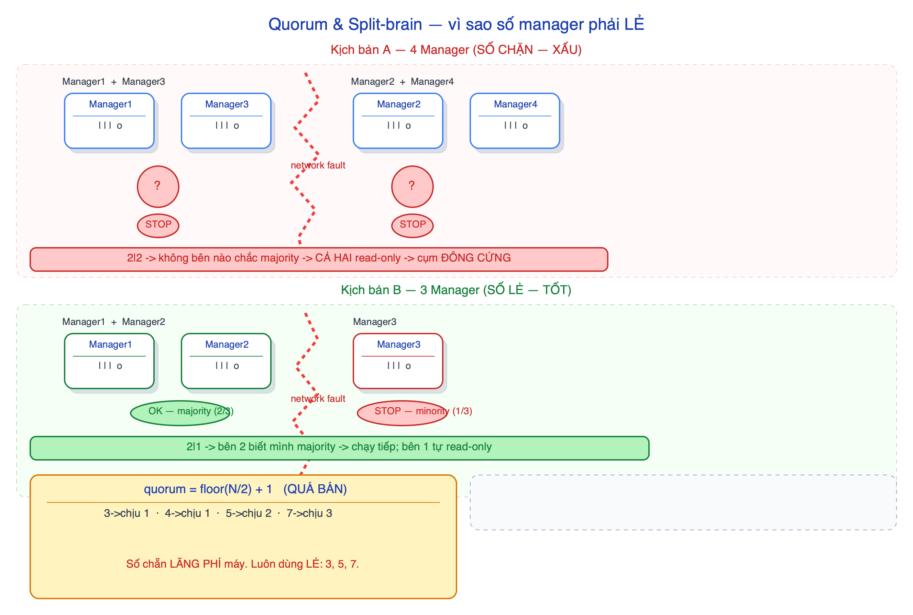
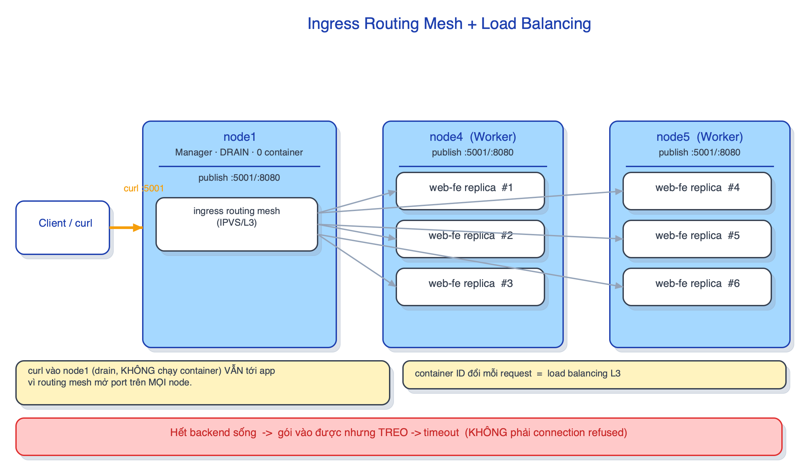
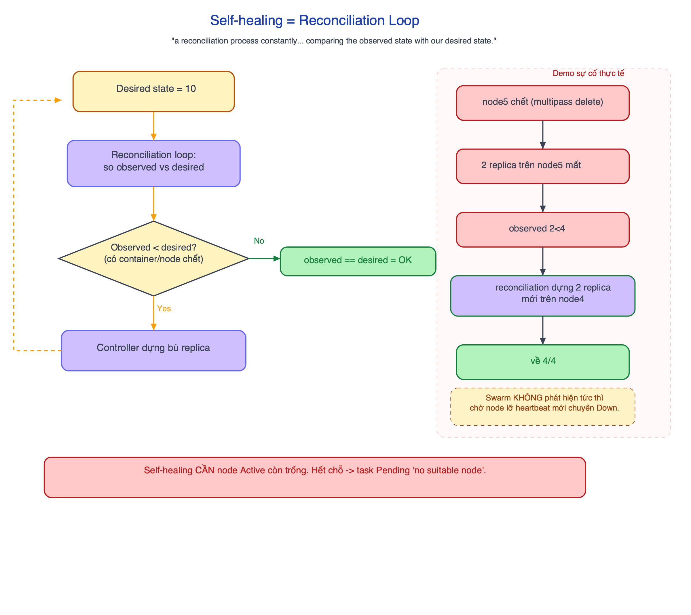
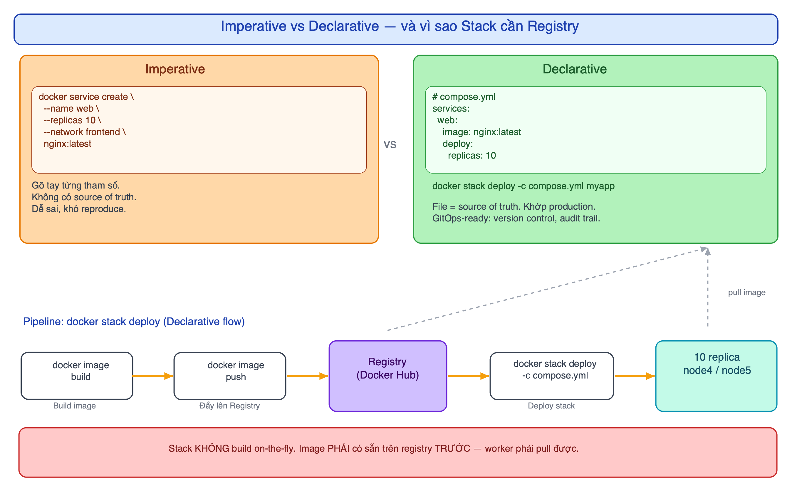
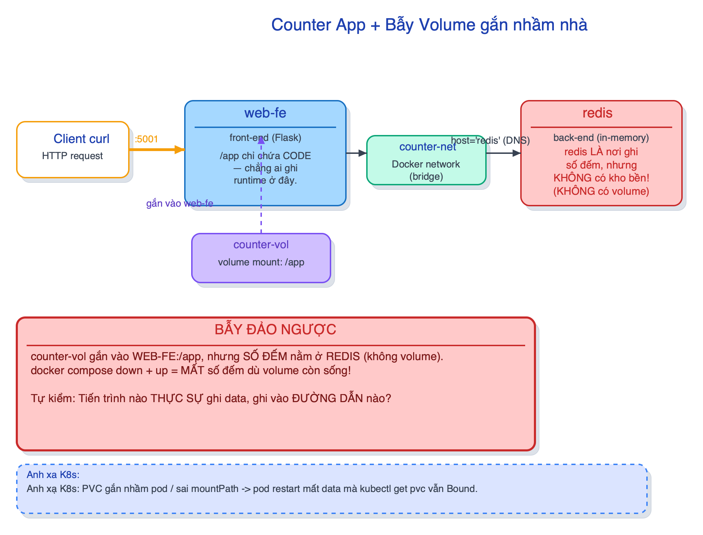

# Docker, Microservices, Swarm

Bộ câu hỏi để tự kiểm tra sau khi làm xong lab. Đọc câu hỏi, tự trả lời trong đầu, rồi bấm mở
phần đáp án để đối chiếu. Các bước thực hành ở [runbook.md](runbook.md).

## Microservices & cloud-native

1. Monolith có những nỗi đau gì? Microservices giải quyết ra sao?

**Monolith** = cả app (web, data store, reporting, logging…) là **một khối duy nhất**. Ba nỗi đau:

- Patch một feature nhỏ → phải hạ/patch **cả app**.
- App business-critical → chỉ dám sửa vào **cuối tuần / giờ thấp điểm**.
- Cần scale **một** feature (vd reporting cuối tháng) → buộc scale **cả** app.

**Microservices** tách mỗi feature thành app nhỏ riêng (thường mỗi cái 1 container), nói chuyện
qua network → patch và scale **độc lập** từng phần.

2. "Cloud-native" có nghĩa là app chạy trên cloud không?

**Không.** Cloud-native là một **bộ khả năng** (auto scaling, patching, rolling update,
self-healing), KHÔNG phải "chạy trên cloud". Chạy trên Docker Desktop ở laptop mà có đủ các khả
năng đó thì vẫn là cloud-native. Đây là hiểu lầm phổ biến nhất.

## Kiến trúc Swarm & quorum

3. Manager và worker khác nhau gì? <code>drain</code> manager để làm gì?

**Manager** giữ control plane: raft store (desired state) + scheduler; cần **quorum** để hoạt
động. Chỉ manager mới chạy được `service`/`stack`/`node`. **Worker** chỉ chạy task (container app).

`docker node update --availability drain nodeN` đẩy hết task ra khỏi node đó → giữ **control
plane sạch**, dồn app xuống worker. Lưu ý: nếu chỉ có **1 node** (vd Docker Desktop) thì ĐỪNG
drain — không còn chỗ chạy app.

4. Vì sao số manager nên LẺ (3/5/7)? Split-brain là gì?

Swarm cần **quorum = floor(N/2) + 1** (quá bán) để chấp nhận thay đổi. **Split-brain** = mạng đứt
làm cụm chia hai nửa không liên lạc được; nếu không nửa nào chắc mình quá bán thì **cả hai đông
cứng ở read-only**, cụm bị đóng băng.

Số **chẵn lãng phí máy** mà không tăng khả năng chịu lỗi: N=4 → quorum 3 → chết 2 là mất quorum,
y hệt N=3. Số lẻ giúp khi đứt mạng dễ có một nửa biết chắc mình quá bán để giữ cụm chạy.

5. 4 manager chịu được mấy node chết? So với 3 manager?

**Cả hai đều chỉ chịu 1.** quorum(3) = 2 → chịu mất 1; quorum(4) = 3 → cũng chỉ chịu mất 1. Thêm
manager thứ 4 tốn thêm một máy mà **không** tăng khả năng chịu lỗi. Bảng: 3 → chịu 1 · 5 → chịu 2
· 7 → chịu 3.

(Ở Kubernetes, etcd theo đúng luật quorum này; đừng gọi raft-log nội bộ của Swarm là "etcd".)

## Dựng cụm

6. Vì sao <code>docker swarm init</code> bắt buộc <code>--advertise-addr</code>?

Mỗi VM có **hai IPv4**: IP mạng Multipass (dải `192.168.x.x`, để các node nói chuyện với nhau)
và `172.17.0.1` (docker0 bridge — mạng nội bộ Docker, **node khác không tới được**).

Không chỉ định thì swarm phải tự đoán interface. Nếu đoán trúng `172.17.0.1` thì các node khác
không join/liên lạc được → **cụm hỏng**. `--advertise-addr <IP-192>` nói rõ interface dùng cho
giao tiếp cụm.

7. Bẫy join-token: vì sao dễ join nhầm vai node2 thành worker?

`docker swarm init` **in sẵn lệnh join WORKER** (không phải manager). Nếu copy ngay dòng đó dán
vào node2 (định làm manager) thì node2 vào cụm với **sai vai** (worker).

Muốn node2 làm manager phải chạy `docker swarm join-token manager` để lấy đúng token, rồi mới
dán. Lỡ dán nhầm thì không cần rời cụm — sửa bằng `docker node promote node2`. Nhắc lại: token
là **chìa khoá vào cụm**, giữ kín, không paste lên chat/repo.

## Service imperative

8. Vì sao <code>docker container ls</code> trên node1 trống mà <code>docker service ps web</code> lại thấy đủ replica?

`docker container ls` chỉ hỏi **node cục bộ** (node1) — mà node1 là manager đã **drain**, không
chạy container nào → trống. Đúng thiết kế.

`docker service ps web` hỏi **toàn cụm** qua manager → thấy đủ replica kèm cột NODE (node4/node5).
Bài học: muốn nhìn toàn cụm phải dùng `service ps`, không phải `container ls`.

9. Vì sao gọi <code>curl</code> vào IP của manager (đã drain, không chạy container nào) vẫn tới được app?

**Ingress routing mesh.** Mọi node trong swarm (kể cả manager đã drain) đều lắng nghe cổng đã
publish (8080) và biết định tuyến request tới node đang chạy replica, rồi load-balance giữa các
replica. Vì vậy gọi vào bất kỳ IP nào cũng tới app, và ID container **đổi qua lại** giữa các lần
gọi.

10. Nếu KHÔNG còn backend sống mà vẫn gọi vào cổng publish → lỗi <code>refused</code> hay <code>timeout</code>?

**Treo rồi `timeout`**, không phải `connection refused`. Vì node vẫn **listen** trên cổng (routing
mesh mở port ở mọi node), chỉ là không định tuyến được tới backend nào → request treo tới khi hết
giờ. `connection refused` là khi **không ai listen** (sai port/IP, hoặc service chưa tạo). Phân
biệt hai triệu chứng này giúp chẩn đoán nhanh.

11. Scale lên 10 rồi giết sạch container trên node4 → tổng còn mấy? Vì sao?

Vẫn **10/10**. Desired state = 10 ghi trong **raft store**. **Reconciliation loop** liên tục so
actual với desired; thấy actual < desired (vừa mất mấy cái) → **tự dựng bù** trên node còn sống.
Không ai can thiệp. Đây là self-healing ở **cấp container**.

## Stack declarative

12. Nếu chỉ build image trên node1 mà không push lên registry, <code>docker stack deploy</code> hỏng ở đâu?

Stack **không build on-the-fly** — mô hình pull-only, image phải có sẵn trên registry *trước*.
Replica được xếp lên **node4/node5** (worker); hai worker phải **pull** được image. Image build
trên node1 chỉ nằm trong **local store của node1** — worker không thấy → replica kẹt
`Preparing`/`Rejected`. Đây chính là lý do registry tồn tại.

(Nếu repo Docker Hub để Private thì phải `docker stack deploy --with-registry-auth` để đẩy
credential đã login ở node1 xuống worker.)

13. Sửa <code>replicas</code> trong YAML rồi deploy lại — khác gì <code>docker service scale</code>?

**Kết quả** giống nhau (đổi số replica). Nhưng **vận hành** khác:

- `docker service scale` = lệnh imperative, thay đổi trực tiếp trên cụm, file config **không còn
 khớp** thực tế.
- Sửa YAML rồi `docker stack deploy` lại = declarative, file luôn là **source of truth** khớp môi
 trường thật (để trong version control).

Kubernetes y hệt — mọi thay đổi đi qua YAML. Đây là gốc của **GitOps**.

14. Routing mesh load-balance ở tầng mấy? Có session affinity / L7 không?

Chỉ **layer 3** — round-robin đơn giản qua các replica, **không** có session affinity, không có
định tuyến application-aware ở layer 7. Cần sticky session hoặc định tuyến theo path/header thì
phải dùng lớp khác (ở Kubernetes là **Ingress**).

15. Xoá node5 (mô phỏng node chết) → replica ra sao? Self-heal cấp node có tức thì không?

Replica trên node5 chuyển `Shutdown`, swarm **dựng lại chúng trên node4** (node còn sống) để giữ
đúng desired state — self-healing ở **cấp node**. Nhưng **không tức thì**: swarm chờ node **lỡ
heartbeat** mới chuyển `Ready → Down` rồi mới reschedule (tránh phản ứng với chớp mạng tạm thời).

Câu nối tiếp: nếu xoá luôn node4 thì sao? → không còn worker Active → task kẹt `Pending` với
`no suitable node (scheduling constraints)`; muốn chạy phải bỏ drain một manager. Ngoài ra redis
không có volume nên reschedule là **mất số đếm**.

## Bẫy

16. Bẫy volume: vì sao xoá stack rồi deploy lại là mất số đếm dù <code>counter-vol</code> vẫn sống?

`counter-vol` mount vào **`web-fe:/app`** — nhưng số đếm thật nằm ở **`redis`**, mà `redis`
**không có volume nào**. Volume gắn nhầm nhà: nó bảo vệ thư mục app của `web-fe` (vốn không cần),
còn dữ liệu cần bền (redis) thì không được gắn. Nên khi stack bị xoá/deploy lại, redis khởi tạo
mới → **reset số đếm**, dù `counter-vol` vẫn còn nguyên. Câu tự kiểm để không nhớ ngược: *tiến
trình nào thực sự **ghi** dữ liệu, và ghi vào **đường dẫn nào**?*

## Bắc cầu sang Kubernetes

17. Các khái niệm Swarm ánh xạ sang Kubernetes thế nào?

| Swarm | Kubernetes |
|---|---|
| service | Deployment (+ ReplicaSet) |
| task | Pod |
| manager reconcile | kube-controller-manager |
| raft log nội bộ manager | etcd (đừng gọi Swarm là "etcd") |
| routing mesh (L3) | Service + kube-proxy; L7 → Ingress |
| `docker service scale` | `kubectl scale` |
| `docker stack deploy` | `kubectl apply -f` |
| `drain` | `cordon` / taint |

Mạch xuyên suốt cả module: **imperative → declarative → desired state → self-healing** — đúng bộ
khái niệm Kubernetes dùng lại.

