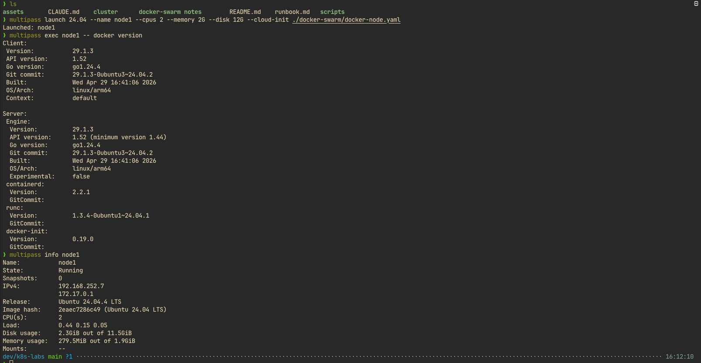
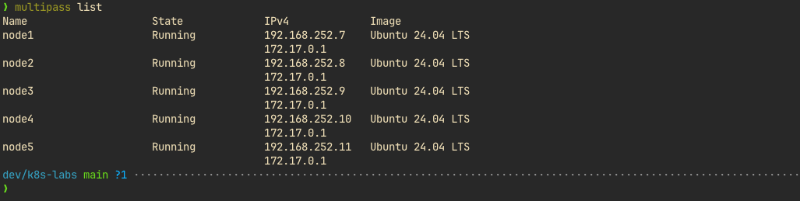
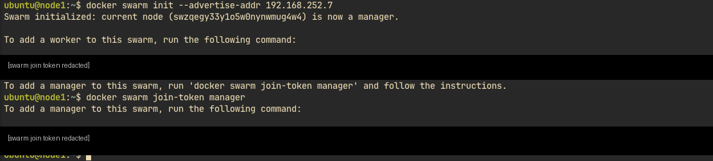
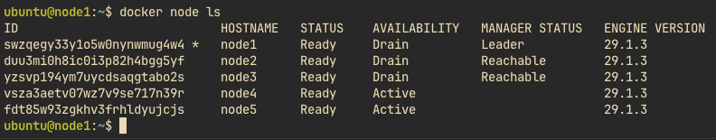
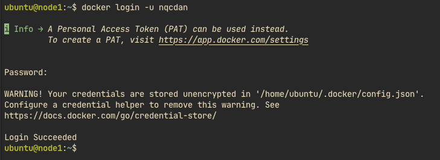
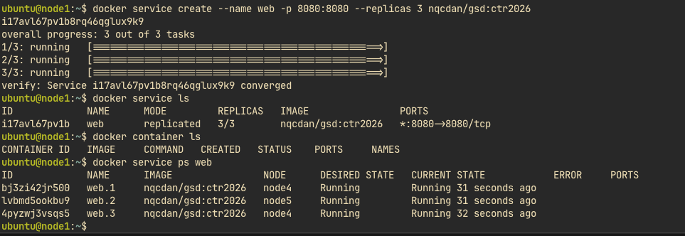
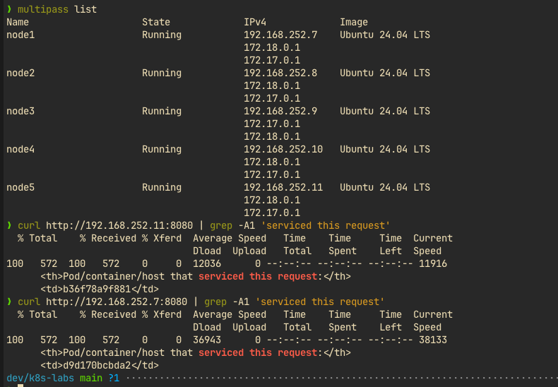
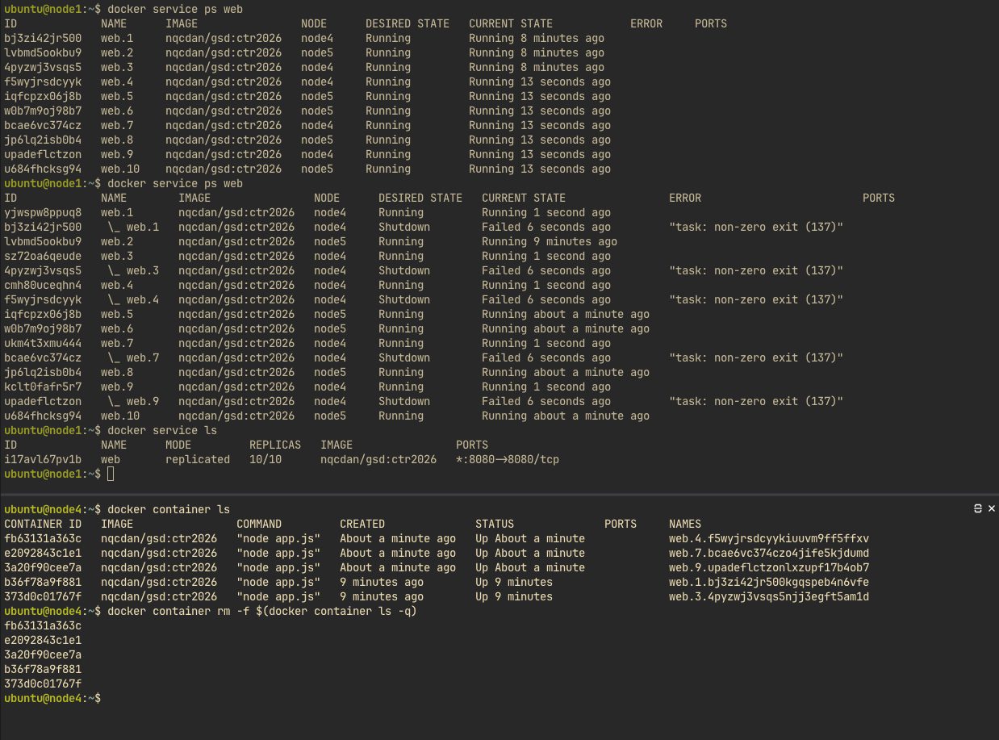
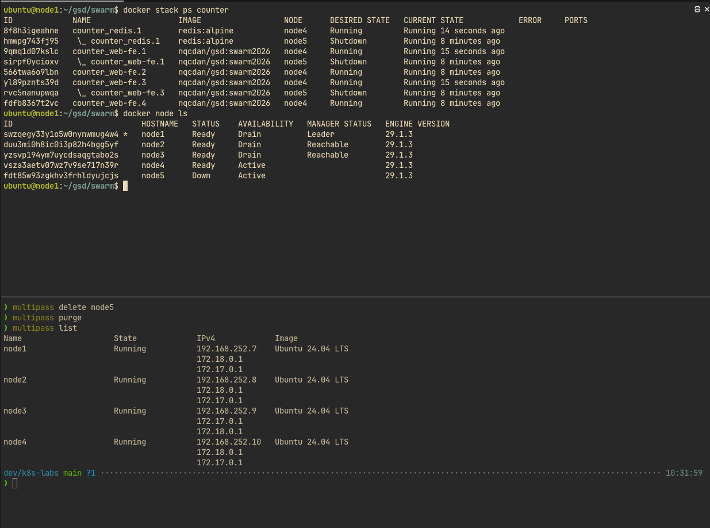

# Docker Swarm lab — runbook

Các bước chi tiết dựng lại cụm Docker Swarm nhiều node trên Multipass. Mục tiêu và tổng quan

luồng xem [README.md](README.md).

## Bước 0 — Khảo sát máy lab

Cần biết RAM/CPU/đĩa để chọn số node. Trên host (macOS Apple Silicon):

```bash
sw_vers | head -2
sysctl -n hw.memsize | awk '{printf "RAM: %.0f GB\n", $1/1073741824}'
sysctl -n hw.ncpu | awk '{print "CPU: "$1" cores"}'
df -h / | tail -1
```

Kết quả khảo sát trên máy lab tham chiếu:

| Hạng mục | Kết quả |
| ---------- | ----------------------------- |
| OS / arch | macOS 15.6, `arm64` |
| RAM / CPU | 24 GB / 10 cores |
| Đĩa | 123 GB trống / 460 GB |
| Docker | 28.5.1 + Compose v2.40.0 |
| brew / git | có sẵn (`/opt/homebrew/bin/`) |
| Multipass | chưa cài → Bước 1 |


Chọn số node theo RAM (mỗi VM đặt `--memory 2G`):

| RAM máy | Số node |
| ---------- | -------------------------------------------------- |
| ≥ 32 GB | 5 (3 manager + 2 worker) |
| 16–24 GB | 5 với `--memory 2G`, hoặc 3 (1 manager + 2 worker) |
| &lt; 16 GB | 2–3 node, hoặc swarm 1 node trên Docker sẵn có |


24 GB: chốt 5 node × 2 GB = 10 GB, cộng macOS ~6 GB = 16 GB / 24 GB, dư ~8 GB.

## Bước 1 — Cài Multipass trên macOS

Cách gọn nhất nếu đã có Homebrew:

```bash
brew install --cask multipass
```

Hoặc tải `.pkg` tại `https://canonical.com/multipass/install`

Kiểm tra sau khi cài:

```bash
multipass version
multipass list          # lần đầu trả về rỗng là đúng
multipass find          # phải thấy dòng "docker" trong danh sách
```

Nếu `multipass list` báo `cannot connect to the multipass socket` thì daemon chưa chạy. Trên

macOS thường tự khởi động; nếu không:

`sudo launchctl kickstart -k system/com.canonical.multipassd`.

## Bước 2 — Tạo 5 VM bằng cloud-init

Blueprint `docker` của Multipass không dùng được: sàn RAM 4 GB/VM

(`launch failed: Requested Memory size is less than Blueprint minimum of 4G`), 5 node × 4 GB

- macOS ~6 GB = 26 GB &gt; 24 GB. Blueprint cũng đã deprecated. Thay bằng Ubuntu 24.04 +

 cloud-init tự cài Docker, tự do đặt RAM.

Trên host — tạo file cloud-init (docker-node.yaml):

```bash
package_update: true
packages:
  - docker.io
runcmd:
  - usermod -aG docker ubuntu
  - systemctl enable --now docker
```

Tạo node1 và kiểm chứng cloud-init chạy xong:

```bash
multipass launch 24.04 --name node1 --cpus 2 --memory 2G --disk 12G --cloud-init docker-node.yaml
multipass exec node1 -- cloud-init status --wait      # kỳ vọng: status: done
multipass exec node1 -- docker version                 # kỳ vọng: có cả Client lẫn Server
multipass info node1
```

Kỳ vọng tham chiếu: Docker 29.1.3 (linux/arm64), RAM dùng ~280 MB / 1.9 GB, đĩa 2.3/11.5 GB

— tức 2G/VM rất dư.



Tạo 4 node còn lại:

```bash
for n in node2 node3 node4 node5; do
  multipass launch 24.04 --name $n --cpus 2 --memory 2G --disk 12G --cloud-init docker-node.yaml
done
multipass list
```

Kỳ vọng: 5 dòng `Running`, IP dải `192.168.x.x` (mạng Multipass).



Theo dõi RAM trong lúc chạy trên host: `memory_pressure | tail -3` — nếu vào vùng `critical`

thì dừng bớt VM (`multipass stop node5`).

## Bước 3 — Dựng swarm (init + join + drain)

Kế hoạch: 3 manager (node1–3) + 2 worker (node4–5).

Vì sao `--advertise-addr` là bắt buộc: `multipass info node1` liệt kê hai IPv4:

```
IPv4:  192.168.x.x       ← mạng Multipass — node nói chuyện với nhau, DÙNG CÁI NÀY
       172.17.0.1        ← docker0 bridge — mạng nội bộ Docker, node khác KHÔNG tới được
```

Không chỉ định thì swarm phải tự đoán interface. Đoán trúng `172.17.0.1` là cụm hỏng.

Trên host — lấy IP mạng Multipass của node1:

```bash
multipass info node1 | grep IPv4
```

Trong VM node1 — khởi tạo swarm:

```bash
docker swarm init --advertise-addr <IP-192-CỦA-NODE1>
docker swarm join-token manager        
exit
```



Join node2, node3 làm manager. Trong VM từng node:

`docker swarm join --token SWMTKN-1-...-... <IP>:2377` vừa copy:

```bash
multipass shell node2   # dán dòng join manager, rồi exit
multipass shell node3   # dán lại dòng đó, rồi exit
```

Lấy token worker rồi join node4, node5. Trong VM node1:

```bash
docker swarm join-token worker         # copy dòng lệnh
exit
```

Rồi trong VM node4 và node5: dán dòng vừa copy.

Kiểm tra — trong VM node1:

```bash
docker node ls
```

Kỳ vọng: 5 dòng. node1–3 có `MANAGER STATUS` (node1 = `Leader`, hai cái kia = `Reachable`).

node4–5 trống cột đó → là worker. Dấu `*` = node đang đứng.

Cấm app chạy trên manager — giữ control plane sạch, đẩy hết app xuống worker. Trong VM node1:

```bash
docker node update --availability drain node1
docker node update --availability drain node2
docker node update --availability drain node3
docker node ls
```

Kỳ vọng: cột `AVAILABILITY` của node1–3 = `Drain`.



## Bước 4 — Service imperative + self-healing

App demo ở đây build từ thư mục `container/` của repo mẫu (app Node trả về tên host đã phản hồi,
không cần redis) — khác app counter của Bước 5. Tự build rồi push lên registry cá nhân, đặt tên
`<DHUB_USER>/gsd:ctr2026` (thay `<DHUB_USER>` bằng username Docker Hub của bạn).

Build & push. Trong VM node1:

```bash
git clone https://github.com/nigelpoulton/gsd.git    # repo mẫu chứa source các app demo
cd gsd/container
docker image build -t <DHUB_USER>/gsd:ctr2026 .
docker login -u <DHUB_USER>                            # dán access token khi hỏi password
docker image push <DHUB_USER>/gsd:ctr2026
cd ~
```



Vì sao phải push, không chạy thẳng image local: service tạo 3 replica nằm trên node4/node5, hai
worker đó phải pull được image từ registry. Image build trên node1 chỉ nằm trong local store
của node1 — worker không thấy. Để repo Docker Hub ở chế độ Public thì worker pull thẳng, không
cần login.

Tạo service. Trong VM node1:

```bash
docker service create --name web -p 8080:8080 --replicas 3 <DHUB_USER>/gsd:ctr2026
docker service ls          # kỳ vọng REPLICAS 3/3
docker container ls        # KHÔNG thấy app — vì đang ở manager đã drain
docker service ps web      # thấy đủ 3, kèm cột NODE = node4/node5
```

Bài học then chốt: `docker container ls` chỉ hỏi node cục bộ, không hiểu cụm. Muốn nhìn toàn

cụm phải dùng `docker service ps`.



Kiểm chứng routing mesh. Trên host (thoát VM):

```bash
multipass list             # lấy IP bất kỳ, kể cả node MANAGER

# gọi 5 lần, mỗi lần chỉ trích ID container đã phục vụ request
for i in $(seq 5); do
  curl -s http://<IP-node1>:8080 | grep -A1 'serviced this request' | grep -oE '[0-9a-f]{12}'
done
```

App trả về HTML, dòng cần xem là `<th>...serviced this request:</th>` theo ngay sau bởi
`<td><ID-container></td>`. `grep -A1 'serviced this request'` lấy cả dòng `<td>`, rồi
`grep -oE '[0-9a-f]{12}'` trích đúng ID container (12 ký tự hex), bỏ hết thẻ HTML.

Kỳ vọng: in ra 5 dòng ID, **đổi qua lại** giữa vài container khác nhau — dù node1 đã drain và
không chạy container nào → ingress routing mesh + load balancing.



Scale lên 10. Trong VM node1:

```bash
docker service scale web=10
docker service ps web       # 10 dòng, vài cái CREATED mới hơn
```

Thí nghiệm giết container. Trước khi gõ, tự trả lời: giết hết container trên node4 thì tổng

còn mấy? Vì sao? Mở terminal thứ hai trên host → trong VM node4:

```bash
docker container ls                       # đếm xem node4 giữ mấy cái
docker container rm -f $(docker container ls -q)
```

Quay lại trong VM node1:

```bash
docker service ps web       # vài dòng Failed/Shutdown + vài dòng Running mới tinh
docker service ls           # vẫn 10/10
```

Giải thích: desired state = 10 ghi trong raft store. Reconciliation loop thấy actual &lt; desired

→ dựng bù. Không ai can thiệp.



Dọn trước khi sang bước stack. Trong VM node1:

```bash
docker service rm web
docker service ls
```

## Bước 5 — Stack declarative + self-healing node

### 5.1 Lấy repo vào VM

Trong VM node1:

```bash
git clone https://github.com/nigelpoulton/gsd.git    # bỏ dòng này nếu đã clone ở Bước 4
cd gsd/swarm
ls                 # app/ compose.yml Dockerfile requirements.txt README.md
cat compose.yml
```

Điểm đáng chú ý trong `compose.yml`:

- `deploy: replicas: 10` — khối `deploy` chỉ swarm hiểu, `docker compose` bỏ qua.
- `image: nigelpoulton/gsd:swarm2023` — không có `build:`. Stack KHÔNG build on-the-fly;

 image phải có sẵn trên registry trước khi deploy.
- `counter-vol` mount vào `web-fe:/app`, còn `redis` (nơi giữ số đếm thật) không có volume.

### 5.2 Deploy stack

```bash
docker stack deploy -c compose.yml counter
docker stack ls                 # 1 stack, 2 service
docker stack services counter   # web-fe 10/10, redis 1/1
docker stack ps counter         # xem từng replica nằm node nào
```

Image ở đây Public nên worker pull thẳng. Nếu để repo Private, phải thêm `--with-registry-auth`
để đẩy credential đã login ở node1 xuống worker, nếu không replica kẹt `Preparing`/`Rejected`:

```bash
docker stack deploy --with-registry-auth -c compose.yml counter
```

Trên host — kiểm chứng (port 5001, không phải 8080):

```bash
curl http://<IP-bất-kỳ>:5001
curl http://<IP-bất-kỳ>:5001
```

Kỳ vọng: counter tăng, container ID đổi mỗi lần → load balancing qua 10 replica.

### 5.3 Sửa YAML 10 → 4 (cách làm đúng bài)

Trong VM node1 — mở `compose.yml` bằng vim, đổi `replicas: 10` thành `replicas: 4` rồi lưu.

Deploy lại để gửi desired state mới:

```bash
docker stack deploy -c compose.yml counter      # gửi lại desired state mới
docker stack services counter                    # web-fe 4/4
docker stack ps counter | grep Running           # xem 4 cái nằm đâu
```

Điểm cốt lõi: sửa file rồi deploy lại đúng bài hơn `docker service scale`, vì file config luôn

khớp môi trường thật. Kubernetes y hệt — mọi thay đổi đi qua YAML. Đây là gốc của GitOps.

### 5.4 Mô phỏng chết node

Trên host:

```bash
multipass list
multipass delete node5
multipass purge
multipass list                 # node5 biến mất
```

Trong VM node1:

```bash
docker stack ps counter        # 2 replica trên node5 = Shutdown, 2 cái mới mọc trên node4
docker node ls                 # node5 Down
```

Kỳ vọng: vẫn đủ 4 Running, dồn hết sang node4. Self-healing ở cấp node, không chỉ cấp

container.



## Bước 6 — Dọn dẹp

Trong VM node1:

```bash
docker stack rm counter
```

Trên host — xoá sạch VM:

```bash
multipass delete node1 node2 node3 node4
multipass purge
multipass list
```

Muốn giữ cụm, chỉ cần `docker stack rm counter`. Muốn bỏ swarm mà giữ VM: trong từng VM chạy

`docker swarm leave --force`.

## Bảng lệnh sống còn


| Việc | Lệnh |
| -------------------- | --------------------------------------------------------------------- |
| Tạo VM | `multipass launch 24.04 --name nodeN --cloud-init ~/docker-node.yaml` |
| Xem IP | `multipass info nodeN | grep IPv4` |
| Vào VM | `multipass shell nodeN` |
| Khởi tạo swarm | `docker swarm init --advertise-addr <IP>` |
| Token mời | `docker swarm join-token manager|worker` |
| Xem node cụm | `docker node ls` |
| Cấm app trên manager | `docker node update --availability drain nodeN` |
| Tạo service | `docker service create --name X -p H:C --replicas N <image>` |
| Xem replica toàn cụm | `docker service ps X` (không phải `container ls`) |
| Scale imperative | `docker service scale X=N` |
| Deploy stack | `docker stack deploy -c compose.yml <tên>` |
| Soi stack | `docker stack ls|services|ps` |
| Xoá VM | `multipass delete nodeN && multipass purge` |


## Lỗi hay gặp


| Triệu chứng | Nguyên nhân |
| ------------------------------------------- | ------------------------------------------------------------------ |
| `cannot connect to the multipass socket` | daemon chưa chạy |
| `This node is not a swarm manager` | đang đứng ở worker; `service`/`stack`/`node` chỉ chạy trên manager |
| `no suitable node (scheduling constraints)` | drain hết node mà không còn worker |
| Replica kẹt `Preparing`/`Rejected` | worker không pull được image — chưa push, sai `<DHUB_USER>`, hoặc repo Private thiếu `--with-registry-auth` |
| `container ls` trống mà service vẫn 10/10 | đúng thiết kế — đang ở manager đã drain, dùng `docker service ps` |
| `the attribute version is obsolete` (cảnh báo) | `version: '3.8'` đầu file nay bị Compose bỏ — chỉ cảnh báo, không chặn; xoá dòng đó cho sạch |
| `port '8080' is already in use by service 'web'` | đã có service cùng tên/port từ lần trước (service swarm bền, không tự mất) — `docker service rm web` rồi tạo lại, hoặc `docker service update --image ... web` |


## Bẫy đã dính

Volume gắn nhầm nhà. `counter-vol` mount vào `web-fe:/app`, nhưng số đếm thật nằm ở `redis` —
mà `redis` không có volume nào. Nên xoá stack rồi deploy lại là mất số đếm dù volume vẫn sống.
Khi đọc `swarm/compose.yml` ở Bước 5.1, kiểm lại xem file này có dính đúng bẫy đó không.