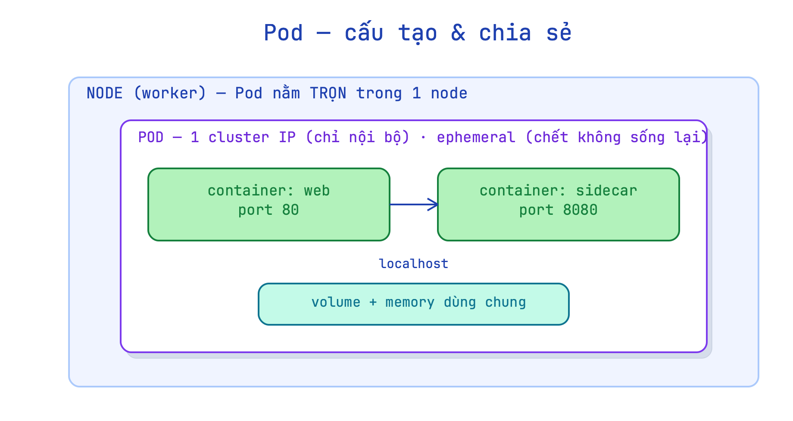

# 03 · Pod — đơn vị nhỏ nhất: tạo, soi, health, "chết không sống lại"

Trước: Multi-stage & registry · kế tiếp: ReplicaSet & Deployment.

**Mục tiêu:** hiểu Pod là gì và tính chất cốt lõi; tạo Pod cả imperative lẫn declarative; thạo bộ lệnh `kubectl` soi/debug (`get`/`describe`/`logs`/`exec`/`port-forward`/`delete`); thấy tận mắt "Pod trần chết là mất" (không có controller); và viết liveness/readiness probe.
**Nền:** đã đúc & chạy được image (2 lab Docker) — Pod chính là thứ *bọc* image đó để K8s quản. Lab `docker-swarm` đã cho trực giác desired-state/self-healing; giờ dịch sang `kubectl`.

## Tiền đề
Bật cụm k8s local: **OrbStack → Settings → Kubernetes → Enable** (đợi ~1 phút). Kiểm tra:
```bash
kubectl config use-context orbstack
kubectl get nodes            # 1 node STATUS=Ready
```

---

## 1. Pod là gì

**Chốt:** Pod là **đơn vị nhỏ nhất K8s tạo/deploy** — nó *bọc* một hoặc vài container tightly-coupled lại, cho chúng **chung IP, localhost, volume**; Pod không span nhiều node, nhận cluster IP, và **ephemeral — chết là mất, không hồi sinh**.

- **Pod** = wrapper quanh 1+ container chạy cùng nhau trên cùng 1 node.
- Container trong cùng Pod **chung** toàn bộ: IP, network namespace, `localhost`, volume mount — nhưng **phải khác port**.
- Pod **không span node** — nằm trọn 1 worker; nhận **cluster IP** (chỉ truy cập nội bộ cluster).
- Pod là **ephemeral**: K8s xóa Pod hỏng rồi tạo Pod **mới** — không phải restart Pod cũ.

**Vì sao:** container đơn lẻ không đủ để K8s quản lý (scheduling, probe, policy). Pod là đơn vị tối thiểu để scheduler đặt vào node, kubelet theo dõi health, và network plugin cấp IP. Nếu bạn chạy thẳng container thì không có khái niệm "K8s biết nó ở đâu để schedule lại khi node chết".

**Cơ chế:** kubelet trên mỗi node nhận spec Pod từ API server, gọi container runtime (containerd) để chạy từng container, rồi dùng pause container (sandbox) giữ network namespace. Vì vậy container A và B cùng Pod thật sự chia sẻ cùng 1 network interface — gọi nhau qua `localhost:port` không qua mạng nào cả.

> **Ẩn dụ:** Pod = căn hộ, container = phòng. Các phòng chung một địa chỉ và hành lang — nhưng mỗi phòng làm việc riêng. Căn hộ nằm trên 1 tòa nhà (node); phá đi xây lại thì địa chỉ mới.

**Dùng / không dùng:**
- Pod 1 container: phổ biến nhất, đủ cho hầu hết microservice.
- Pod nhiều container: chỉ khi thật sự *tightly-coupled* (sidecar log-shipper, init container). **Phản đề:** đừng nhét 2 app độc lập vào 1 Pod chỉ vì tiện — mất khả năng scale độc lập, lỗi 1 container kéo cả Pod.

**Làm:**
```bash
# tạo Pod trực tiếp (imperative)
kubectl run my-nginx --image=nginx:alpine

# xem Pod đang chạy trên node nào, IP gì
kubectl get pod my-nginx -o wide

# xem Events (Scheduled→Pulled→Created→Started)
kubectl describe pod my-nginx | tail -20
```

**Kết quả:**
```text
$ kubectl get pod my-nginx -o wide
NAME       READY   STATUS    RESTARTS   AGE   IP           NODE
my-nginx   1/1     Running   0          12s   192.168.194.7   orbstack

$ kubectl describe pod my-nginx | tail -20
Events:
  Type    Reason     Age   Message
  ----    ------     ----  -------
  Normal  Scheduled  15s   Successfully assigned default/my-nginx to orbstack
  Normal  Pulled     14s   Successfully pulled image "nginx:alpine" in 1.2s
  Normal  Created    14s   Created container my-nginx
  Normal  Started    14s   Started container my-nginx
```
→ **Verify:** STATUS=Running, IP nội bộ cụm, Events đủ 4 bước. Giữ Pod này cho các bước sau.

> **Thực chạy — Events có TTL ~1h.** Nếu soi một Pod đã cũ (vd `AGE=15h` còn sót từ buổi trước), khối `Events:` sẽ hiện `<none>` — không phải lỗi, mà là các sự kiện khai sinh đã hết hạn và bị xoá khỏi etcd. `describe … Events` chỉ hữu ích cho sự kiện **gần đây**. Muốn thấy chuỗi `Scheduled→Pulled→Created→Started` phải soi Pod **mới tạo**.



---

## 2. Tạo Pod: imperative vs declarative

**Chốt:** `kubectl run` (imperative) nhanh nhưng không lưu ý định; `kubectl apply -f` (declarative, YAML) check vào Git, tái tạo được, idempotent — đây là cách của production.

- **Imperative** (`kubectl run`): nhanh, hợp thử nghịch, không lưu ý định — xóa là mất config.
- **Declarative** (`kubectl apply -f <yaml>`): viết YAML, commit Git, `apply` bất cứ lúc nào = cụm về đúng trạng thái.
- `apply` **idempotent** — tạo nếu chưa có, cập nhật nếu đã có; `create` báo lỗi nếu đã tồn tại.
- `--dry-run=client -o yaml`: xem YAML sinh ra **mà không tạo thật** — hữu ích để bootstrap YAML từ imperative.

**Vì sao:** với 1 Pod thì run hay apply đều được, nhưng 10 Pod, 3 môi trường (dev/staging/prod) thì YAML + Git = duy nhất có thể track, review, rollback. Trong môi trường thật, toàn bộ workload quản bằng Helm/YAML; không ai `kubectl run` thẳng lên prod.

**Cơ chế:** `kubectl apply` gửi manifest lên API server; controller manager so với state hiện tại (etcd), bảo kubelet làm gì thiếu. Kubernetes lưu snapshot YAML vào annotation `kubectl.kubernetes.io/last-applied-configuration` để lần `apply` sau biết cần diff gì — nên `apply` luôn nhất quán hơn `edit` thủ công.

> **Ẩn dụ:** run = gọi điện "mang cà phê lên" (không ai nhớ); apply -f = gửi ticket order có chữ ký — lần sau gửi lại ticket y hệt, quán tự biết "đã xong, không làm thêm".

**Dùng / không dùng:**
- Thử nhanh, debug tạm: `kubectl run` được.
- Bất kỳ thứ gì đụng môi trường staging/prod hoặc nhiều hơn 1 người quản: **bắt buộc YAML + apply**.
- **Phản đề:** YAML dài, nhiều boilerplate — với cluster cá nhân 1 người, run đủ nhanh; đừng viết YAML cho mọi thứ thử nghịch tạm.

**Làm:**
```bash
cat > /tmp/nginx.pod.yml <<'EOF'
apiVersion: v1
kind: Pod
metadata:
  name: web
  labels: { app: nginx }
spec:
  containers:
  - name: web
    image: nginx:alpine
    ports:
    - containerPort: 80
EOF

# tạo lần đầu
kubectl apply -f /tmp/nginx.pod.yml

# apply lại — idempotent, không báo lỗi
kubectl apply -f /tmp/nginx.pod.yml

# xem YAML K8s sẽ sinh ra từ lệnh run, không tạo thật
kubectl run probe-dry --image=nginx:alpine --dry-run=client -o yaml | head -20
```

**Kết quả:**
```text
$ kubectl apply -f /tmp/nginx.pod.yml
pod/web created

$ kubectl apply -f /tmp/nginx.pod.yml
pod/web unchanged         ← idempotent, không lỗi

$ kubectl run probe-dry --image=nginx:alpine --dry-run=client -o yaml | head -20
apiVersion: v1
kind: Pod
metadata:
  creationTimestamp: null
  labels:
    run: probe-dry
  name: probe-dry
spec:
  containers:
  - image: nginx:alpine
    name: probe-dry
    resources: {}
  dnsPolicy: ClusterFirst
  restartPolicy: Always
```
→ **Verify:** lần 2 `apply` trả `unchanged` (không phải lỗi); `--dry-run` hiện YAML hoàn chỉnh mà không có Pod nào được tạo.

---

## 3. kubectl cốt lõi — soi & debug

**Chốt:** 4 lệnh debug thiết yếu — `describe` (Events), `logs [--previous]`, `exec -it -- sh`, `get -o wide/yaml` — dùng theo thứ tự này khi Pod không chạy đúng.

- `kubectl get pods [-o wide|-o yaml]` — liệt kê + IP/node/YAML đầy đủ.
- `kubectl describe pod <p>` — toàn bộ spec + **Events** (lý do lỗi thường nằm đây).
- `kubectl logs <p> [--previous]` — stdout/stderr app; `--previous` = lần chạy trước nếu vừa restart.
- `kubectl exec <p> -it -- sh` — vào shell container, tương đương `docker exec`.
- `kubectl port-forward <p> 8080:80` — map cổng ra localhost để test tạm (không qua Service).

**Vì sao:** khi Pod `CrashLoopBackOff` mà chỉ biết `get pods` thì bế tắc. `describe` cho Events, `logs --previous` cho stack trace lần crash trước — phần lớn bug tìm ra trong 2 lệnh này. `exec` dùng khi nghi vấn config/file bên trong container.

**Cơ chế:** `describe` gọi API server đọc object + events (events lưu riêng trong etcd, TTL ~1h). `logs` kéo stdout/stderr từ kubelet trên node chứa Pod — kubelet buffer log theo log driver. `exec` mở một luồng attach ngược từ API server → kubelet → container runtime (`nsenter` vào namespace của container). `port-forward` tạo tunnel qua API server — không cần Service, không mở NodePort, hợp debug nhưng không dùng cho production traffic.

> **Ẩn dụ:** `describe` = đọc hồ sơ bệnh án; `logs` = nghe bệnh nhân kể; `exec` = bác sĩ vào phòng khám trực tiếp; `port-forward` = kéo một ống nước tạm từ trong phòng ra ngoài để kiểm tra.

**Dùng / không dùng:**
- Debug quy trình: `describe` → `logs` → `exec` (theo thứ tự, không nhảy cóc).
- `port-forward` cho test tạm, không cho traffic production.
- **Phản đề:** `exec` vào container prod là hành động rủi ro (dễ làm hỏng state) — chỉ dùng khi bug không thể tái hiện ở dev; ở môi trường prod cần ghi nhật ký lý do.

**Làm:**
```bash
# xem log nginx (access log mặc định rỗng vì chưa có request)
kubectl logs web

# vào shell, liệt kê web-root
kubectl exec web -it -- sh -c 'ls /usr/share/nginx/html'

# mở cổng tạm → test bằng browser hoặc curl
kubectl port-forward web 8080:80 &
curl -s localhost:8080 | head -5
kill %1

# xem full YAML của Pod đang chạy (kể cả field K8s tự thêm)
kubectl get pod web -o yaml | head -30
```

**Kết quả:**
```text
$ kubectl exec web -it -- sh -c 'ls /usr/share/nginx/html'
50x.html  index.html

$ curl -s localhost:8080 | head -5
<!DOCTYPE html>
<html>
<head>
<title>Welcome to nginx!</title>

$ kubectl get pod web -o yaml | head -30
apiVersion: v1
kind: Pod
metadata:
  name: web
  namespace: default
  labels:
    app: nginx
  ...
status:
  phase: Running
  podIP: 192.168.194.8
```
→ **Verify:** `exec` thấy 2 file html; `curl` qua port-forward trả trang nginx; `get -o yaml` hiện `phase: Running` và `podIP`.

---

## 4. "Pod chết không sống lại" — ownerReferences

**Chốt:** Pod tạo trực tiếp (`run`/`apply` Pod) là **Pod trần** — `ownerReferences` rỗng, không controller nào giám sát → xóa/chết là **mất vĩnh viễn**. Muốn tự-hồi phải có Deployment/ReplicaSet đứng sau.

- `ownerReferences` là trường trong metadata Pod, trỏ tới controller sở hữu (ReplicaSet, DaemonSet…).
- Pod trần: `ownerReferences: []` — không ai reconcile → chết là mất.
- Pod của Deployment: `ownerReferences` trỏ ReplicaSet → ReplicaSet thấy thiếu → tạo Pod mới trong vài giây.
- `RESTARTS` trong `kubectl get pods` = số lần container **trong Pod** bị restart (do probe fail hoặc crash); Pod vẫn là Pod cũ, chưa xóa.

**Vì sao:** self-healing — thứ bạn đã thấy ở Swarm — đến từ controller loop, không phải từ Pod. Hiểu điều này tránh nhầm: "tôi xóa Pod thì nó mọc lại" (đúng khi có Deployment) vs "tôi apply Pod thì nó mọc lại" (sai — không ai tạo lại).

**Cơ chế:** controller manager chạy ReplicaSet controller — liên tục `watch` API server. Khi Pod bị xóa hoặc không healthy, controller thấy `replicas hiện tại < desired` → gửi yêu cầu tạo Pod mới. Pod trần không có controller watch → không ai phát hiện thiếu → không ai tạo lại.

> **Ẩn dụ:** Pod trần = công nhân tự do — nghỉ là mất việc, không ai thay. Pod của Deployment = nhân viên biên chế — nghỉ thì HR tuyển người mới đủ số.

**Dùng / không dùng:**
- Pod trần: chỉ dùng thử nghịch/debug — không bao giờ production.
- Production luôn qua Deployment (hoặc StatefulSet/DaemonSet tùy workload).
- **Phản đề:** Pod trần đôi khi dùng trong Job/batch ngắn (chạy xong là xóa) — nhưng ngay cả đó thì nên dùng resource `Job` thay vì Pod trần.

**Làm:**
```bash
# kiểm ownerReferences của Pod trần
kubectl get pod web -o jsonpath='{.metadata.ownerReferences}'; echo

# xóa Pod trần — không ai tạo lại
kubectl delete pod web
kubectl get pods                         # web MẤT HẲN

# dọn Pod my-nginx còn sót
kubectl delete pod my-nginx --ignore-not-found
```

**Kết quả:**
```text
$ kubectl get pod web -o jsonpath='{.metadata.ownerReferences}'; echo
                                         ← rỗng = Pod trần, không ai sở hữu

$ kubectl delete pod web
pod "web" deleted

$ kubectl get pods
No resources found in default namespace.  ← web MẤT HẲN, không mọc lại
```
→ **Verify:** `ownerReferences` rỗng; sau delete `kubectl get pods` không thấy `web` — đối chiếu với Deployment lab sau (xóa Pod sẽ thấy Pod mới lập tức).

---

## 5. Pod health — liveness & readiness probe

**Chốt:** K8s dùng **probe** (chẩn đoán định kỳ) để biết container ổn không. **Liveness** fail → **restart** container; **readiness** fail → **chưa route traffic** (không restart). Ba action: `httpGet`, `tcpSocket`, `exec`.

- **liveness probe:** "container còn sống không?" — fail → kubelet restart container (RESTARTS tăng).
- **readiness probe:** "container sẵn sàng nhận request chưa?" — fail → K8s tạm gỡ Pod khỏi endpoints, **không restart**, không route traffic.
- **startupProbe** (bổ sung K8s ≥1.18): hoãn liveness cho đến khi app khởi động xong — dành cho app chậm start.
- Ba kiểu action: `httpGet` (200–399 = ok), `tcpSocket` (mở được port = ok), `exec` (exit 0 = ok).
- Tham số quan trọng: `initialDelaySeconds` (đợi bao lâu trước probe đầu tiên), `periodSeconds` (cách bao lâu probe 1 lần), `failureThreshold` (fail bao nhiêu lần liên tiếp mới hành động).
- `restartPolicy` mặc định `Always` — probe liveness fail nhiều lần → container restart, rồi `CrashLoopBackOff` nếu cứ fail.

**Vì sao:** không có probe, K8s chỉ biết process chạy hay không — không biết app deadlock, DB mất kết nối, hoặc chưa warm up xong. Readiness đặc biệt quan trọng khi rolling update: Pod mới phải qua readiness mới nhận traffic → không downtime. Liveness bắt deadlock mà process vẫn sống.

**Cơ chế:** kubelet gọi probe theo `periodSeconds`. `httpGet`: kubelet gọi HTTP trực tiếp vào container IP (không qua Service). `exec`: kubelet `exec` command trong container, đọc exit code. Kết quả probe quyết định kubelet action — không phải controller; controller không liên quan đến probe. Đây là lý do probe viết sai (initialDelaySeconds quá nhỏ, threshold quá thấp) làm app restart liên tục dù code đúng.

> **Ẩn dụ:** liveness = màn hình ECG ICU — tim ngừng đập → sốc điện ngay (restart). Readiness = đèn xanh trước khi bệnh nhân nhận khách — chưa tỉnh hẳn thì không cho vào (no traffic).

**Dùng / không dùng:**
- **Luôn viết readiness probe** cho app có thời gian warm-up (kết nối DB, load cache).
- Liveness probe: thêm khi cần bắt deadlock/infinite loop; **không** nhất thiết phải có cho mọi app.
- **Phản đề:** liveness probe gọi endpoint nặng (query DB) → probe bản thân gây load → ngưỡng `failureThreshold` thấp → restart oan. Endpoint `/health` của liveness nên **cực nhẹ** (chỉ trả 200).

**Làm** (liveness httpGet — xóa file → probe fail → restart):
```bash
cat > /tmp/live.pod.yml <<'EOF'
apiVersion: v1
kind: Pod
metadata:
  name: live
spec:
  containers:
  - name: web
    image: nginx:alpine
    ports:
    - containerPort: 80
    livenessProbe:
      httpGet:
        path: /index.html
        port: 80
      initialDelaySeconds: 5
      periodSeconds: 5
      # restart ngay sau 1 lần fail (để thấy nhanh trong lab)
      failureThreshold: 1
EOF

kubectl apply -f /tmp/live.pod.yml

# đợi Running
kubectl get pod live

# xóa file → liveness GET /index.html trả 404 → probe fail → restart
kubectl exec live -it -- rm /usr/share/nginx/html/index.html

# watch RESTARTS tăng; Ctrl+C thoát
kubectl get pod live -w

# xem lý do restart trong Events
kubectl describe pod live | grep -A5 -i liveness
```

**Kết quả:**
```text
$ kubectl get pod live -w
NAME   READY   STATUS    RESTARTS   AGE
live   1/1     Running   0          8s
live   0/1     Running   1          18s   ← RESTARTS tăng sau probe fail
live   1/1     Running   1          22s   ← container restart xong, Running lại

$ kubectl describe pod live | grep -A5 -i liveness
    Liveness:     http-get http://:80/index.html delay=5s timeout=1s period=5s #success=1 #failure=1
  Warning  Unhealthy  12s   kubelet  Liveness probe failed: HTTP probe failed with statuscode: 404
  Normal   Killing    12s   kubelet  Container web failed liveness probe, will be restarted
```
→ **Verify:** RESTARTS tăng, Events hiện `Liveness probe failed` và `will be restarted` — không phải Pod bị xóa mà container bên trong bị restart.

## Dọn dẹp
```bash
kubectl delete pod web my-nginx live --ignore-not-found
```

---

## Đủ khi
① Pod là gì + vì sao container cùng Pod chung IP/localhost · ② imperative vs declarative, khi nào dùng cái nào · ③ 4 lệnh kubectl để soi 1 Pod lỗi, theo thứ tự · ④ vì sao Pod trần xóa là mất (ownerReferences/controller) · ⑤ liveness vs readiness khác gì + phản đề probe nặng.

## Recall
1. Pod là gì? Nhiều container trong 1 Pod chia sẻ những gì?
2. Pod có span nhiều node không? Nhận loại IP gì?
3. `kubectl run` vs `kubectl apply -f` — khác gì, khi nào dùng cái nào?
4. `apply` vs `create` khác gì?
5. 4 lệnh để soi/debug 1 Pod, theo thứ tự nên dùng khi Pod lỗi?
6. Vì sao Pod trần xóa là mất, còn Pod của Deployment thì mọc lại?
7. Liveness probe fail → chuyện gì xảy ra? Readiness probe fail → chuyện gì?
8. 3 kiểu action của probe? Mỗi loại "thành công" nghĩa là gì?
9. `failureThreshold` quá nhỏ gây hậu quả gì?
10. RESTARTS tăng nhưng Pod không bị xóa — điều đó nói lên gì?

### Đáp án

1. Đơn vị nhỏ nhất K8s tạo, bọc 1+ container. Container cùng Pod chung IP, network namespace/`localhost`, volume, memory (phải khác port).
2. Không span node — nằm trọn 1 worker. Nhận **cluster IP** (chỉ nội bộ cluster).
3. `run` = imperative, nhanh, không lưu ý định. `apply -f` = declarative, YAML check vào Git, tái tạo được → production. Thử nhanh dùng `run`, còn lại dùng `apply`.
4. `apply` = tạo-hoặc-cập-nhật (idempotent); `create` báo lỗi nếu resource đã tồn tại.
5. `describe pod` (Events) → `logs [--previous]` → `exec -it -- sh` → `get -o wide/yaml`.
6. Pod trần `ownerReferences` rỗng — không controller nào reconcile. Pod của Deployment có ReplicaSet watch → thấy thiếu → tạo Pod mới trong vài giây.
7. Liveness fail → kubelet **restart container** (RESTARTS tăng). Readiness fail → K8s **gỡ Pod khỏi endpoints, không route traffic** (không restart).
8. `httpGet` (200–399 = ok), `tcpSocket` (mở được TCP = ok), `exec` (exit 0 = ok).
9. App chưa warm up đã bị probe → fail → restart oan → `CrashLoopBackOff` dù code đúng. Tăng `initialDelaySeconds` hoặc `failureThreshold`.
10. RESTARTS = container bên trong Pod bị restart (do liveness fail hoặc crash), Pod object vẫn là Pod cũ — chưa bị xóa và tạo mới.

---

## Bắc cầu sang Kubernetes production
Pod trần hiếm khi dùng thẳng ở prod — luôn qua controller (Deployment). Trên cụm thật, `kubectl -n <namespace> get pods` sẽ thấy Pod có `ownerReferences` trỏ ReplicaSet (do Deployment quản) → đó là lý do chúng tự hồi. Probe bạn viết = thứ giữ rolling update không downtime (chặng deploy sau). `kubectl logs [--previous]` + `describe` Events là 2 lệnh đầu tiên mỗi khi Pod không healthy.

---

