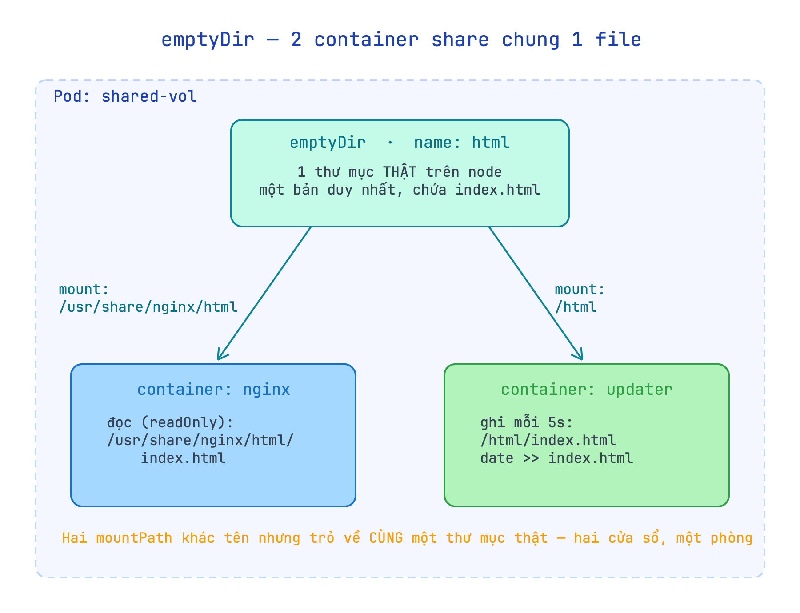
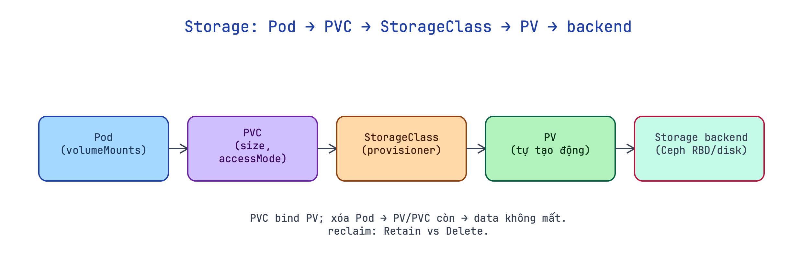

# 07 · Volume / PV / PVC / StorageClass — tách data ra khỏi vòng đời Pod

**Mục tiêu:** hiểu tại sao cần tách data khỏi Pod; phân biệt emptyDir vs hostPath vs PV/PVC; biết cách dùng StorageClass với dynamic provisioning; thực hành tạo PVC trên OrbStack, mount vào Pod, xoá Pod rồi tạo lại thấy data vẫn còn; hiểu CSI là lớp plugin nằm giữa K8s và hệ thống lưu trữ ngoài.
**Nền:** đã biết Pod là ephemeral — xoá Pod là mất container filesystem. Lab này giải quyết câu hỏi "vậy data bền vững đặt ở đâu?".
**⏱** 60–75 phút · **Sân:** host local (OrbStack Kubernetes).

> Mỗi mục: **Chốt → Vì sao → Cơ chế → Dùng/không → Làm → Kết quả**. Đọc để *hiểu*, gõ để *thấy*.

## Tiền đề (1 lần)
```bash
kubectl config use-context orbstack
kubectl get nodes # 1 node STATUS=Ready
kubectl get storageclass # xem StorageClass mặc định (OrbStack tự tạo)
```

---

## 1. Volume trong Pod — emptyDir & hostPath

**Chốt:** mặc định filesystem của container **chết cùng container**; `emptyDir` và `hostPath` là hai volume cơ bản bổ sung vào Pod, nhưng đều còn bị ràng buộc với Pod hoặc node.

- **Volume** trong K8s = một thư mục có thể gắn vào container — khai báo ở `spec.volumes[]`, mount vào container qua `spec.containers[].volumeMounts[]` (khớp nhau bằng `name`).
- **`emptyDir`** — K8s cấp thư mục rỗng khi Pod được schedule. Vòng đời = vòng đời Pod: Pod bị xoá hoặc crash không restart lại → mất sạch. Nhiều container trong cùng Pod dùng chung được (pattern: sidecar ghi, app đọc).
- **`hostPath`** — mount thẳng đường dẫn trên worker node vào container. Dễ setup, nhưng gắn cứng với 1 node.

**Vì sao:** container filesystem là lớp writable mỏng phủ lên image read-only — container bị replace (rolling update, crash-restart, reschedule), lớp đó biến mất. Cần ít nhất `emptyDir` để share data giữa sidecar và app trong cùng Pod, và hiểu giới hạn của nó trước khi học PV/PVC.

**Cơ chế:** `emptyDir` được tạo lần đầu khi Pod landing trên node và bị xoá khi kubelet xoá Pod — không có gì được lưu ra ngoài node. `hostPath` gắn bind-mount kernel từ path node vào container; nếu Pod được scheduler đẩy sang node khác (reschedule), nó thấy path đó trên node mới — có thể trống hoặc có nội dung khác.

> **Ẩn dụ:** `emptyDir` = bảng trắng trong phòng họp — có thể ghi thoải mái trong buổi họp, ai cũng dùng chung được, nhưng ai xoá phòng thì mất. `hostPath` = tủ khóa ở sảnh tầng 3 cụ thể — bạn phải về đúng tầng 3 mới lấy được đồ.

> **Cách 2 container mount chung 1 file — nối qua `name` (áp dụng cho MỌI loại volume):**
> Volume và mount là **hai việc tách rời**, nối nhau bằng trường `name`.
> ① Khai báo **một** ổ đĩa ở cấp Pod: `spec.volumes[]` có `name: html` + loại (`emptyDir: {}`).
> ② Mỗi container gắn ổ đĩa đó vào chỗ của nó: `spec.containers[].volumeMounts[]` trỏ **cùng `name: html`**,
> chọn `mountPath` tùy container (`nginx` → `/usr/share/nginx/html` vì đó là web-root mặc định; `updater` → `/html` cho gọn).
> Có **đúng một thư mục vật lý** trên node; hai `mountPath` khác tên chỉ là **hai cửa sổ nhìn vào cùng một phòng** →
> updater ghi `/html/index.html`, nginx đọc `/usr/share/nginx/html/index.html` = **cùng file**. Đổi `name` lệch nhau → mount 2 volume khác → hết share.
> Bộ khung `volumes` + `volumeMounts` này **không đổi** khi lên PVC — chỉ thay `emptyDir: {}` bằng `persistentVolumeClaim: {claimName: ...}`.



> **Thực chạy — 502 warmup (teachable moment):** `port-forward ... & curl` ngay lập tức → lần curl **đầu** ra `502 Bad Gateway`
> (body có `nginx/1.29.5` → chính nginx sinh ra). Lý do: lúc `t=0` emptyDir còn **rỗng** (updater `sleep 5` xong mới ghi lần đầu) +
> tunnel port-forward chưa ổn định → request rớt vào khe hở. Vài giây sau curl ra timestamp bình thường. Đây đúng là lý do tồn tại của
> **readinessProbe** (module 03): nếu có readiness gác cửa, Pod chưa phục vụ được sẽ không nhận traffic → client không bao giờ thấy 502 warmup.

| | emptyDir | hostPath |
|---|---|---|
| Vòng đời | = Pod | = node path (tồn tại dù Pod chết) |
| Scope | trong Pod | node cụ thể |
| Rủi ro | mất khi Pod xoá | mất khi reschedule sang node khác |
| Dùng khi | sidecar ghi/app đọc | hook `/var/run/docker.sock`, dev 1 node |

**Dùng / không:** `emptyDir` hợp khi cần cache/temp hoặc sidecar truyền file cho app. **Phản đề:** đừng dùng `emptyDir` cho state quan trọng — nó không persist qua Pod delete. `hostPath` chỉ ổn khi cluster 1 node hoặc khóa Pod lại node bằng Node Affinity; nhiều node → dùng hostPath là hỏi thảm hoạ.

**Làm:**
```bash
# emptyDir chia sẻ giữa 2 container — updater ghi, nginx đọc
cat > /tmp/emptydir.pod.yml <<'EOF'
apiVersion: v1
kind: Pod
metadata:
 name: shared-vol
spec:
 volumes:
 - name: html
 emptyDir: {}
 containers:
 - name: nginx
 image: nginx:alpine
 volumeMounts:
 - name: html
 mountPath: /usr/share/nginx/html
 readOnly: true
 - name: updater
 image: alpine
 volumeMounts:
 - name: html
 mountPath: /html
 command: ["/bin/sh", "-c"]
 args:
 - while true; do date >> /html/index.html; sleep 10; done
EOF
kubectl apply -f /tmp/emptydir.pod.yml
kubectl wait --for=condition=Ready pod/shared-vol --timeout=60s
kubectl port-forward shared-vol 8080:80 &
# đợi 10s rồi curl lại → dòng mới xuất hiện
curl -s localhost:8080
kill %1
kubectl delete pod shared-vol
# tạo lại → /html rỗng hoàn toàn → emptyDir không persist
```

**Kết quả:**
```text
$ curl -s localhost:8080
Thu Aug 7 02:10:05 UTC 2026
Thu Aug 7 02:10:15 UTC 2026 ← updater ghi thêm mỗi 10s, nginx phục vụ ngay

# sau kubectl delete pod shared-vol + tạo lại:
$ kubectl exec shared-vol -c nginx -- ls /usr/share/nginx/html
 ← thư mục rỗng — emptyDir đã mất
```
→ **Verify:** updater ghi, nginx đọc qua emptyDir dùng chung; xoá Pod → trống lại.

---

## 2. Tại sao cần PV/PVC — tách vòng đời data khỏi Pod



**Chốt:** `emptyDir` mất khi Pod xoá, `hostPath` mất khi reschedule — cả hai đều không đủ cho stateful app. **PersistentVolume (PV)** và **PersistentVolumeClaim (PVC)** tách data ra thành object K8s riêng, sống độc lập khỏi Pod.

- **PersistentVolume (PV)** — object cluster-scoped, ánh xạ 1-1 với storage thật (cloud disk, NFS, Ceph…). Vòng đời độc lập khỏi mọi Pod.
- **PersistentVolumeClaim (PVC)** — object namespace-scoped, do developer tạo, là "đơn xin" storage. K8s bind PVC → PV khi điều kiện khớp (capacity, accessMode, storageClassName).
- Bind là **exclusive**: 1 PVC bind 1 PV, không PVC nào khác dùng được PV đó khi đang bound.
- Pod reference PVC trong `spec.volumes[]` — container không biết gì về storage backend, chỉ thấy mountPath.

**Vì sao:** Pod là ephemeral (bị replace khi node fail, rolling update, crash-restart). Data của database, transaction log, file upload không thể ở trong Pod. PV/PVC cắt đứt coupling: Pod chết — PV không bị ảnh hưởng; Pod mới mount cùng PVC → thấy lại data cũ.

**Cơ chế — luồng bind:**
1. Admin (hoặc CSI driver) tạo storage thật ngoài K8s (cloud disk, NFS volume, Ceph pool).
2. Admin tạo **PV** — K8s object ánh xạ vào storage đó, khai báo capacity, accessMode, reclaimPolicy.
3. Developer tạo **PVC** — khai báo capacity tối thiểu cần, accessMode, storageClassName.
4. K8s control-plane chạy bind loop: tìm PV có capacity ≥ request và accessMode + storageClassName khớp → bind (trạng thái cả hai chuyển sang `Bound`).
5. Pod khai báo PVC trong `spec.volumes[]` → kubelet mount volume vào container.

> **Ẩn dụ:** PV = căn hộ sẵn sàng cho thuê (được chủ nhà đăng ký). PVC = đơn thuê của bạn (nêu yêu cầu diện tích). K8s = môi giới — ghép đơn với căn hộ phù hợp. Khi bạn thuê rồi, không ai khác thuê được căn đó. Khi bạn dọn đi (xoá PVC), tài sản trong căn (data) giữ hay mất tuỳ reclaim policy của chủ nhà.

**Dùng / không:** bất kỳ stateful workload nào cần persist data qua Pod lifecycle đều phải dùng PV/PVC (database, log, upload). **Phản đề:** emptyDir vẫn hợp khi chỉ cần share tmp giữa sidecars trong 1 Pod và không cần persist — đừng phức tạp hoá bằng PVC khi không cần.

---

## 3. PV / PVC — YAML, accessModes, reclaimPolicy

**Chốt:** PV là template storage cluster-scoped; PVC là đơn xin namespace-scoped; bind theo 3 điều kiện (accessMode + capacity + storageClassName); reclaimPolicy quyết định PV bị xoá hay giữ lại khi PVC bị xoá.

- **accessModes** — khai báo ở cả PV lẫn PVC, phải khớp:

| Mode | Viết tắt | Ý nghĩa | Hỗ trợ bởi |
|---|---|---|---|
| `ReadWriteOnce` | RWO | 1 node read/write | block (EBS, Ceph RBD) |
| `ReadOnlyMany` | ROX | nhiều node, chỉ đọc | hầu hết |
| `ReadWriteMany` | RWX | nhiều node read/write | file-based (NFS, CephFS) |
| `ReadWriteOncePod` | RWOP | 1 Pod duy nhất trên cluster | K8s ≥1.22, block |

- **RWO ≠ "chỉ 1 container":** nhiều container trong cùng 1 Pod đều có thể mount RWO PVC — cùng node thì được. Container trong Pod khác (trên node khác) thì không.
- **persistentVolumeReclaimPolicy** — xảy ra sau khi PVC bị xoá:
 - `Retain` — PV còn đó, trạng thái `Released`, không PVC nào bind lại được; admin phải can thiệp thủ công.
 - `Delete` — K8s xoá PV và volume backend (cloud disk, Ceph volume…) — mặc định của dynamic provisioning; xoá PVC là mất data luôn.

**Vì sao:** static provisioning cần admin tạo PV trước, bind theo các điều kiện — hiểu điều kiện để không bị "PVC pending mãi" (mismatch accessMode hay storageClassName). Retain quan trọng ở prod: một lệnh `kubectl delete pvc` vô tình không nên bay data.

**Cơ chế:** control-plane chạy *PersistentVolumeController* loop liên tục tìm PVC ở trạng thái `Pending` và PV ở trạng thái `Available` — nếu khớp capacity + accessMode + storageClassName → bind cả hai sang `Bound`. PVC không bao giờ bind PV nhỏ hơn request; nếu PV lớn hơn, vẫn bind nhưng phần dư không dùng được.

**Làm** — static provisioning (PV tay, PVC tay):
```yaml
# PV — do "admin" tạo (ở dev local dùng hostPath cho đơn giản)
apiVersion: v1
kind: PersistentVolume
metadata:
 name: my-pv
spec:
 capacity:
 storage: 10Gi
 accessModes: [ReadWriteOnce]
 persistentVolumeReclaimPolicy: Retain
 storageClassName: local-storage
 hostPath:
 path: /tmp/k8s-data
---
# PVC — developer tạo
apiVersion: v1
kind: PersistentVolumeClaim
metadata:
 name: my-pvc
spec:
 accessModes: [ReadWriteOnce]
 resources:
 requests:
 storage: 5Gi # bind PV có capacity >= 5Gi
 storageClassName: local-storage
---
# Pod reference PVC
apiVersion: v1
kind: Pod
metadata:
 name: static-app
spec:
 volumes:
 - name: data-vol
 persistentVolumeClaim:
 claimName: my-pvc
 containers:
 - name: app
 image: nginx:alpine
 volumeMounts:
 - name: data-vol
 mountPath: /data
```

```bash
kubectl apply -f /tmp/my-pv.yml # gộp 3 object vào 1 file, cách nhau ---
kubectl get pvc my-pvc # STATUS: Bound
kubectl get pv my-pv # STATUS: Bound, CLAIM: default/my-pvc
```

**Kết quả:**
```text
$ kubectl get pvc my-pvc
NAME STATUS VOLUME CAPACITY ACCESS MODES STORAGECLASS AGE
my-pvc Bound my-pv 10Gi RWO local-storage 5s

$ kubectl get pv my-pv
NAME CAPACITY ACCESS MODES RECLAIM POLICY STATUS CLAIM STORAGECLASS
my-pv 10Gi RWO Retain Bound default/my-pvc local-storage
```
→ **Verify:** PVC Bound, PV Bound, CLAIM trỏ đúng namespace/name. Dọn: `kubectl delete pod static-app && kubectl delete pvc my-pvc && kubectl delete pv my-pv`.

---

## 4. StorageClass và dynamic provisioning

**Chốt:** static provisioning không scale — admin phải tạo từng PV trước. **StorageClass** định nghĩa template + provisioner (CSI driver) → PVC reference StorageClass → K8s tự tạo PV và volume backend on-demand. Developer tạo PVC, K8s lo phần còn lại.

- Một cluster có thể có nhiều StorageClass (fast-ssd, slow-hdd, replicated…).
- SC đánh dấu `storageclass.kubernetes.io/is-default-class: "true"` → PVC không khai báo `storageClassName` dùng SC mặc định.
- **StorageClass là immutable** sau khi deploy — sai config phải xoá và tạo lại.
- **`volumeBindingMode`:**
 - `Immediate` (mặc định) — tạo PV và volume ngay khi PVC xuất hiện.
 - `WaitForFirstConsumer` — đợi đến khi Pod dùng PVC được schedule → đảm bảo volume tạo đúng zone/region với Pod (tránh cross-zone latency trên cloud).

**Vì sao:** team lớn có hàng trăm service, mỗi service cần PV — admin không thể tạo thủ công kịp. StorageClass + dynamic provisioning = self-service: developer tạo PVC, vài giây sau PV có, volume backend được cấp phát. Không cần ticket gửi admin.

**Cơ chế:** khi PVC reference một StorageClass có dynamic provisioner, *volume controller* gọi CSI driver tương ứng (qua gRPC interface chuẩn) để tạo volume thật trên backend; sau đó tạo PV object và bind vào PVC. Khi PVC bị xoá (và reclaimPolicy = `Delete`), CSI driver được gọi để xoá volume backend.

> **Ẩn dụ:** StorageClass = catalogue thuê xe của Grab (Economy, Premium, XL…) — bạn chọn hạng, hệ thống tự match và điều phối, không cần bạn biết xe nào đang rảnh. Static provisioning = gọi thẳng chủ xe, hỏi từng xe còn không.

| | Static | Dynamic |
|---|---|---|
| Admin làm gì | Tạo từng PV | Tạo StorageClass 1 lần |
| Developer làm gì | Tạo PVC + biết tên PV | Tạo PVC + chọn StorageClass |
| Scale | Khó | Tốt |
| Môi trường | Dev local, on-prem không có provisioner | Cloud, Ceph, bất kỳ nơi có CSI |

**Dùng / không:** dynamic provisioning là mặc định hợp lý cho mọi môi trường có CSI driver. **Phản đề:** static provisioning vẫn cần khi storage backend không hỗ trợ dynamic (legacy NFS server không có provisioner) hoặc khi cần dùng lại volume đã có sẵn (data migration — tạo PV trỏ vào volume cũ, không muốn tạo volume mới).

**Làm** — xem StorageClass trên OrbStack:
```bash
kubectl get storageclass
```

**Kết quả:**
```text
NAME PROVISIONER RECLAIMPOLICY VOLUMEBINDINGMODE ALLOWVOLUMEEXPANSION
local-path (default) rancher.io/local-path Delete WaitForFirstConsumer false
```
→ **Verify:** thấy `(default)` nghĩa là PVC không khai báo `storageClassName` sẽ dùng SC này. `WaitForFirstConsumer` = PV chỉ tạo khi Pod được schedule (đúng cho single-node OrbStack).

---

## 5. CSI — Container Storage Interface

**Chốt:** trước CSI, storage plugin baked trong core K8s (in-tree) — mỗi bug fix phải chờ K8s release. CSI là chuẩn interface mở cho phép vendor viết plugin out-of-tree, tự release, không bị ràng buộc Apache 2.0.

- **In-tree driver** — code của NetApp, AWS EBS, Azure Disk… nằm thẳng trong `kubernetes/kubernetes` repo. K8s maintainer phải maintain; vendor muốn fix bug chờ release cycle K8s (~3 tháng).
- **CSI driver** — plugin chạy ngoài K8s core (thường là DaemonSet + Deployment trong namespace `kube-system`). Vendor tự release, không mở source bắt buộc, feature riêng (snapshot, resize, clone, raw block) không cần K8s core thay đổi.
- Từ phía app: chỉ thấy `PersistentVolume` với field chuẩn. Mọi chi tiết backend (RAID, replication, iSCSI LUN, NFS export) ẩn hoàn toàn.
- Tất cả feature volume mới (snapshot, resize, clone) đều đi qua CSI — không còn qua in-tree.

**Vì sao:** K8s muốn là platform-agnostic. Nhét code vendor vào core tạo ra bottleneck và rủi ro (bug vendor làm crash toàn cluster). CSI = tách mối lo: K8s lo orchestration, vendor lo storage.

**Cơ chế:** CSI định nghĩa interface gRPC chuẩn (`CreateVolume`, `DeleteVolume`, `ControllerPublishVolume`…). K8s gọi driver qua interface này; driver tự implement phía mình. kubelet trên node gọi `NodePublishVolume` để mount volume vào Pod sandbox.

> **Ẩn dụ:** CSI giống USB-C — thiết bị nào cắm vào cũng được miễn implement USB-C; Apple/Samsung/Sony tự thiết kế phần cứng bên trong, không cần Intel cho phép.

**Dùng / không:** nếu đang dùng cloud (AWS, GCP, Azure) hoặc Ceph — đều đi qua CSI driver rồi. **Phản đề:** không cần hiểu sâu CSI để dùng PV/PVC thường ngày — nó là plumbing ẩn sau StorageClass. Chỉ cần hiểu khi debug driver issue hoặc khi tự cài Rook-Ceph.

---

## 6. Thực hành — PVC với StorageClass mặc định trên OrbStack

**Chốt:** tạo PVC (không khai báo `storageClassName` → dùng SC mặc định), mount vào Pod, ghi file, xoá Pod, tạo lại — data còn nguyên.

**Làm:**
```bash
# Bước 1: tạo PVC — dùng StorageClass mặc định (local-path)
cat > /tmp/my-pvc.yml <<'EOF'
apiVersion: v1
kind: PersistentVolumeClaim
metadata:
 name: test-pvc
spec:
 accessModes: [ReadWriteOnce]
 resources:
 requests:
 storage: 1Gi
EOF
kubectl apply -f /tmp/my-pvc.yml
kubectl get pvc test-pvc # STATUS sẽ là Pending cho đến khi Pod dùng (WaitForFirstConsumer)
```

```bash
# Bước 2: tạo Pod mount PVC
cat > /tmp/pvc-pod.yml <<'EOF'
apiVersion: v1
kind: Pod
metadata:
 name: writer
spec:
 volumes:
 - name: data
 persistentVolumeClaim:
 claimName: test-pvc
 containers:
 - name: app
 image: alpine
 command: ["/bin/sh", "-c", "sleep 3600"]
 volumeMounts:
 - name: data
 mountPath: /data
EOF
kubectl apply -f /tmp/pvc-pod.yml
kubectl wait --for=condition=Ready pod/writer --timeout=60s
```

```bash
# Bước 3: ghi data vào PVC
kubectl exec writer -- sh -c 'echo "hello persistent" > /data/test.txt'
kubectl exec writer -- cat /data/test.txt
```

```bash
# Bước 4: xoá Pod → tạo lại → kiểm tra data còn không
kubectl delete pod writer
kubectl apply -f /tmp/pvc-pod.yml
kubectl wait --for=condition=Ready pod/writer --timeout=60s
kubectl exec writer -- cat /data/test.txt
```

```bash
# Bước 5: xem tổng quan PVC / PV / StorageClass
kubectl get pvc,pv,storageclass
```

**Kết quả:**
```text
$ kubectl exec writer -- cat /data/test.txt
hello persistent ← ghi từ Pod cũ, Pod mới thấy nguyên

$ kubectl get pvc,pv,storageclass
NAME STATUS VOLUME CAPACITY ACCESS MODES STORAGECLASS AGE
persistentvolumeclaim/test-pvc Bound pvc-3a7f1c2b-9d4e-4a1f-8c3d-2e5f7a9b0c1d 1Gi RWO local-path 3m

NAME CAPACITY ACCESS MODES RECLAIM POLICY STATUS CLAIM STORAGECLASS
persistentvolume/pvc-3a7f1c2b-9d4e-4a1f-8c3d-2e5f7a9b0c1d 1Gi RWO Delete Bound default/test-pvc local-path

NAME PROVISIONER RECLAIMPOLICY VOLUMEBINDINGMODE ALLOWVOLUMEEXPANSION
storageclass.storage.k8s.io/local-path rancher.io/local-path Delete WaitForFirstConsumer false
```
→ **Verify:** PVC `Bound`, PV được dynamic provisioning tạo tự động, `hello persistent` vẫn còn sau khi xoá và tạo lại Pod.

> **Thực chạy (OrbStack, 2 loại provisioning cạnh nhau):** sau khi làm cả static lẫn dynamic, `kubectl get pv` in **2 PV** đối lập rõ:
> ```text
> NAME                                       CAPACITY  RECLAIM   STATUS  CLAIM              STORAGECLASS
> my-pv                                      10Gi      Retain    Bound   default/my-pvc     local-storage   ← static: mình đặt tên, Retain
> pvc-aa0a6f8a-6a04-486c-b53d-1783902c772a   1Gi       Delete    Bound   default/test-pvc   local-path      ← dynamic: K8s sinh tên UUID, Delete
> ```
> Static = mình nặn PV tay + tự đặt tên + `Retain`; dynamic = provisioner đẻ PV, tên UUID, `Delete`. Chi tiết bind: PVC xin 5Gi nhưng `CAPACITY` hiện **10Gi** — PVC chiếm **cả** PV, phần dư 5Gi bị phí.
>
> **Chứng minh persist tách vòng đời Pod:** ghi `hello persistent - Fri Aug 14 08:36:42` vào `/data/test.txt` → `kubectl delete pod writer` (PVC báo `unchanged`, chỉ Pod bị xoá) → `apply` lại → Pod mới `cat` **vẫn ra đúng `08:36:42`**. Đối chiếu bước 1: cùng thao tác xoá-tạo-lại Pod, `emptyDir` mất sạch (timestamp reset), PVC giữ nguyên. Đó là toàn bộ lý do PV/PVC tồn tại.

---

## Dọn dẹp
```bash
kubectl delete pod writer --ignore-not-found
kubectl delete pvc test-pvc --ignore-not-found
# PV sẽ tự xoá (reclaimPolicy=Delete) sau khi PVC bị xoá
kubectl delete pod shared-vol --ignore-not-found
```

---

## Đủ khi (nói trơn bằng lời mình)
① emptyDir vs hostPath khác gì, khi nào dùng cái nào · ② tại sao cần tách data ra PV/PVC thay vì để trong container · ③ PV vs PVC khác gì, ai tạo cái nào · ④ accessModes RWO/RWX/ROX nghĩa là gì, block vs file hỗ trợ chế độ nào · ⑤ Retain vs Delete reclaim policy khi nào nên dùng · ⑥ StorageClass + dynamic provisioning giải quyết vấn đề gì của static provisioning · ⑦ CSI là gì, thay thế in-tree driver như thế nào.

## Recall — tự kiểm (cuối buổi)
Tự trả lời trước, xong hết mới cuộn xuống Đáp án.

**Nhóm cơ bản:**
1. emptyDir bị mất khi nào? Dùng để làm gì?
2. hostPath rủi ro gì khi cluster có nhiều worker node?
3. PV là gì, ai tạo, scope là gì (namespace/cluster)?
4. PVC là gì, khác PV ở điểm gì, bind theo điều kiện nào?
5. `ReadWriteOnce` nghĩa là gì? Nếu 2 container trong 1 Pod dùng cùng PVC RWO có được không?

**Nhóm nâng cao:**
6. Retain vs Delete reclaim policy — khi nào PV bị xoá, khi nào không?
7. StorageClass giải quyết vấn đề gì của static provisioning?
8. `WaitForFirstConsumer` trong StorageClass dùng để làm gì?
9. CSI là gì, tại sao K8s chuyển từ in-tree sang CSI?
10. StorageClass đã deploy có sửa được không?

### Đáp án

1. emptyDir mất khi **Pod bị xoá** (hoặc bị crash không restart lại). Dùng để share data giữa các container trong cùng Pod trong suốt vòng đời Pod.
2. hostPath gắn với 1 node cụ thể — nếu Pod được reschedule sang node khác, volume không theo (data mất hoặc thấy bản khác). Chỉ an toàn khi 1 node hoặc dùng Node Affinity khóa Pod lại 1 node.
3. PV là **cluster-scoped** object (không có namespace), do admin (hoặc CSI driver) tạo, ánh xạ 1-1 với storage thật bên ngoài. Lifecycle độc lập khỏi Pod.
4. PVC là **namespace-scoped** object, do developer tạo. Bind vào PV khi accessMode + capacity + storageClassName khớp (PVC không bind PV nhỏ hơn request). Mỗi PVC chỉ bind được 1 PV (exclusive).
5. RWO = 1 node mount read/write. 2 container trong cùng Pod **có thể** dùng cùng PVC RWO vì chúng cùng node.
6. **Retain**: PVC xoá → PV trạng thái `Released`, không bị xoá; admin phải dọn tay. **Delete**: PVC xoá → PV bị xoá + volume backend bị xoá. Default của dynamic provisioning là Delete.
7. Static: admin phải tạo từng PV thủ công → không scale. StorageClass + provisioner → PVC reference SC → K8s tự tạo PV và volume backend on demand.
8. `WaitForFirstConsumer` hoãn tạo PV và backend volume đến khi Pod được schedule — đảm bảo volume được tạo ở cùng zone/region với Pod (tránh cross-zone latency trên cloud).
9. CSI = chuẩn interface giữa K8s và storage vendor, plugin chạy out-of-tree: vendor tự release, không phụ thuộc K8s release cycle, không bị buộc mở source. K8s maintainer không phải maintain code của vendor nữa.
10. Không — StorageClass là **immutable** sau khi tạo. Sai config phải xoá và tạo lại.
