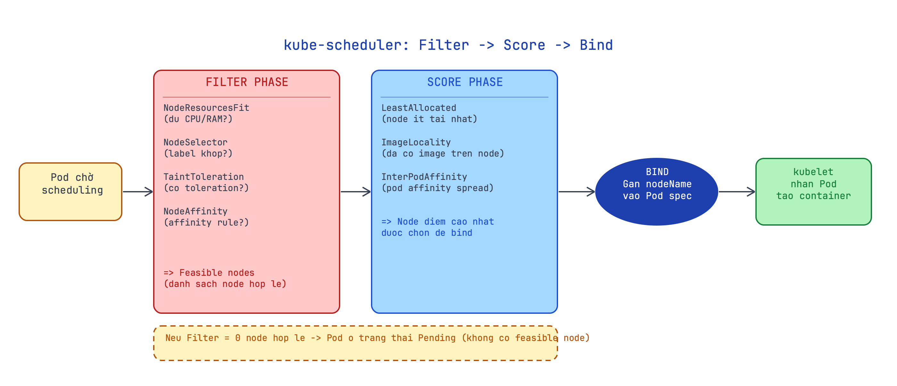

# 13 · Scheduling — Pod được đặt lên node nào, và vì sao

> **Chặng 3 · ◻ chưa mở** — [◈ Bảng tiến độ](../../wiki/notebook/k8s/sessions/learning-plan.md) · trước: Networking nâng cao · kế tiếp: RBAC & Security · [course-catalog](../../wiki/notebook/k8s/course-catalog.md)

**Mục tiêu:** hiểu kube-scheduler lọc và chấm điểm node như thế nào; thạo nodeSelector, Taints/Tolerations, Affinity/anti-affinity để điều hướng Pod; biết dùng PriorityClass khi tài nguyên thiếu; hiểu Static Pod là gì và tại sao control-plane components lại là static pod.

**Nền:** đã qua Deployment và Service (Pod sống trên node, Service route traffic). Bây giờ đặt câu hỏi: *ai quyết định Pod ở node nào?* — đó là kube-scheduler. Lab này cho thấy cách kiểm soát quyết định đó.

## Tiền đề
Cụm kind-lab cần có 3 node (1 control-plane + 2 worker). Kiểm tra:

```bash
kubectl config use-context kind-lab
kubectl get nodes --show-labels
```

```text
NAME                     STATUS   ROLES           AGE   VERSION   LABELS
kind-lab-control-plane   Ready    control-plane   10m   v1.30.0   kubernetes.io/hostname=kind-lab-control-plane,...
kind-lab-worker          Ready    <none>          10m   v1.30.0   kubernetes.io/hostname=kind-lab-worker,...
kind-lab-worker2         Ready    <none>          10m   v1.30.0   kubernetes.io/hostname=kind-lab-worker2,...
```

→ Thấy 3 node STATUS=Ready là đủ điều kiện. Nếu chỉ có 1 node, một số bài demo placement sẽ không thấy khác biệt.

---

## 1. Scheduler làm gì — filter → score → bind

**Chốt:** kube-scheduler nhận Pod chưa có `nodeName` → chạy qua 2 giai đoạn — **Filter** (loại node không hợp lệ) rồi **Score** (chấm điểm node còn lại) — rồi **Bind** (gán `nodeName` vào Pod spec). kubelet trên node được chọn thấy Pod có `nodeName` của mình → kéo image và tạo container.

- **Filter phase:** loại node không đủ điều kiện — thiếu CPU/RAM (`NodeResourcesFit`), không khớp label (`NodeSelector`), có taint không được tolerate (`TaintToleration`), vi phạm affinity rule (`NodeAffinity`). Kết quả: danh sách *feasible nodes*.
- **Score phase:** chấm điểm feasible nodes — ưu tiên node ít tải (`LeastAllocated`), node đã có image (`ImageLocality`), node phân tán pod cùng app (`InterPodAffinity`). Node điểm cao nhất được chọn.
- **Bind:** scheduler ghi `nodeName` vào Pod spec qua API server; kubelet trên node đó watch và thấy Pod mới → tạo container.
- Nếu Filter không ra node nào → Pod ở trạng thái **Pending** mãi cho đến khi điều kiện thay đổi.

**Vì sao:** tách scheduling thành 2 bước giúp K8s mở rộng được — Filter loại nhanh những node rõ ràng không hợp lệ (O(n) check đơn giản), Score chỉ cần tính toán trên số node nhỏ hơn (thường). Plugin scheduler có thể thêm/bỏ theo từng bước; `kube-scheduler` có thể thay bằng scheduler tự viết.

**Cơ chế:** scheduler watch API server qua `List-Watch` — thấy Pod mới không có `nodeName` → đưa vào hàng đợi → chạy Filter plugins (mỗi plugin là 1 hàm trả `bool`) → chạy Score plugins (mỗi plugin trả 0–100) → tổng điểm → chọn max → gọi `Bind` (HTTP POST tới `/api/v1/namespaces/default/pods/<name>/binding`). Scheduler không tự chạy container — chỉ viết `nodeName`.

> 💡 **Ẩn dụ:** scheduler như HR tuyển dụng. Filter = vòng loại hồ sơ (thiếu bằng cấp → loại). Score = phỏng vấn (điểm năng lực). Bind = ký hợp đồng với ứng viên điểm cao nhất.

| Bước | Input | Output | Nếu thất bại |
|---|---|---|---|
| Filter | Tất cả node | Feasible nodes | 0 node → Pod Pending |
| Score | Feasible nodes | Node điểm cao nhất | Tie → chọn random |
| Bind | Node được chọn | `nodeName` ghi vào Pod | Lỗi API → retry |

**Dùng / không dùng:**
- Phần lớn thời gian không cần can thiệp — scheduler tự cân bằng tải tốt.
- Can thiệp khi cần ràng buộc cứng (GPU node, zone cụ thể, node dedicated) — dùng các cơ chế ở mục 2–4.
- **Phản đề:** đừng can thiệp quá nhiều — nodeSelector cứng + taint + affinity cùng lúc dễ dẫn tới Pod Pending mãi vì không node nào qua nổi Filter. Debug bằng `kubectl describe pod` → phần Events.

**Làm:**
```bash
# tạo Pod và quan sát Scheduled event
kubectl run demo-sched --image=nginx:alpine
kubectl get events --field-selector reason=Scheduled
```

```text
$ kubectl get events --field-selector reason=Scheduled
LAST SEEN   TYPE     REASON      OBJECT             MESSAGE
5s          Normal   Scheduled   pod/demo-sched     Successfully assigned default/demo-sched to kind-lab-worker
```

```bash
# xem node được chọn
kubectl get pod demo-sched -o wide
```

```text
NAME          READY   STATUS    RESTARTS   AGE   IP           NODE               NOMINATED NODE   READINESS GATES
demo-sched    1/1     Running   0          12s   10.244.1.5   kind-lab-worker    <none>           <none>
```

→ **Verify:** Events thấy `Scheduled … to kind-lab-worker`; cột NODE của `get pod -o wide` khớp.



---

## 2. nodeSelector & node labels

**Chốt:** `nodeSelector` là cách đơn giản nhất ràng buộc Pod vào node theo **label** — scheduler Filter sẽ loại mọi node không có label khớp. Nếu không node nào có label đó, Pod ở **Pending** mãi.

- `kubectl label node <node> <key>=<value>` — gán label cho node.
- `spec.nodeSelector: { <key>: <value> }` — Pod chỉ được đặt lên node có đúng label này.
- Label built-in: `kubernetes.io/hostname`, `kubernetes.io/os`, `topology.kubernetes.io/zone` (nếu cloud provider cài).
- Xóa label: `kubectl label node <node> <key>-` (dấu `-` ở cuối).

**Vì sao:** cần chạy workload trên node có GPU, SSD, hoặc node ở zone cụ thể — nodeSelector là lựa chọn thẳng nhất. Đơn giản nhưng cứng — nếu label bị xóa hoặc node chết, Pod Pending ngay.

**Cơ chế:** `NodeSelector` plugin trong Filter phase đọc `spec.nodeSelector` của Pod → so sánh với labels của từng node → loại node không khớp. Đây là AND của tất cả key-value (phải khớp hết). Không có OR hay wildcard trong nodeSelector — muốn linh hoạt hơn dùng Affinity (mục 4).

> 💡 **Ẩn dụ:** nodeSelector = dán thẻ "phòng A chỉ đón khách VIP" — chỉ khách có thẻ VIP mới được dẫn vào phòng A. Khách thường đứng chờ hoặc vào phòng khác.

| Thuộc tính | nodeSelector | nodeAffinity |
|---|---|---|
| Cú pháp | Đơn giản key-value | Expression (In, NotIn, Exists…) |
| OR logic | Không | Có (matchExpressions) |
| Mềm/cứng | Cứng (hard) | Cả hai |
| Khi không khớp | Pod Pending | Pending (required) hoặc ignore (preferred) |

**Dùng / không dùng:**
- Dùng khi ràng buộc đơn giản, ít exception (GPU node, node type).
- **Phản đề:** nodeSelector không có fallback — nếu label bị xóa khỏi tất cả node, toàn bộ Deployment Pending. Môi trường production nên dùng `requiredDuringSchedulingIgnoredDuringExecution` (affinity) kết hợp với `preferredDuring…` để có fallback.

**Làm:**
```bash
# gán label disktype=ssd cho worker đầu tiên
kubectl label node kind-lab-worker disktype=ssd

# kiểm tra label đã gán
kubectl get node kind-lab-worker --show-labels | grep disktype
```

```text
kind-lab-worker   Ready   <none>   15m   v1.30.0   ...,disktype=ssd,...
```

```bash
# tạo Pod với nodeSelector
cat > /tmp/nodeselector.yml <<'EOF'
apiVersion: v1
kind: Pod
metadata:
  name: ssd-pod
spec:
  nodeSelector:
    disktype: ssd
  containers:
  - name: web
    image: nginx:alpine
EOF

kubectl apply -f /tmp/nodeselector.yml
kubectl get pod ssd-pod -o wide
```

```text
NAME      READY   STATUS    RESTARTS   AGE   IP           NODE              NOMINATED NODE   READINESS GATES
ssd-pod   1/1     Running   0          8s    10.244.1.6   kind-lab-worker   <none>           <none>
```

```bash
# demo Pod Pending khi không node nào có label
cat > /tmp/nodeselector-missing.yml <<'EOF'
apiVersion: v1
kind: Pod
metadata:
  name: gpu-pod
spec:
  nodeSelector:
    accelerator: nvidia-gpu
  containers:
  - name: web
    image: nginx:alpine
EOF

kubectl apply -f /tmp/nodeselector-missing.yml
kubectl get pod gpu-pod
kubectl describe pod gpu-pod | grep -A5 Events
```

```text
NAME      READY   STATUS    RESTARTS   AGE
gpu-pod   0/1     Pending   0          10s

Events:
  Type     Reason            Age   From               Message
  ----     ------            ----  ----               -------
  Warning  FailedScheduling  10s   default-scheduler  0/3 nodes are available: 3 node(s) didn't match Pod's node affinity/selector. preemption: 0/3 nodes are available: 3 Preemption is not helpful for scheduling.
```

→ **Verify:** `ssd-pod` chạy trên `kind-lab-worker` (node có `disktype=ssd`); `gpu-pod` Pending với message "didn't match Pod's node affinity/selector".

---

## 3. Taints & Tolerations

**Chốt:** **Taint** dán lên node để đẩy Pod ra; **Toleration** ghi vào Pod để được phép ở lại dù có taint. Không có toleration khớp → Pod không được đặt lên node đó (hoặc bị đẩy ra nếu đã chạy).

- `kubectl taint node <node> <key>=<value>:<effect>` — gán taint; effect là `NoSchedule`, `PreferNoSchedule`, hoặc `NoExecute`.
- `NoSchedule`: Pod mới không được đặt lên node này nếu không có toleration khớp. Pod đang chạy không bị đẩy.
- `PreferNoSchedule`: scheduler cố tránh, nhưng vẫn đặt nếu không có chỗ khác.
- `NoExecute`: Pod không có toleration bị **evict** (đuổi) khỏi node nếu đang chạy; Pod mới không được vào.
- Xóa taint: `kubectl taint node <node> <key>-` (dấu `-`).
- Control-plane node có taint sẵn: `node-role.kubernetes.io/control-plane:NoSchedule` — đó là lý do Pod thường không lên control-plane.
- Toleration viết trong `spec.tolerations` của Pod, khớp theo `key`, `operator` (`Equal`/`Exists`), `value`, `effect`.

**Vì sao:** taint cho phép dành riêng node cho loại workload cụ thể — ví dụ node GPU chỉ nhận Pod có GPU request, node monitoring chỉ nhận Prometheus. Ngược với nodeSelector (Pod chọn node), taint/toleration là node từ chối Pod.

**Cơ chế:** `TaintToleration` plugin trong Filter phase kiểm tra tất cả taint của node — nếu tìm thấy taint mà Pod không có toleration khớp → node bị loại (với `NoSchedule`/`NoExecute`). `NoExecute` còn được kubelet kiểm tra thêm sau khi Pod đã được lên node — kubelet sẽ evict Pod không có toleration khi taint được thêm vào.

> 💡 **Ẩn dụ:** taint = biển "Chỉ nhân viên". Toleration = thẻ nhân viên. Khách thường không vào được; nhân viên có thẻ thì qua. `NoSchedule` = không vào được; `NoExecute` = ai không có thẻ bị mời ra ngay.

| Effect | Pod mới | Pod đang chạy |
|---|---|---|
| NoSchedule | Không lên node | Không bị đẩy |
| PreferNoSchedule | Tránh nếu có thể | Không bị đẩy |
| NoExecute | Không lên node | Bị evict (trừ khi có `tolerationSeconds`) |

**Dùng / không dùng:**
- Dành riêng node cho infra workload (monitoring, ingress controller, database) — taint `NoSchedule` + DaemonSet toleration.
- Đánh dấu node đang bảo trì: `kubectl taint node <n> maintenance=true:NoExecute` → evict tất cả Pod.
- **Phản đề:** quá nhiều taint → scheduler không còn node hợp lệ → Pod Pending. Luôn kiểm tra `kubectl describe node` để thấy taint list; debug Pod Pending bằng `kubectl describe pod` → Events.

**Làm:**
```bash
# xem taint của control-plane node
kubectl describe node kind-lab-control-plane | grep -A3 Taints
```

```text
Taints:             node-role.kubernetes.io/control-plane:NoSchedule
```

```bash
# thêm taint NoSchedule vào worker2
kubectl taint node kind-lab-worker2 dedicated=infra:NoSchedule

# tạo Pod không có toleration → sẽ không lên worker2
cat > /tmp/no-toleration.yml <<'EOF'
apiVersion: v1
kind: Pod
metadata:
  name: normal-pod
spec:
  containers:
  - name: web
    image: nginx:alpine
EOF

kubectl apply -f /tmp/no-toleration.yml
kubectl get pod normal-pod -o wide
```

```text
NAME         READY   STATUS    RESTARTS   AGE   IP           NODE              NOMINATED NODE   READINESS GATES
normal-pod   1/1     Running   0          6s    10.244.1.7   kind-lab-worker   <none>           <none>
```

```bash
# tạo Pod có toleration → được phép lên worker2
cat > /tmp/with-toleration.yml <<'EOF'
apiVersion: v1
kind: Pod
metadata:
  name: infra-pod
spec:
  tolerations:
  - key: "dedicated"
    operator: "Equal"
    value: "infra"
    effect: "NoSchedule"
  nodeSelector:
    kubernetes.io/hostname: kind-lab-worker2
  containers:
  - name: web
    image: nginx:alpine
EOF

kubectl apply -f /tmp/with-toleration.yml
kubectl get pod infra-pod -o wide
```

```text
NAME        READY   STATUS    RESTARTS   AGE   IP           NODE               NOMINATED NODE   READINESS GATES
infra-pod   1/1     Running   0          9s    10.244.2.4   kind-lab-worker2   <none>           <none>
```

→ **Verify:** `normal-pod` chạy trên `kind-lab-worker` (không lên được `worker2` bị taint); `infra-pod` có toleration và nodeSelector nên lên được `worker2`.

---

## 4. Affinity / anti-affinity

**Chốt:** Affinity là phiên bản nâng cấp của nodeSelector — hỗ trợ **biểu thức** (In, NotIn, Exists, Gt…), có hai chế độ **cứng** (`requiredDuringSchedulingIgnoredDuringExecution`) và **mềm** (`preferredDuringSchedulingIgnoredDuringExecution`). **Pod affinity** và **anti-affinity** cho phép đặt Pod *gần* hoặc *xa* các Pod khác theo `topologyKey`.

- **Node affinity:** ràng buộc dựa trên label của *node* — thay thế và mở rộng nodeSelector.
  - `required…`: cứng — không khớp → Pending. Tương đương nodeSelector nhưng dùng expression.
  - `preferred…`: mềm — scheduler cố ưu tiên, nhưng vẫn đặt nếu không có node nào ưu tiên được.
- **Pod affinity:** đặt Pod *gần* Pod khác có label khớp (cùng node, cùng zone…).
- **Pod anti-affinity:** đặt Pod *xa* Pod khác — trải đều qua node/zone cho HA.
- `topologyKey`: đơn vị "gần/xa" — `kubernetes.io/hostname` (cùng node), `topology.kubernetes.io/zone` (cùng zone).

**Vì sao:** nodeSelector chỉ có AND, không có OR, không có "ưu tiên nhưng không bắt buộc". Affinity giải quyết cả hai. Anti-affinity đặc biệt quan trọng cho HA: replica của Deployment nên trải ra các node khác nhau — nếu 1 node chết, không mất hết replica.

**Cơ chế:** `NodeAffinity` plugin chạy trong Filter (với `required`) và Score (với `preferred`). `InterPodAffinity` plugin tương tự — kiểm tra label của các Pod đang chạy trên node (hoặc trong cùng topology domain) để quyết định ưu tiên. `topologyKey` quyết định "cùng" nghĩa là gì: `hostname` = cùng node, `zone` = cùng AZ.

> 💡 **Ẩn dụ:** `required` = hợp đồng cứng ("tôi chỉ làm ở tòa nhà có thang máy"). `preferred` = mong muốn ("tôi thích tòa nhà có canteen, nhưng không bắt buộc"). Anti-affinity = "tôi không muốn ngồi cùng phòng với đồng nghiệp A" — để tránh 2 người bị kẹt cùng 1 phòng khi có sự cố.

| Loại | Cú pháp rút gọn | Tác dụng |
|---|---|---|
| nodeSelector | `spec.nodeSelector` | Cứng, AND, chỉ = |
| node affinity required | `required…` | Cứng, expression (In/NotIn/Gt…) |
| node affinity preferred | `preferred…` | Mềm, có weight 1–100 |
| pod affinity | `podAffinity.required/preferred` | Gần Pod khác (cùng topology) |
| pod anti-affinity | `podAntiAffinity.required/preferred` | Xa Pod khác (khác topology) |

**Dùng / không dùng:**
- `preferred` cho gợi ý không bắt buộc (tiết kiệm chi phí transfer, locality).
- `required` cho ràng buộc cứng (GPU zone, compliance).
- Anti-affinity `required` với `topologyKey: hostname` → đảm bảo mỗi node chỉ có 1 replica — dùng cho quorum/etcd.
- **Phản đề:** `required` pod anti-affinity + replicas > số node → không bao giờ đủ node → Deployment mãi không đủ replicas. Luôn kiểm tra số node đủ để thỏa mãn anti-affinity.

**Làm:**

```bash
# node affinity preferred — ưu tiên node có disktype=ssd, nhưng không bắt buộc
cat > /tmp/affinity-preferred.yml <<'EOF'
apiVersion: v1
kind: Pod
metadata:
  name: prefer-ssd
spec:
  affinity:
    nodeAffinity:
      preferredDuringSchedulingIgnoredDuringExecution:
      - weight: 80
        preference:
          matchExpressions:
          - key: disktype
            operator: In
            values:
            - ssd
  containers:
  - name: web
    image: nginx:alpine
EOF

kubectl apply -f /tmp/affinity-preferred.yml
kubectl get pod prefer-ssd -o wide
```

```text
NAME         READY   STATUS    RESTARTS   AGE   IP           NODE              NOMINATED NODE   READINESS GATES
prefer-ssd   1/1     Running   0          7s    10.244.1.8   kind-lab-worker   <none>           <none>
```

```bash
# pod anti-affinity — 2 replica không được cùng node
cat > /tmp/anti-affinity.yml <<'EOF'
apiVersion: apps/v1
kind: Deployment
metadata:
  name: spread-deploy
spec:
  replicas: 2
  selector:
    matchLabels:
      app: spread
  template:
    metadata:
      labels:
        app: spread
    spec:
      affinity:
        podAntiAffinity:
          requiredDuringSchedulingIgnoredDuringExecution:
          - labelSelector:
              matchLabels:
                app: spread
            topologyKey: kubernetes.io/hostname
      containers:
      - name: web
        image: nginx:alpine
EOF

kubectl apply -f /tmp/anti-affinity.yml
kubectl get pods -l app=spread -o wide
```

```text
NAME                            READY   STATUS    RESTARTS   AGE   IP           NODE               NOMINATED NODE   READINESS GATES
spread-deploy-6d8b9c7f4-4rk2p   1/1     Running   0          10s   10.244.1.9   kind-lab-worker    <none>           <none>
spread-deploy-6d8b9c7f4-xt7mq   1/1     Running   0          10s   10.244.2.5   kind-lab-worker2   <none>           <none>
```

→ **Verify:** `prefer-ssd` chạy trên `kind-lab-worker` (có `disktype=ssd`, weight 80 được tính); 2 replica của `spread-deploy` nằm trên 2 node khác nhau (anti-affinity `required` với `topologyKey: hostname`).

---

## 5. PriorityClass & preemption

**Chốt:** `PriorityClass` gán số ưu tiên (integer) cho Pod — khi cluster hết tài nguyên, Pod ưu tiên **cao** có thể **preempt** (đẩy ra) Pod ưu tiên **thấp** đang chạy để lấy chỗ. Không có PriorityClass → mặc định priority = 0.

- `PriorityClass` là cluster-scoped resource — không thuộc namespace.
- `value`: integer, range thực tế 0–1 000 000 000 (1 tỷ). Số càng cao, ưu tiên càng cao.
- `globalDefault: true` — PriorityClass mặc định cho Pod không khai báo `priorityClassName`.
- `preemptionPolicy: PreemptLowerPriority` (default) → Pod cao sẽ evict Pod thấp hơn nếu cần tài nguyên. `preemptionPolicy: Never` → ưu tiên cao trong hàng đợi nhưng không evict.
- Built-in class: `system-cluster-critical` (2 000 000 000) và `system-node-critical` (2 000 001 000) — dành cho system Pod.

**Vì sao:** trong cluster shared nhiều team, Pod quan trọng (payment service) không nên bị Pending trong khi Pod batch thấp hơn chiếm tài nguyên. PriorityClass + preemption tự động giải phóng chỗ mà không cần tay can thiệp.

**Cơ chế:** scheduler duy trì hàng đợi theo priority. Khi Pod Pending và không có node nào qua Filter, scheduler tìm "victim" — Pod priority thấp hơn trên node có thể giải phóng đủ tài nguyên → evict victim → bind Pod ưu tiên cao. Victim bị terminate; controller của nó (Deployment/ReplicaSet) sẽ tạo lại Pod ở nơi khác.

> 💡 **Ẩn dụ:** PriorityClass = hạng vé máy bay. Vé business class được ưu tiên lên máy bay; nếu chuyến overbook, hành khách economy bị chuyển sang chuyến sau (preemption). VIP (system-critical) thì không bao giờ bị đẩy.

| Tình huống | Kết quả |
|---|---|
| Cluster dư tài nguyên | priority không quan trọng — ai vào hàng đợi trước lên trước |
| Cluster hết tài nguyên, Pod cao Pending | scheduler tìm victim thấp hơn để evict |
| Pod cao `preemptionPolicy: Never` | Pending trong hàng đợi ưu tiên cao, không evict ai |
| Pod thấp bị evict | controller tạo lại Pod đó — nhưng lại Pending vì cluster vẫn đầy |

**Dùng / không dùng:**
- Dùng cho workload có SLA khác nhau trong cùng cluster (batch job vs payment service).
- Không đặt `globalDefault` trên nhiều hơn 1 PriorityClass (chỉ 1 `globalDefault: true`).
- **Phản đề:** preemption không phải giải pháp thay cho capacity planning — nếu pod cao preempt pod thấp liên tục, pod thấp không bao giờ chạy được. Dùng `ResourceQuota` và `LimitRange` kết hợp để giới hạn tổng tài nguyên mỗi team.

**Làm:**

```bash
# xem built-in priority classes
kubectl get priorityclass
```

```text
NAME                      VALUE        GLOBAL-DEFAULT   AGE
system-cluster-critical   2000000000   false            10m
system-node-critical      2000001000   false            10m
```

```bash
# tạo 2 PriorityClass
cat > /tmp/priority-classes.yml <<'EOF'
apiVersion: scheduling.k8s.io/v1
kind: PriorityClass
metadata:
  name: high-priority
value: 1000000
globalDefault: false
description: "High priority workloads"
---
apiVersion: scheduling.k8s.io/v1
kind: PriorityClass
metadata:
  name: low-priority
value: 100
globalDefault: true
description: "Default low priority"
EOF

kubectl apply -f /tmp/priority-classes.yml
kubectl get priorityclass
```

```text
NAME                      VALUE        GLOBAL-DEFAULT   AGE
high-priority             1000000      false            5s
low-priority              100          true             5s
system-cluster-critical   2000000000   false            10m
system-node-critical      2000001000   false            10m
```

```bash
# tạo Pod với high-priority
cat > /tmp/high-pod.yml <<'EOF'
apiVersion: v1
kind: Pod
metadata:
  name: critical-pod
spec:
  priorityClassName: high-priority
  containers:
  - name: web
    image: nginx:alpine
EOF

kubectl apply -f /tmp/high-pod.yml
kubectl get pod critical-pod -o jsonpath='{.spec.priority}'; echo
```

```text
1000000
```

→ **Verify:** `kubectl get priorityclass` thấy cả 2 class mới; `critical-pod` có `spec.priority: 1000000` đúng với PriorityClass `high-priority`.

---

## 6. Static Pod

**Chốt:** Static Pod là Pod do **kubelet** trực tiếp quản lý từ file YAML trên disk (`/etc/kubernetes/manifests/`), **không qua API server hay scheduler**. kubelet watch thư mục đó, tự tạo/xóa/restart Pod theo file. Tên Static Pod có hậu tố `-<nodeName>`.

- Thư mục mặc định: `/etc/kubernetes/manifests/` (cấu hình trong `kubelet-config.yaml` → `staticPodPath`).
- Tạo Static Pod: đặt file `.yaml` vào thư mục; kubelet phát hiện trong vài giây và tạo Pod.
- Xóa Static Pod: xóa file khỏi thư mục; kubelet xóa Pod.
- **Mirror Pod:** API server tạo bản "phản chiếu" (read-only) để hiển thị trên `kubectl get pods -n kube-system` — nhưng không thể xóa bằng `kubectl delete pod` (kubelet sẽ tạo lại ngay).
- Tên hậu tố: `kube-apiserver-kind-lab-control-plane`, `etcd-kind-lab-control-plane`, `kube-scheduler-kind-lab-control-plane`.
- Không qua scheduler → không thể dùng nodeSelector/affinity trên Static Pod (kubelet chạy thẳng trên node đó).

**Vì sao:** control-plane components (kube-apiserver, etcd, kube-controller-manager, kube-scheduler) phải khởi động được *trước khi* API server sẵn sàng — chúng không thể đợi scheduler. Static Pod giải quyết chicken-and-egg này: kubelet tự bootstrap control-plane mà không cần API server. Nếu kube-apiserver crash, kubelet tự restart nó từ file manifest.

**Cơ chế:** kubelet có watcher inotify trên `staticPodPath`. Khi file `.yaml` thay đổi → kubelet đọc spec → so với container đang chạy → tạo/xóa/update container trực tiếp qua containerd. Không có ReplicaSet, không có controller — kubelet *là* controller cho static pod của mình. Mirror pod trên API server chỉ để hiển thị; xóa mirror pod sẽ bị kubelet tạo lại trong vài giây.

> 💡 **Ẩn dụ:** Static Pod = lính canh gác tự túc — không cần chỉ huy (API server) ra lệnh. Họ tự đọc lệnh từ tờ giấy dán ở cửa (file manifest) và tự làm việc. Nếu có ai đến thay thế lệnh (chỉnh file), họ tự cập nhật.

| | Static Pod | Pod thường |
|---|---|---|
| Ai tạo | kubelet (đọc file) | API server + scheduler |
| Qua scheduler | Không | Có |
| Controller | kubelet (tự restart) | Deployment/ReplicaSet |
| Xóa bằng kubectl | Không (tạo lại ngay) | Có |
| Tên | `<name>-<nodeName>` | Tên tự đặt |

**Dùng / không dùng:**
- Dùng cho control-plane components — đây là use case chính, không phải workload app.
- Đôi khi dùng để chạy agent monitoring trên mọi node mà không cần DaemonSet (khi API server chưa sẵn sàng).
- **Phản đề:** static pod không scale, không rolling update tự động, không có health check từ controller — đừng dùng cho app thông thường. DaemonSet tốt hơn cho agent trên mọi node khi cluster đã hoạt động.

**Làm:**

```bash
# xem static pod của control-plane trong kube-system
kubectl get pods -n kube-system
```

```text
NAME                                             READY   STATUS    RESTARTS   AGE
coredns-7db6d8ff4d-2bk9r                         1/1     Running   0          15m
coredns-7db6d8ff4d-wpslr                         1/1     Running   0          15m
etcd-kind-lab-control-plane                      1/1     Running   0          15m
kube-apiserver-kind-lab-control-plane            1/1     Running   0          15m
kube-controller-manager-kind-lab-control-plane   1/1     Running   0          15m
kube-proxy-4q8xz                                 1/1     Running   0          15m
kube-proxy-9tbnk                                 1/1     Running   0          15m
kube-proxy-ls72m                                 1/1     Running   0          15m
kube-scheduler-kind-lab-control-plane            1/1     Running   0          15m
```

```bash
# nhận ra static pod qua hậu tố -kind-lab-control-plane
# vào node control-plane xem thư mục manifests
docker exec kind-lab-control-plane ls /etc/kubernetes/manifests/
```

```text
etcd.yaml
kube-apiserver.yaml
kube-controller-manager.yaml
kube-scheduler.yaml
```

```bash
# tạo một static pod demo trên control-plane
docker exec kind-lab-control-plane bash -c 'cat > /etc/kubernetes/manifests/static-demo.yaml <<EOF
apiVersion: v1
kind: Pod
metadata:
  name: static-demo
  namespace: default
spec:
  containers:
  - name: web
    image: nginx:alpine
EOF'

# đợi kubelet phát hiện file (~5s)
sleep 6
kubectl get pod -n default
```

```text
NAME                                    READY   STATUS    RESTARTS   AGE
static-demo-kind-lab-control-plane      1/1     Running   0          5s
```

```bash
# thử xóa mirror pod — kubelet tạo lại ngay
kubectl delete pod static-demo-kind-lab-control-plane
sleep 3
kubectl get pod static-demo-kind-lab-control-plane
```

```text
NAME                                    READY   STATUS    RESTARTS   AGE
static-demo-kind-lab-control-plane      1/1     Running   0          2s
```

```bash
# xóa đúng cách: xóa file manifest
docker exec kind-lab-control-plane rm /etc/kubernetes/manifests/static-demo.yaml
sleep 5
kubectl get pod static-demo-kind-lab-control-plane 2>&1
```

```text
Error from server (NotFound): pods "static-demo-kind-lab-control-plane" not found
```

→ **Verify:** static pod tên có hậu tố `-kind-lab-control-plane`; xóa bằng `kubectl delete pod` xong 2s lại xuất hiện; chỉ xóa file manifest mới xóa thật sự.

---

## 🧹 Dọn dẹp

```bash
# xóa Pod và Deployment lab
kubectl delete pod ssd-pod gpu-pod normal-pod infra-pod prefer-ssd critical-pod demo-sched --ignore-not-found
kubectl delete deployment spread-deploy --ignore-not-found

# xóa PriorityClass
kubectl delete priorityclass high-priority low-priority --ignore-not-found

# bỏ label và taint đã thêm
kubectl label node kind-lab-worker disktype- --ignore-not-found
kubectl taint node kind-lab-worker2 dedicated- --ignore-not-found
```

---

## ✅ Đủ khi

① Giải thích được Filter → Score → Bind và `kubectl get events --field-selector reason=Scheduled` cho thấy gì.
② Dùng `kubectl label node` + `nodeSelector` để buộc Pod lên node cụ thể; biết Pod Pending khi không node nào có label.
③ Thêm taint `NoSchedule` vào node và giải thích tại sao `normal-pod` không lên được; viết toleration để pod vượt qua taint.
④ Viết `preferredDuringScheduling` node affinity có `weight`; viết `podAntiAffinity required` với `topologyKey: hostname` để trải replica qua node.
⑤ Tạo PriorityClass, gán vào Pod, kiểm tra `spec.priority`; giải thích khi nào preemption xảy ra.
⑥ Nêu được 3 đặc điểm của Static Pod (không qua scheduler, kubelet quản, tên có hậu tố node); biết tại sao xóa mirror pod bằng kubectl không có tác dụng.

---

## 🧠 Recall

**Câu hỏi 1→10**

1. kube-scheduler làm gì với Pod chưa có `nodeName`? Nêu 3 bước theo thứ tự.
2. Pod Pending mãi không vào được node — cần xem gì đầu tiên để tìm nguyên nhân?
3. `nodeSelector` và `nodeAffinity required` khác nhau chỗ nào (2 điểm)?
4. Taint effect `NoSchedule` vs `NoExecute` khác nhau thế nào với Pod đang chạy?
5. `preferredDuringSchedulingIgnoredDuringExecution` nghĩa là gì — khi nào scheduler bỏ qua preference?
6. Viết (trong đầu) toleration cho taint `gpu=true:NoSchedule`.
7. `podAntiAffinity` với `topologyKey: kubernetes.io/hostname` đảm bảo điều gì?
8. PriorityClass `value: 1000000` — khi nào Pod này preempt Pod khác?
9. Static Pod khác Pod thường ở điểm nào quan trọng nhất (nêu 2)?
10. Tại sao `kubectl delete pod kube-apiserver-<node>` không có tác dụng lâu dài?

### Đáp án

1. Filter (loại node không đủ điều kiện) → Score (chấm điểm node còn lại) → Bind (gán `nodeName` vào Pod spec). kubelet sau đó tạo container.
2. `kubectl describe pod <name>` → phần Events cuối — message lý do thường nằm đây (ví dụ "0/3 nodes are available: 3 node(s) didn't match...").
3. `nodeSelector` chỉ dùng AND key=value bằng. `nodeAffinity required` dùng expression (In, NotIn, Exists, Gt…) linh hoạt hơn — có thể viết OR qua `matchExpressions` nhiều dòng.
4. `NoSchedule`: Pod đang chạy **không bị đẩy** — chỉ Pod mới không được lên. `NoExecute`: Pod đang chạy **bị evict** nếu không có toleration khớp.
5. Nghĩa là "ưu tiên khi đang scheduling nhưng bỏ qua khi đã chạy". Scheduler bỏ qua preference khi không có node nào thỏa — lúc đó đặt Pod vào bất kỳ node hợp lệ nào (không Pending).
6. `tolerations: [{key: "gpu", operator: "Equal", value: "true", effect: "NoSchedule"}]`
7. Đảm bảo 2 Pod có cùng label không nằm trên cùng 1 node (mỗi node chỉ có ≤1 Pod của app đó) — đây là cách trải replica để HA.
8. Khi Pod này Pending vì cluster hết tài nguyên và có node đang chạy Pod priority thấp hơn 1 000 000 — scheduler evict Pod thấp đó để giải phóng chỗ.
9. (1) Không qua API server/scheduler — kubelet đọc file manifest trực tiếp. (2) Không thể xóa bằng `kubectl delete pod` — kubelet tạo lại ngay; phải xóa file manifest.
10. `kube-apiserver-<node>` là Static Pod — kubelet đang watch `/etc/kubernetes/manifests/kube-apiserver.yaml`. Xóa mirror pod trên API server thì kubelet tạo lại trong vài giây vì file manifest vẫn còn.

---

## Bắc cầu sang production

- **Dành riêng node cho workload quan trọng:** taint node GPU/SSD/database với `NoSchedule` + chỉ những workload có toleration tương ứng mới lên được — tránh app random chiếm tài nguyên chuyên dụng.
- **Trải Pod qua node cho HA:** Deployment production nên có `podAntiAffinity preferred` (hoặc `required` nếu SLA cao) với `topologyKey: kubernetes.io/hostname` — đảm bảo 1 node chết không mất hết replica.
- **PriorityClass phân tầng:** ít nhất 3 class (critical / default / batch) — preemption tự động ưu tiên payment/auth service khi cluster bị spike.
- **Static Pod chỉ cho control-plane:** app thông thường dùng DaemonSet (có rolling update, health check từ controller, xóa được bằng kubectl).
- **Debug scheduling:** `kubectl describe pod` → Events → tìm `FailedScheduling`; `kubectl get events --field-selector reason=FailedScheduling` xem toàn cluster; filter/score chi tiết trong log của `kube-scheduler` Pod ở kube-system.

---

## 📎 Nguồn & xem lại

- [course-catalog](../../wiki/notebook/k8s/course-catalog.md) — bản đồ toàn bộ roadmap
- `course/` — video bài giảng tương ứng chặng 3
- Docs chính thức: Assigning Pods to Nodes, Taints and Tolerations, Pod Priority and Preemption
