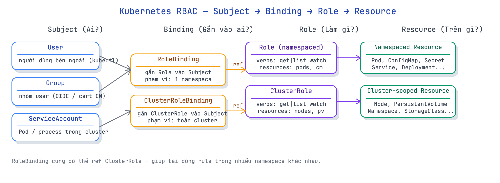

# 14 · RBAC & Security — ai được làm gì trong cluster

> **Chặng 2 · ◻ chưa mở** — [◈ Bảng tiến độ](../../wiki/notebook/k8s/sessions/learning-plan.md) · trước: Scheduling · kế tiếp: kubeadm — dựng cụm · [course-catalog](../../wiki/notebook/k8s/course-catalog.md)

**Mục tiêu:** hiểu mô hình RBAC (Subject → Binding → Role → Resource); tạo ServiceAccount riêng cho workload; viết Role/ClusterRole đúng nguyên tắc least-privilege; kiểm tra quyền bằng `kubectl auth can-i`; và thêm SecurityContext để Pod không chạy với quyền root.

**Nền:** đã thạo Service, ConfigMap/Secret, Deployment — RBAC là lớp bảo vệ đặt trên các resource đó. Trong mọi cluster production, mặc định `default` ServiceAccount không có quyền gì cụ thể; mọi workload cần quyền phải được cấp tường minh.

## Tiền đề
Kiểm tra context và quyền hiện tại trước khi bắt đầu:

```bash
kubectl config current-context        # xác nhận đang dùng cụm lab, không phải prod
kubectl auth can-i --list             # liệt kê mọi quyền của user hiện tại (admin)
kubectl auth can-i create pods        # test nhanh 1 quyền cụ thể
```

**Kết quả:**
```text
$ kubectl config current-context
kind-kind                              ← hoặc orbstack, minikube — miễn không phải prod

$ kubectl auth can-i --list | head -6
Resources                                       Non-Resource URLs   Resource Names   Verbs
*.*                                             []                  []               [*]
                                                [*]                 []               [*]
...
→ user hiện tại là cluster-admin, có mọi quyền.

$ kubectl auth can-i create pods
yes
```

Tạo namespace demo dùng xuyên suốt lab:

```bash
kubectl create namespace demo
kubectl config set-context --current --namespace=demo   # đặt default ns = demo
```

---

## 1. Mô hình RBAC — Subject · Verb · Resource

**Chốt:** RBAC trả lời 3 câu hỏi: **Ai** (Subject) — **làm gì** (Verb: get/list/create/delete) — **trên cái gì** (Resource). Role là tập quyền; Binding gắn Role vào Subject.

- **Subject** — ai thực hiện hành động: `User` (người dùng bên ngoài, định danh từ cert/OIDC), `Group` (nhóm user), `ServiceAccount` (Pod/process trong cluster).
- **Verb** — hành động: `get`, `list`, `watch`, `create`, `update`, `patch`, `delete`, `deletecollection`. Dùng `*` = tất cả.
- **Resource** — đối tượng bị tác động: `pods`, `services`, `configmaps`, `nodes`, `persistentvolumes`…
- **Role** = tập hợp rules (verb × resource), chỉ có hiệu lực trong 1 namespace.
- **ClusterRole** = như Role nhưng cluster-scoped: áp cho cả cluster hoặc các resource không có namespace (node, pv, namespace).
- **RoleBinding** = gắn Role (hoặc ClusterRole) vào Subject trong 1 namespace cụ thể.
- **ClusterRoleBinding** = gắn ClusterRole vào Subject trên toàn cluster.

**Vì sao:** trước RBAC (K8s < 1.8), bất kỳ process nào trong cluster đều có thể đọc mọi secret, liệt kê mọi node — một lỗ hổng lớn. RBAC triển khai nguyên tắc least-privilege: Pod chỉ có đúng quyền nó cần, không hơn. Ngay cả khi container bị chiếm, attacker không tự động có quyền truy cập toàn cluster.

**Cơ chế:** mỗi request tới API server mang thông tin Subject (lấy từ kubeconfig cert hoặc ServiceAccount token). API server tra RBAC: có Binding nào gắn Subject này với Role cho phép verb × resource này không? Nếu không có → 403 Forbidden.

> 💡 **Ẩn dụ:** cluster là tòa nhà văn phòng. Role = thẻ giấy phép ghi "được vào phòng A, được photo nhưng không được ký hợp đồng". RoleBinding = trao thẻ đó cho một người cụ thể. Người không có thẻ → bảo vệ chặn lại (403).

| Loại | Phạm vi | Dùng cho |
|------|---------|---------|
| Role | 1 namespace | resource namespaced (pod, svc, cm…) |
| ClusterRole | toàn cluster | resource cluster-scoped (node, pv) hoặc dùng lại nhiều namespace |
| RoleBinding | 1 namespace | gắn Role/ClusterRole vào Subject trong ns đó |
| ClusterRoleBinding | toàn cluster | gắn ClusterRole vào Subject cho toàn cluster |

**Dùng / không dùng:**
- Luôn bắt đầu từ Role + RoleBinding (namespaced) trừ khi cần cluster-scoped resource.
- **Phản đề:** dùng ClusterRoleBinding cho workload chỉ cần đọc pod trong 1 namespace = over-permissive, sai về nguyên tắc. Dùng RoleBinding ref ClusterRole thay thế.



**Làm:**
```bash
# xem Role mặc định K8s tạo sẵn (cluster-admin, view, edit, admin...)
kubectl get clusterroles | grep -v system: | head -10

# xem ClusterRoleBinding của kube-system
kubectl get clusterrolebindings | grep system:node | head -5
```

**Kết quả:**
```text
$ kubectl get clusterroles | grep -v system: | head -10
NAME                                               CREATED AT
admin                                              2025-01-10T08:00:00Z
cluster-admin                                      2025-01-10T08:00:00Z
edit                                               2025-01-10T08:00:00Z
view                                               2025-01-10T08:00:00Z
...

$ kubectl get clusterrolebindings | grep system:node | head -5
system:node                  ClusterRole/system:node   ...
```
→ **Verify:** thấy 4 built-in role (`admin`, `cluster-admin`, `edit`, `view`) — đây là ClusterRole K8s tự tạo, có thể tái dùng.

---

## 2. ServiceAccount

**Chốt:** ServiceAccount (SA) là identity cho Pod/process **bên trong** cluster. Mỗi namespace có SA `default` tự động; K8s mount token của SA vào Pod tại `/var/run/secrets/kubernetes.io/serviceaccount/`. SA khác hoàn toàn với `User` — SA là object K8s có thể tạo/xóa, User không.

- Mỗi namespace có `default` SA được K8s tự tạo.
- Pod không khai báo SA → K8s gán `default` SA.
- Token SA được mount vào Pod, app dùng token này để gọi API server.
- SA **không** có quyền gì đặc biệt theo mặc định (từ K8s 1.22+, `automountServiceAccountToken` là `true` nhưng token đó không được bind vào Role nào).
- `User` là danh tính từ cert/OIDC, không có object K8s — không thể `kubectl get user`.

**Vì sao:** Pod cần gọi API server (xem config, đọc secret, watch resource khác) thì cần identity. SA cung cấp identity đó với scope rõ ràng (namespace-local), có thể audit và revoke. Nếu Pod chiếm được, attacker chỉ có quyền của SA — không phải quyền của cluster-admin như user kubectl.

**Cơ chế:** kubelet mount secret chứa token JWT vào container tại đường dẫn cố định. App (hoặc client library như `client-go`) tự động đọc token này khi gọi API server. Từ K8s 1.21+ token là bound service account token — có thời hạn, gắn với Pod cụ thể, không dùng được ở Pod khác.

> 💡 **Ẩn dụ:** SA = thẻ nhân viên công ty. Token mount vào Pod = thẻ nhân viên cấp cho phòng ban đó. Thẻ hết hạn → kubelet xoay token mới (bound token). Thẻ bị mất → không dùng được ở phòng ban khác.

| | ServiceAccount | User |
|---|---|---|
| Là object K8s? | Có (`kubectl get sa`) | Không |
| Phạm vi | namespace | cluster (cert/OIDC) |
| Dùng cho | Pod, process trong cluster | `kubectl` từ ngoài cluster |
| Tạo/xóa được | Có | Không (cert revocation) |

**Dùng / không dùng:**
- Luôn tạo SA riêng cho mỗi workload thay vì dùng `default` SA.
- **Phản đề:** dùng `default` SA cho tất cả = mọi Pod trong namespace có chung identity → khi một Pod bị chiếm thì tất cả SA của namespace bị ảnh hưởng.

**Làm:**
```bash
# xem SA mặc định của namespace demo
kubectl get serviceaccount -n demo

# tạo SA riêng cho workload đọc pod
kubectl create serviceaccount reader -n demo

# xem token mount point (describe sa)
kubectl describe sa reader -n demo
```

**Kết quả:**
```text
$ kubectl get serviceaccount -n demo
NAME      SECRETS   AGE
default   0         2m

$ kubectl create serviceaccount reader -n demo
serviceaccount/reader created

$ kubectl describe sa reader -n demo
Name:                reader
Namespace:           demo
Labels:              <none>
Annotations:         <none>
Image pull secrets:  <none>
Mountable secrets:   <none>
Tokens:              <none>
Events:              <none>
```
→ **Verify:** `reader` SA tạo thành công; `Tokens: <none>` vì từ K8s 1.24+ không tự tạo long-lived token — token được tạo on-demand khi Pod chạy.

---

## 3. Role & RoleBinding (namespaced)

**Chốt:** Role định nghĩa tập verb × resource trong 1 namespace; RoleBinding gắn Role đó vào Subject. Hai object này luôn đi cùng nhau — Role không tự có tác dụng nếu không có Binding.

- Role: khai báo `rules[]` gồm `apiGroups`, `resources`, `verbs`.
- `apiGroups: [""]` = core API (pod, service, configmap…); `["apps"]` = Deployment/ReplicaSet; `["batch"]` = Job.
- RoleBinding: khai báo `subjects[]` (ai) và `roleRef` (role nào).
- `resourceNames: ["my-config"]` = giới hạn chỉ resource có tên cụ thể — fine-grained control.

**Vì sao:** namespace là đơn vị isolation cơ bản trong K8s. Role + RoleBinding đảm bảo chính sách quyền không rò ra ngoài namespace — workload của team A không đọc được secret của team B dù cùng cluster.

**Cơ chế:** khi SA `reader` (namespace `demo`) gọi API server với token, API server tra: có RoleBinding nào trong namespace `demo` bind `reader` vào Role cho phép `get pods` không? Nếu có → 200 OK, nếu không → 403.

> 💡 **Ẩn dụ:** Role = nội quy phòng (ai vào phòng này được làm gì). RoleBinding = trao thẻ ra vào cho nhân viên cụ thể. Hai thứ phải đồng thời tồn tại mới có hiệu lực.

**Dùng / không dùng:**
- Dùng `--dry-run=client -o yaml` để xem YAML trước khi tạo thật.
- **Phản đề:** verb `*` hoặc resource `*` trong Role = trao toàn quyền trong namespace, phá vỡ least-privilege. Chỉ dùng khi thật sự cần (role `admin`).

**Làm:**
```bash
# tạo Role cho phép get/list pod trong namespace demo
kubectl create role pod-reader \
  --verb=get,list,watch \
  --resource=pods \
  -n demo \
  --dry-run=client -o yaml

# áp thật
kubectl create role pod-reader \
  --verb=get,list,watch \
  --resource=pods \
  -n demo

# bind Role vào SA reader
kubectl create rolebinding reader-binding \
  --role=pod-reader \
  --serviceaccount=demo:reader \
  -n demo

# xem YAML của Role vừa tạo
kubectl get role pod-reader -n demo -o yaml
```

**Kết quả:**
```text
$ kubectl create role pod-reader --verb=get,list,watch --resource=pods -n demo --dry-run=client -o yaml
apiVersion: rbac.authorization.k8s.io/v1
kind: Role
metadata:
  name: pod-reader
  namespace: demo
rules:
- apiGroups:
  - ""
  resources:
  - pods
  verbs:
  - get
  - list
  - watch

$ kubectl create rolebinding reader-binding \
  --role=pod-reader --serviceaccount=demo:reader -n demo
rolebinding.rbac.authorization.k8s.io/reader-binding created

$ kubectl get role pod-reader -n demo -o yaml
apiVersion: rbac.authorization.k8s.io/v1
kind: Role
metadata:
  name: pod-reader
  namespace: demo
  namespace: demo
rules:
- apiGroups: [""]
  resources: ["pods"]
  verbs: ["get", "list", "watch"]
```
→ **Verify:** Role tạo thành công, RoleBinding tạo thành công. Kiểm tra ngay bước tiếp.

---

## 4. ClusterRole & ClusterRoleBinding + auth can-i

**Chốt:** ClusterRole áp trên toàn cluster — dùng cho resource cluster-scoped (node, pv, namespace) hoặc để tái dùng rule trên nhiều namespace. `kubectl auth can-i` là lệnh thiết yếu để test quyền trước và sau khi bind, tránh phải deploy app mới để kiểm tra.

- ClusterRole không thuộc namespace nào.
- `kubectl auth can-i <verb> <resource> --as=system:serviceaccount:<ns>:<sa>` — test quyền thay mặt SA khác, không cần phải là SA đó.
- `--as` flag chỉ hoạt động nếu user hiện tại có quyền impersonate (cluster-admin có).
- Built-in ClusterRole `view` = read-only mọi resource namespaced; `edit` = read-write; `admin` = quản lý trong 1 namespace; `cluster-admin` = toàn quyền.

**Vì sao:** thay vì tạo Role giống nhau ở 10 namespace, tạo 1 ClusterRole rồi dùng RoleBinding trong mỗi namespace để ref nó. Node, PersistentVolume, Namespace không thuộc namespace nào → phải dùng ClusterRole. `auth can-i` cho phép verify policy mà không cần chạy app — tiết kiệm thời gian debug.

**Cơ chế:** ClusterRoleBinding gắn Subject (SA, User, Group) với ClusterRole ở tầng cluster. RoleBinding cũng có thể ref ClusterRole nhưng giới hạn phạm vi vào 1 namespace — đây là pattern chuẩn để share rule mà không share scope.

> 💡 **Ẩn dụ:** ClusterRole = quy định chung của công ty ("nhân viên IT được truy cập server room"). RoleBinding ref ClusterRole = "IT team của chi nhánh Hà Nội được vào phòng máy Hà Nội" — dùng quy định chung nhưng giới hạn địa bàn.

| Binding type | ref Role | ref ClusterRole | Phạm vi |
|---|---|---|---|
| RoleBinding | Role cùng ns | ClusterRole | 1 namespace |
| ClusterRoleBinding | — | ClusterRole | Toàn cluster |

**Dùng / không dùng:**
- Ưu tiên RoleBinding ref ClusterRole hơn ClusterRoleBinding cho workload namespaced.
- ClusterRoleBinding chỉ khi SA thật sự cần scope toàn cluster (monitoring, node-exporter).
- **Phản đề:** gán `cluster-admin` ClusterRoleBinding cho SA của app thường = trao chìa khóa toàn bộ cluster — lỗi bảo mật nghiêm trọng, thường gặp ở cấu hình Helm chart lười.

**Làm:**
```bash
# test quyền của SA reader TRƯỚC khi bind thêm gì
kubectl auth can-i get pods \
  --as=system:serviceaccount:demo:reader -n demo

kubectl auth can-i list nodes \
  --as=system:serviceaccount:demo:reader

# tạo ClusterRole cho phép xem node (cluster-scoped resource)
kubectl create clusterrole node-viewer \
  --verb=get,list,watch \
  --resource=nodes

# bind ClusterRole vào SA reader — ClusterRoleBinding (toàn cluster)
kubectl create clusterrolebinding reader-node-binding \
  --clusterrole=node-viewer \
  --serviceaccount=demo:reader

# test lại
kubectl auth can-i get pods \
  --as=system:serviceaccount:demo:reader -n demo

kubectl auth can-i list nodes \
  --as=system:serviceaccount:demo:reader

kubectl auth can-i delete pods \
  --as=system:serviceaccount:demo:reader -n demo
```

**Kết quả:**
```text
# TRƯỚC khi bind gì thêm:
$ kubectl auth can-i get pods --as=system:serviceaccount:demo:reader -n demo
yes                              ← RoleBinding pod-reader đã bind ở bước trước

$ kubectl auth can-i list nodes --as=system:serviceaccount:demo:reader
no                               ← chưa có ClusterRole node-viewer

# SAU khi bind ClusterRole node-viewer:
$ kubectl auth can-i list nodes --as=system:serviceaccount:demo:reader
yes                              ← ClusterRoleBinding có hiệu lực

$ kubectl auth can-i delete pods --as=system:serviceaccount:demo:reader -n demo
no                               ← không có verb delete trong pod-reader Role
```
→ **Verify:** kết quả khớp chính xác với policy đã bind — `yes` cho get/list pods và list nodes, `no` cho delete pods và mọi thứ chưa được cấp.

---

## 5. SecurityContext

**Chốt:** SecurityContext kiểm soát bảo mật ở tầng OS cho container — chạy user gì, có quyền root không, filesystem read-only không, capability nào được giữ. Đây là lớp hardening quan trọng nhất sau RBAC.

- **`runAsNonRoot: true`** — từ chối container chạy process root (UID 0). Nếu image có default user root → Pod fail `CreateContainerConfigError`.
- **`runAsUser: <uid>`** — ép container chạy với UID cụ thể.
- **`readOnlyRootFilesystem: true`** — filesystem của container read-only, ghi phải vào volume — ngăn attacker ghi file malicious.
- **`allowPrivilegeEscalation: false`** — ngăn process leo thang đặc quyền (setuid bit, sudo).
- **`capabilities.drop: ["ALL"]`** — bỏ mọi Linux capability (CAP_NET_ADMIN, CAP_SYS_PTRACE…); thêm lại capability cần thiết bằng `add`.
- SecurityContext có 2 cấp: **Pod-level** (`spec.securityContext`) và **container-level** (`spec.containers[].securityContext`). Container-level override Pod-level.

**Vì sao:** RBAC bảo vệ API server, SecurityContext bảo vệ bên trong container — hai lớp độc lập. Attacker vào được container (qua app vuln) mà container chạy root = có thể leo thang ra node. Container chạy non-root + readOnly + drop ALL = attacker bị giới hạn trong sandbox. Đây là tiêu chuẩn CIS Kubernetes Benchmark và PodSecurity Standard `restricted`.

**Cơ chế:** kubelet truyền `securityContext` xuống container runtime (containerd). Runtime dùng `runc` để set Linux user namespace, mount namespace (readOnly), và `seccomp`/capability bitmask trước khi bắt đầu process. Nếu image entrypoint chạy UID 0 mà `runAsNonRoot: true` → runtime từ chối khởi tạo container.

> 💡 **Ẩn dụ:** RBAC = quyền truy cập tòa nhà. SecurityContext = quy định trong phòng làm việc: chỉ được ngồi ghế của mình, không được mở két, không được cài phần mềm — ngay cả khi đã vào được phòng.

**Dùng / không dùng:**
- `runAsNonRoot: true` + `allowPrivilegeEscalation: false` + `capabilities.drop: ["ALL"]` = bộ 3 bắt buộc cho mọi workload production.
- `readOnlyRootFilesystem: true` thêm nếu app không cần ghi vào `/tmp` hoặc local dir.
- **Phản đề:** image bên thứ ba (database, cache) thường cần chạy root hoặc cần capability — đọc kỹ image docs trước khi drop ALL; override bằng `capabilities.add` chỉ những gì cần thiết, không tắt drop.

**Làm:**
```bash
# thử chạy Pod với runAsNonRoot=true dùng image nginx (mặc định chạy root)
cat > /tmp/sc-nonroot.yml <<'EOF'
apiVersion: v1
kind: Pod
metadata:
  name: secure-nginx
  namespace: demo
spec:
  securityContext:
    runAsNonRoot: true
  containers:
  - name: web
    image: nginx:alpine
EOF

kubectl apply -f /tmp/sc-nonroot.yml
# đợi 5s rồi xem trạng thái
sleep 5
kubectl get pod secure-nginx -n demo
kubectl describe pod secure-nginx -n demo | grep -A5 "Warning"

# thử với image chạy non-root thật sự (nginx unprivileged)
cat > /tmp/sc-secure.yml <<'EOF'
apiVersion: v1
kind: Pod
metadata:
  name: secure-web
  namespace: demo
spec:
  securityContext:
    runAsNonRoot: true
    runAsUser: 101
  containers:
  - name: web
    image: nginxinc/nginx-unprivileged:alpine
    securityContext:
      allowPrivilegeEscalation: false
      readOnlyRootFilesystem: false    # nginx-unprivileged cần ghi cache
      capabilities:
        drop: ["ALL"]
EOF

kubectl apply -f /tmp/sc-secure.yml
kubectl get pod secure-web -n demo -w
```

**Kết quả:**
```text
# secure-nginx: nginx mặc định chạy root → bị từ chối
$ kubectl get pod secure-nginx -n demo
NAME           READY   STATUS                       RESTARTS   AGE
secure-nginx   0/1     CreateContainerConfigError   0          6s

$ kubectl describe pod secure-nginx -n demo | grep -A5 "Warning"
  Warning  Failed  5s  kubelet  Error: container has runAsNonRoot and image will run as root
                                       (pod: "secure-nginx_demo(...)", container: web)

# secure-web: nginx-unprivileged chạy UID 101 → OK
$ kubectl get pod secure-web -n demo -w
NAME         READY   STATUS              RESTARTS   AGE
secure-web   0/1     ContainerCreating   0          3s
secure-web   1/1     Running             0          6s   ← Running với non-root
```
→ **Verify:** `secure-nginx` mắc `CreateContainerConfigError` do image root + `runAsNonRoot: true`; `secure-web` với image non-root chạy bình thường. Đây là lý do tại sao phải chọn image non-root ngay từ đầu.

---

## 🧹 Dọn dẹp

```bash
kubectl delete pod secure-nginx secure-web -n demo --ignore-not-found
kubectl delete rolebinding reader-binding -n demo --ignore-not-found
kubectl delete clusterrolebinding reader-node-binding --ignore-not-found
kubectl delete role pod-reader -n demo --ignore-not-found
kubectl delete clusterrole node-viewer --ignore-not-found
kubectl delete serviceaccount reader -n demo --ignore-not-found
kubectl delete namespace demo
```

---

## ✅ Đủ khi

① Giải thích được 3 câu hỏi RBAC (Subject/Verb/Resource) và sự khác biệt Role vs ClusterRole, RoleBinding vs ClusterRoleBinding.
② Tạo được SA riêng cho workload và giải thích tại sao không dùng `default` SA.
③ Viết được Role + RoleBinding từ đầu (imperative hoặc YAML) và verify bằng `kubectl auth can-i`.
④ Phân biệt khi nào dùng ClusterRole (cluster-scoped resource) vs Role (namespaced); khi nào bind bằng RoleBinding ref ClusterRole.
⑤ Khai báo SecurityContext với `runAsNonRoot`, `allowPrivilegeEscalation: false`, `capabilities.drop: ["ALL"]`; biết tại sao `CreateContainerConfigError` xảy ra và cách sửa.

---

## 🧠 Recall

**Câu hỏi 1 → 10** (đọc và trả lời trước khi xem đáp án):

1. RBAC trả lời 3 câu hỏi gì? Cho ví dụ Subject/Verb/Resource cụ thể.
2. ServiceAccount khác User ở điểm nào? SA có phải object K8s không?
3. Token SA được mount vào Pod ở đường dẫn nào? Dùng để làm gì?
4. Role và ClusterRole khác nhau thế nào? Cho ví dụ resource chỉ ClusterRole mới quản được.
5. RoleBinding ref ClusterRole khác ClusterRoleBinding ở điểm quan trọng nào?
6. Lệnh nào để test quyền của một SA mà không cần chạy Pod? Cú pháp đầy đủ?
7. `runAsNonRoot: true` hoạt động thế nào? Image nào sẽ fail với cờ này?
8. `readOnlyRootFilesystem: true` ngăn điều gì cụ thể?
9. `capabilities.drop: ["ALL"]` ảnh hưởng gì đến container? Khi nào cần `add` lại?
10. SecurityContext Pod-level và container-level khác gì? Cái nào ưu tiên hơn?

### Đáp án

1. **Ai** (Subject: User/Group/ServiceAccount) — **làm gì** (Verb: get/list/create/delete…) — **trên cái gì** (Resource: pods/nodes/configmaps…). Ví dụ: SA `reader` (ai) → `get,list` (làm gì) → `pods` (trên cái gì) trong namespace `demo`.

2. SA là object K8s (`kubectl get serviceaccount`) thuộc namespace, dùng cho process trong cluster. User không phải object K8s — định danh từ cert TLS hoặc OIDC token, không `kubectl get user` được.

3. `/var/run/secrets/kubernetes.io/serviceaccount/token` (cùng thư mục có `ca.crt` và `namespace`). App dùng token này để xác thực khi gọi API server.

4. Role giới hạn trong 1 namespace; ClusterRole áp toàn cluster. Resource cluster-scoped (Node, PersistentVolume, Namespace, StorageClass) không thuộc namespace nào → phải dùng ClusterRole để quản.

5. RoleBinding ref ClusterRole giữ phạm vi **chỉ trong 1 namespace** dù dùng ClusterRole. ClusterRoleBinding áp trên **toàn cluster**. Pattern chuẩn: dùng RoleBinding ref ClusterRole để tái dùng rule mà không mở rộng scope.

6. `kubectl auth can-i <verb> <resource> --as=system:serviceaccount:<namespace>:<sa-name> [-n <namespace>]`. Ví dụ: `kubectl auth can-i get pods --as=system:serviceaccount:demo:reader -n demo`.

7. Kubelet kiểm tra UID process trong image. Image dùng `USER root` (UID 0) → bị từ chối với lỗi `CreateContainerConfigError`. Image dùng `USER 101` hoặc bất kỳ UID ≠ 0 → cho qua.

8. Ngăn process trong container ghi vào filesystem của container (overlay layer). Attacker không thể cài binary, ghi script, hoặc thay đổi file trong rootfs. Ghi vào volume mount vẫn được nếu volume cho phép.

9. Bỏ mọi Linux capability (CAP_NET_ADMIN, CAP_SYS_PTRACE, CAP_CHOWN…) — container chỉ làm được các syscall cơ bản. Cần add lại khi app thật sự cần: ví dụ `NET_BIND_SERVICE` để bind cổng < 1024, `SYS_PTRACE` để debug.

10. Pod-level (`spec.securityContext`) áp cho tất cả container trong Pod (runAsUser, fsGroup…). Container-level (`spec.containers[].securityContext`) override Pod-level cho container đó. Container-level ưu tiên hơn.

---

## Bắc cầu sang production

Trong môi trường production, nguyên tắc cốt lõi:

- **Mỗi workload có SA riêng** — không dùng `default` SA, không share SA giữa app khác nhau. Khi cần audit "ai đã gọi API gì lúc mấy giờ" thì SA riêng mới cho log có ý nghĩa.
- **Bind RoleBinding ref ClusterRole thay vì ClusterRoleBinding** cho workload namespaced — tái dùng rule mà không mở rộng scope toàn cluster.
- **SecurityContext non-root là chuẩn hardening tối thiểu** — `runAsNonRoot: true` + `allowPrivilegeEscalation: false` + `capabilities.drop: ["ALL"]` là baseline. PodSecurity admission `restricted` profile enforce các rule này tự động.
- Dùng `kubectl auth can-i` và `kubectl auth reconcile` để kiểm tra policy trước khi deploy; tích hợp vào CI/CD pipeline.
- Rotate và audit RBAC binding định kỳ — binding cũ của team rời đi thường bị quên, là nguồn rủi ro.

---

## 📎 Nguồn & xem lại

- [course-catalog](../../wiki/notebook/k8s/course-catalog.md) — tổng quan lộ trình và tham chiếu bài giảng.
- Thư mục `course/` trong repo — video và slide gốc của khoá học.
- K8s docs: [Authorization/RBAC](https://kubernetes.io/docs/reference/access-authn-authz/rbac/), [Security Context](https://kubernetes.io/docs/tasks/configure-pod-container/security-context/).
