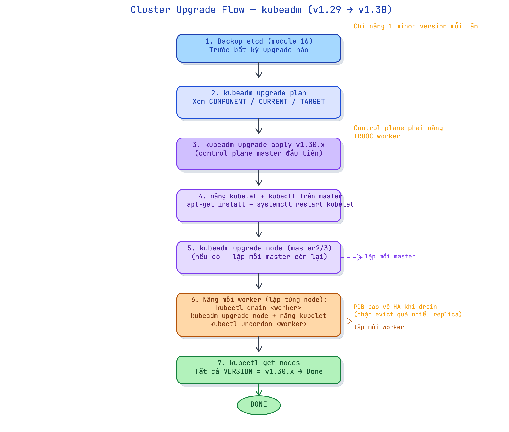

# 17 · Cluster upgrade + node maintenance — nâng cấp có kỷ luật

> **Chặng 7 · ◻ chưa mở** — [◈ Bảng tiến độ](../../wiki/notebook/k8s/sessions/learning-plan.md) · trước: etcd backup & restore · kế tiếp: Troubleshooting cụm · [course-catalog](../../wiki/notebook/k8s/course-catalog.md)

**Mục tiêu:** hiểu version skew policy (tại sao chỉ nâng 1 minor mỗi lần, thứ tự control plane trước); thực hành drain node an toàn với PodDisruptionBudget; chạy quy trình `kubeadm upgrade` đầu-cuối trên cụm multi-node; verify cụm hoàn toàn ở version mới sau upgrade; biết fallback khi upgrade hỏng là restore etcd.
**Nền:** đã dựng cụm kubeadm multi-node (module 15) và biết backup/restore etcd (module 16). Upgrade K8s = thao tác nguy hiểm nhất trên cluster — backup trước, hiểu thứ tự trước, làm sau.

> ⚠ **Lưu ý:** dùng cụm multipass ở **lab 15** (cấu hình gọn 1 master + 2 worker × 2 GB rất hợp bài này trên Mac Mini M4 24 GB — xem "Lưu ý phần cứng" đầu lab 15). **Output là MẪU chuẩn theo hành vi thật — CHƯA chạy trên máy bạn; verify lại version/số thật khi upgrade.**

## Tiền đề
Cụm đang chạy Kubernetes v1.29.x — mục tiêu nâng lên v1.30.x. Trước khi bắt đầu bất kỳ bước nào trong lab này, **backup etcd** (module 16):

```bash
# Trên control-plane node — backup snapshot etcd
sudo ETCDCTL_API=3 etcdctl snapshot save /tmp/etcd-before-upgrade.db \
  --endpoints=https://127.0.0.1:2379 \
  --cacert=/etc/kubernetes/pki/etcd/ca.crt \
  --cert=/etc/kubernetes/pki/etcd/server.crt \
  --key=/etc/kubernetes/pki/etcd/server.key

sudo ETCDCTL_API=3 etcdctl snapshot status /tmp/etcd-before-upgrade.db --write-out=table
```

```text
+----------+----------+------------+------------+
|   HASH   | REVISION | TOTAL KEYS | TOTAL SIZE |
+----------+----------+------------+------------+
| 4a71e9bf |    12847 |       1243 |     3.5 MB |
+----------+----------+------------+------------+
```

Nếu mọi thứ hỏng sau upgrade → `etcdctl snapshot restore` (module 16) để quay lại. Không có backup = không có đường lùi.

---

## 1. Version skew policy

**Chốt:** Kubernetes áp đặt **version skew** nghiêm ngặt — kubelet không được mới hơn apiserver; `kubectl` lệch tối đa ±1 minor so với apiserver; mỗi lần chỉ nâng **1 minor version** (không nhảy từ 1.29 lên 1.31); control plane phải nâng **trước** worker.

- **Skew rule cốt lõi:** `kubelet` trên node chỉ được cũ hơn `kube-apiserver` tối đa **2 minor** (từ 1.27+), không được mới hơn.
- **Nâng 1 minor mỗi lần:** không bỏ bước (1.28 → 1.29 → 1.30, không nhảy 1.28 → 1.30). kubeadm chặn cứng khi phát hiện nhảy minor.
- **Thứ tự bắt buộc:** control plane (kube-apiserver, controller-manager, scheduler, etcd) nâng trước; sau đó mới nâng kubelet/kubectl trên từng node.
- `kubectl` có thể lệch ±1 minor so với apiserver — dùng tạm `kubectl` cũ để quản lý apiserver mới vẫn hoạt động trong upgrade window.

**Vì sao:** apiserver là điểm tập trung mọi API call. Nếu kubelet mới hơn apiserver, kubelet có thể gửi field/opcode mà apiserver chưa hiểu → race condition và undefined behavior. Ngược lại, apiserver mới có thể giữ backward compatibility với kubelet cũ trong phạm vi 2 minor — đây là lý do cho phép skew có kiểm soát thay vì đòi upgrade đồng bộ toàn cụm (zero-downtime rolling upgrade).

**Cơ chế:** mỗi component K8s đăng ký version của nó với API server khi khởi động. `kubeadm upgrade plan` đọc các version hiện tại qua API, so sánh với stable release mới nhất trên `dl.k8s.io`, và tính xem nâng component nào theo thứ tự nào. kubeadm từ chối `upgrade apply` nếu bạn cố nhảy > 1 minor.

> **Ẩn dụ:** control plane là tổng đài điện thoại — phải nâng cấp tổng đài trước, rồi mới đổi máy lẻ từng phòng. Nếu đổi máy lẻ mà tổng đài còn cũ, máy lẻ mới sẽ gọi theo giao thức tổng đài không hiểu.

| Component | Phiên bản tối đa so với kube-apiserver |
|---|---|
| kube-apiserver | N (chuẩn, nâng trước) |
| kube-controller-manager | N-1 (minor) |
| kube-scheduler | N-1 (minor) |
| kubelet (trên node) | N-2 (minor, mới hơn là KHÔNG được) |
| kubectl | N±1 (minor) |

**Dùng / không dùng:**
- Mỗi lần maintenance, nâng đúng 1 minor: v1.29 → v1.30; không bao giờ v1.29 → v1.31.
- Giữ kubectl trong ±1 minor của apiserver — tiện dùng kubectl mới hơn apiserver 1 bước khi chuẩn bị upgrade.
- **Phản đề:** một số distro (EKS managed node group, GKE autopilot) tự động upgrade và cho phép worker lag thêm 1-2 minor vì họ kiểm soát được skew window. Trên self-managed kubeadm, làm tay theo đúng thứ tự — không được tự suy rộng.

**Làm:**
```bash
# Kiểm tra version hiện tại của tất cả node
kubectl get nodes -o wide

# Xem version apiserver và các component control plane
kubectl version --short 2>/dev/null || kubectl version
```

**Kết quả:**
```text
$ kubectl get nodes -o wide
NAME           STATUS   ROLES           AGE   VERSION   INTERNAL-IP   OS-IMAGE
control-plane  Ready    control-plane   12d   v1.29.3   10.0.0.10     Ubuntu 22.04
worker-1       Ready    <none>          12d   v1.29.3   10.0.0.11     Ubuntu 22.04
worker-2       Ready    <none>          12d   v1.29.3   10.0.0.12     Ubuntu 22.04

$ kubectl version
Client Version: v1.29.3
Server Version: v1.29.3
```
→ **Verify:** tất cả 3 node đang ở v1.29.x, apiserver đồng phiên bản với kubelet trên các node.



---

## 2. drain + PodDisruptionBudget

**Chốt:** `kubectl drain <node>` evict toàn bộ Pod trên node đó (trừ DaemonSet) trước khi bảo trì; `PodDisruptionBudget (PDB)` chặn drain không được phá quá nhiều replica cùng lúc — đảm bảo app vẫn có đủ Pod phục vụ traffic; `kubectl uncordon <node>` cho phép scheduler đặt Pod trở lại.

- `kubectl cordon <node>`: đánh dấu node `SchedulingDisabled` — scheduler không đặt Pod mới, Pod hiện tại vẫn chạy.
- `kubectl drain <node> --ignore-daemonsets --delete-emptydir-data`: evict tất cả Pod không phải DaemonSet; Pod DaemonSet bỏ qua (chúng sẽ tự nâng khi kubelet nâng); `--delete-emptydir-data` bắt buộc nếu Pod có `emptyDir` volume (dữ liệu sẽ mất — chấp nhận với Pod stateless).
- **PodDisruptionBudget:** object K8s chỉ định `minAvailable` (số Pod tối thiểu còn sống) hoặc `maxUnavailable` (số Pod tối đa được down) khi evict. Nếu drain vi phạm PDB → K8s **từ chối evict**, drain bị chặn.
- `kubectl uncordon <node>`: bỏ taint `SchedulingDisabled`, node nhận Pod mới trở lại.

**Vì sao:** không drain thì kubelet trên node khi restart sẽ dừng đột ngột — Pod đang chạy mất kết nối giữa chừng, traffic bị drop. Drain cho controller thời gian reschedule Pod sang node khác trước khi kubelet tắt. PDB là lớp an toàn thứ hai: dù admin gõ drain cả 3 node cùng lúc, K8s vẫn chặn nếu đó sẽ phá vỡ `minAvailable`.

**Cơ chế:** `kubectl drain` gọi **Eviction API** (không phải xóa Pod thẳng). Eviction API kiểm tra PDB trước khi cho phép evict từng Pod — nếu evict Pod đó sẽ vi phạm PDB, API trả 429 Too Many Requests và kubectl chờ thêm. `cordon` ghi taint `node.kubernetes.io/unschedulable` vào node object; scheduler skip node có taint này khi bind Pod mới.

> **Ẩn dụ:** drain = bảo khách rời tầng trước khi sơn (evict từng người có trật tự). PDB = quy định "phải còn ít nhất 2 phòng mở" — nếu drain sẽ phá quy định đó, bảo vệ chặn cửa không cho sơn. uncordon = mở tầng trở lại sau khi xong.

**Dùng / không dùng:**
- Luôn drain trước khi bảo trì node (upgrade kubelet, reboot kernel, thêm RAM).
- Đặt PDB cho mọi Deployment có `replicas ≥ 2` chạy production traffic.
- **Phản đề:** với cụm dev 1 node, drain tự evict cả etcd và apiserver static Pod — cụm mất liên lạc hoàn toàn. Không drain control-plane node của cụm single-node; chỉ drain worker.

**Làm:**
```bash
# Tạo Deployment 3 replica + PDB minAvailable=2
kubectl create deployment web --image=nginx:alpine --replicas=3

cat > /tmp/web-pdb.yaml <<'EOF'
apiVersion: policy/v1
kind: PodDisruptionBudget
metadata:
  name: web-pdb
spec:
  minAvailable: 2
  selector:
    matchLabels:
      app: web
EOF
kubectl apply -f /tmp/web-pdb.yaml

# Xem PDB đang bảo vệ bao nhiêu Pod
kubectl get pdb web-pdb

# Thử drain worker-1 — PDB cho phép vì còn 2 replica trên worker-2
kubectl drain worker-1 --ignore-daemonsets --delete-emptydir-data

# Xem trạng thái node sau drain
kubectl get nodes

# Sau bảo trì — uncordon để nhận Pod trở lại
kubectl uncordon worker-1
```

**Kết quả:**
```text
$ kubectl get pdb web-pdb
NAME      MIN AVAILABLE   MAX UNAVAILABLE   ALLOWED DISRUPTIONS   AGE
web-pdb   2               N/A               1                     5s

$ kubectl drain worker-1 --ignore-daemonsets --delete-emptydir-data
node/worker-1 cordoned
evicting pod default/web-7d9f4b6c8d-xkp2m
pod/web-7d9f4b6c8d-xkp2m evicted
node/worker-1 drained

$ kubectl get nodes
NAME           STATUS                     ROLES           AGE   VERSION
control-plane  Ready                      control-plane   12d   v1.29.3
worker-1       Ready,SchedulingDisabled   <none>          12d   v1.29.3
worker-2       Ready                      <none>          12d   v1.29.3

$ kubectl uncordon worker-1
node/worker-1 uncordoned
```
→ **Verify:** `ALLOWED DISRUPTIONS=1` xác nhận PDB cho phép tối đa 1 Pod down; drain in `evicting pod ...` rồi `drained`; sau drain node STATUS=`SchedulingDisabled`; sau uncordon trở lại `Ready`.

Thử vi phạm PDB — drain worker-2 trong khi worker-1 vẫn đang drain (cả 2 cùng lúc):
```bash
# Drain worker-1 lần nữa (cordon trước), rồi thử drain worker-2
kubectl drain worker-1 --ignore-daemonsets --delete-emptydir-data
kubectl drain worker-2 --ignore-daemonsets --delete-emptydir-data
```

```text
$ kubectl drain worker-2 --ignore-daemonsets --delete-emptydir-data
node/worker-2 cordoned
evicting pod default/web-7d9f4b6c8d-r9tx1
error when evicting pods/"web-7d9f4b6c8d-r9tx1" -n "default" (will retry after 5s):
Cannot evict pod as it would violate the pod's disruption budget.
```
→ **Verify:** K8s từ chối evict vì `minAvailable=2` mà đã chỉ còn 1 replica chạy — PDB hoạt động đúng.

---

## 3. Nâng control plane (master đầu tiên)

**Chốt:** nâng control plane gồm 2 bước tách biệt — (a) `kubeadm upgrade apply` nâng các static Pod system (apiserver, controller-manager, scheduler, etcd); (b) nâng package `kubelet` + `kubectl` trên node đó rồi restart. Chạy `kubeadm upgrade plan` trước để xem bản nâng khả thi và component nào thay đổi.

- Bước 0: `apt-mark unhold kubeadm && apt-get install -y kubeadm=1.30.x-*` — nâng `kubeadm` lên phiên bản mới trước; kubeadm mới sẽ điều phối nâng toàn bộ.
- `kubeadm upgrade plan`: query phiên bản stable từ internet, in bảng COMPONENT / CURRENT / TARGET và xác nhận có thể nâng không.
- `kubeadm upgrade apply v1.30.x`: nâng static Pod (`/etc/kubernetes/manifests/`) cho kube-apiserver, kube-controller-manager, kube-scheduler, etcd; cập nhật kubeconfig và certificate.
- Sau đó: nâng package `kubelet` + `kubectl`, reload daemon, restart kubelet — lúc này kubelet trên control-plane mới khớp apiserver.

**Vì sao:** `kubeadm upgrade apply` chỉ nâng các static Pod (component control plane) — kubelet vẫn là phiên bản cũ cho đến khi bạn cài package mới. K8s cho phép kubelet cũ N-2 chạy với apiserver mới N trong thời gian ngắn, nhưng phải nâng kubelet sớm để hạn chế window skew.

**Cơ chế:** kubeadm đọc `/etc/kubernetes/manifests/*.yaml` (static Pod manifest), viết lại image tag sang version mới, rồi kubelet tự-restart static Pod. Vì kubelet theo dõi thư mục `/etc/kubernetes/manifests/` qua inotify, nó phát hiện thay đổi manifest trong vài giây và pull image mới. Không có downtime apiserver nào lâu hơn vài giây trong bước này.

> **Ẩn dụ:** `kubeadm upgrade apply` là nhà thầu thay lõi máy chủ (CPU/RAM) trong khi toà nhà vẫn mở — nhanh, ít gián đoạn. Nâng `kubelet` sau đó là thay hệ thống điện trong phòng máy chủ — cần cordon trước để an toàn.

**Dùng / không dùng:**
- Chỉ chạy `upgrade apply` trên control plane đầu tiên; các control plane còn lại dùng `upgrade node` (mục 4).
- Đọc kỹ output `upgrade plan` trước — nếu thấy "Cannot upgrade: skipping minor version", dừng lại, nâng từng bước.
- **Phản đề:** đừng vừa nâng kubeadm vừa chạy workload deploy lớn — apiserver restart ngắn trong upgrade có thể làm timeout 1 số watch client tạm thời.

**Làm:**
```bash
# Trên control-plane node
# Bước 1: nâng kubeadm lên 1.30
sudo apt-mark unhold kubeadm
sudo apt-get update
sudo apt-get install -y kubeadm=1.30.3-1.1
sudo apt-mark hold kubeadm
kubeadm version

# Bước 2: xem kế hoạch upgrade
sudo kubeadm upgrade plan

# Bước 3: apply upgrade control plane
sudo kubeadm upgrade apply v1.30.3

# Bước 4: nâng kubelet + kubectl
sudo apt-mark unhold kubelet kubectl
sudo apt-get install -y kubelet=1.30.3-1.1 kubectl=1.30.3-1.1
sudo apt-mark hold kubelet kubectl
sudo systemctl daemon-reload
sudo systemctl restart kubelet

# Verify control plane node đã lên v1.30
kubectl get nodes
```

**Kết quả:**
```text
$ sudo kubeadm upgrade plan
[upgrade/config] Making sure the configuration is correct:
[preflight] Running pre-flight checks.
[upgrade] Running cluster health checks
[upgrade] Fetching available versions to upgrade to
[upgrade/versions] Cluster version: v1.29.3
[upgrade/versions] kubeadm version: v1.30.3
[upgrade/versions] Target version: v1.30.3
[upgrade/versions] Latest version in the v1.29 series: v1.29.9

Components that must be upgraded manually after you have upgraded the control plane with 'kubeadm upgrade apply':
COMPONENT   CURRENT        TARGET
kubelet     3 x v1.29.3    v1.30.3

Upgrade to the latest stable version:

COMPONENT                 CURRENT    TARGET
kube-apiserver            v1.29.3    v1.30.3
kube-controller-manager   v1.29.3    v1.30.3
kube-scheduler            v1.29.3    v1.30.3
kube-proxy                v1.29.3    v1.30.3
CoreDNS                   v1.11.1    v1.11.1
etcd                      3.5.12-0   3.5.12-0

$ sudo kubeadm upgrade apply v1.30.3
[upgrade/config] Making sure the configuration is correct:
[preflight] Running pre-flight checks.
[upgrade/health] Making sure the cluster is healthy:
[upgrade/version] You have chosen to change the cluster version to "v1.30.3"
[upgrade/versions] Cluster version: v1.29.3
[upgrade/versions] kubeadm version: v1.30.3
[upgrade/prepull] Pulling images required for setting up a Kubernetes cluster
[upgrade/apply] Upgrading your Static Pod-hosted control plane to version "v1.30.3" (timeout: 5m0s)...
[upgrade/staticpods] Writing new Static Pod manifests to "/etc/kubernetes/tmp/..."
[upgrade/staticpods] Moved new manifest to "/etc/kubernetes/manifests/kube-apiserver.yaml"
[upgrade/staticpods] Moved new manifest to "/etc/kubernetes/manifests/kube-controller-manager.yaml"
[upgrade/staticpods] Moved new manifest to "/etc/kubernetes/manifests/kube-scheduler.yaml"
[upgrade/staticpods] Waiting for the kubelet to restart the component
[apiclient] Found working API server after 8 seconds
[upgrade/apply] Waiting for the cluster to be available
[upgrade] Backing up etcd data to "/var/lib/etcdbk"
[upgrade/etcd] Upgraded etcd to v3.5.12-0
[upgrade] The cluster configuration has been updated.

W0901 10:23:14.000000       1 postupgrade.go:188] ...
[upgrade/successful] SUCCESS! Your cluster was successfully upgraded to "v1.30.3". Enjoy!

$ kubectl get nodes
NAME           STATUS   ROLES           AGE   VERSION
control-plane  Ready    control-plane   12d   v1.30.3
worker-1       Ready    <none>          12d   v1.29.3
worker-2       Ready    <none>          12d   v1.29.3
```
→ **Verify:** `upgrade plan` in bảng COMPONENT/CURRENT/TARGET đầy đủ; `upgrade apply` kết thúc bằng `SUCCESS!`; `kubectl get nodes` thấy `control-plane` đã là `v1.30.3` trong khi worker vẫn `v1.29.3` — đây là trạng thái hợp lệ trong skew window.

---

## 4. Nâng các master còn lại + worker nodes

**Chốt:** master thứ 2/3 dùng `kubeadm upgrade node` (không dùng `apply`); worker node cũng dùng `kubeadm upgrade node` nhưng phải **drain trước** và **uncordon sau**; quy trình worker lặp từng node — không drain hàng loạt vì PDB bảo vệ.

- Master 2/3: `kubeadm upgrade node` (không cần `plan` hay `apply` lại — chỉ đồng bộ config từ master đầu); sau đó nâng kubelet + kubectl package và restart.
- Worker: drain → `kubeadm upgrade node` → nâng kubelet package → restart kubelet → uncordon → chờ Pod schedule lại → lặp node tiếp theo.
- Mỗi `uncordon` phải đợi Pod reschedule đầy đủ trước khi drain node kế tiếp (để PDB không bị vi phạm liên tục).

**Vì sao:** `kubeadm upgrade apply` chỉ chạy 1 lần trên master đầu vì nó đảm nhận phần nâng control plane toàn cụm (rewrite static Pod manifest, nâng certificate). Các node còn lại chỉ cần pull config mới xuống bằng `upgrade node`. Worker không có static Pod control plane — `upgrade node` trên worker chỉ cập nhật kubelet config (KubeletConfiguration) từ ConfigMap.

**Cơ chế:** `kubeadm upgrade node` đọc ConfigMap `kubelet-config` trong namespace `kube-system` (được master đầu update ở bước 3), viết lại `/var/lib/kubelet/config.yaml`. Kubelet sau khi restart đọc config mới này. Không có image pull nào cho control plane component ở đây — nhanh hơn `apply` nhiều.

> **Ẩn dụ:** master đầu là kiến trúc sư sửa bản vẽ (upgrade apply). Các node còn lại chỉ cần nhận bản vẽ mới xuống (upgrade node) rồi thợ thi công (kubelet) theo đó.

**Dùng / không dùng:**
- Drain từng worker một, không đồng thời nhiều node — PDB sẽ chặn, nhưng chủ động làm tuần tự tránh gây alert.
- Đợi `kubectl get nodes <worker> -o wide` STATUS=Ready trước khi drain node tiếp.
- **Phản đề:** trong môi trường có node pool tự động (EKS node group, GKE node pool), không cần drain thủ công — rolling replace toàn bộ node pool. Trên kubeadm tự dựng: làm tay, không có automation.

**Làm:**

```bash
# === Master 2/3 (nếu có) — chạy trên node đó ===
# (SSH vào master-2 trước)
sudo apt-mark unhold kubeadm && sudo apt-get install -y kubeadm=1.30.3-1.1
sudo kubeadm upgrade node

sudo apt-mark unhold kubelet kubectl
sudo apt-get install -y kubelet=1.30.3-1.1 kubectl=1.30.3-1.1
sudo apt-mark hold kubelet kubectl
sudo systemctl daemon-reload && sudo systemctl restart kubelet

# === Worker node — lặp từng node (chạy từ control-plane) ===

# --- Worker 1 ---
# Drain từ control-plane
kubectl drain worker-1 --ignore-daemonsets --delete-emptydir-data

# SSH vào worker-1, nâng kubeadm + upgrade node + nâng kubelet
# (Trên worker-1):
sudo apt-mark unhold kubeadm && sudo apt-get install -y kubeadm=1.30.3-1.1
sudo kubeadm upgrade node
sudo apt-mark unhold kubelet kubectl
sudo apt-get install -y kubelet=1.30.3-1.1 kubectl=1.30.3-1.1
sudo apt-mark hold kubelet kubectl
sudo systemctl daemon-reload && sudo systemctl restart kubelet

# Trở lại control-plane — uncordon
kubectl uncordon worker-1

# Đợi worker-1 Ready rồi mới drain worker-2
kubectl get nodes -w
# (Ctrl+C khi thấy worker-1 Ready)

# --- Worker 2 --- (lặp tương tự)
kubectl drain worker-2 --ignore-daemonsets --delete-emptydir-data
# (SSH vào worker-2, nâng kubeadm + upgrade node + nâng kubelet — tương tự trên)
kubectl uncordon worker-2
```

**Kết quả:**
```text
# Sau khi drain worker-1:
$ kubectl get nodes
NAME           STATUS                     ROLES           AGE   VERSION
control-plane  Ready                      control-plane   12d   v1.30.3
worker-1       Ready,SchedulingDisabled   <none>          12d   v1.29.3
worker-2       Ready                      <none>          12d   v1.29.3

# Sau khi upgrade kubelet trên worker-1 và uncordon:
$ kubectl get nodes
NAME           STATUS   ROLES           AGE   VERSION
control-plane  Ready    control-plane   12d   v1.30.3
worker-1       Ready    <none>          12d   v1.30.3
worker-2       Ready    <none>          12d   v1.29.3

# Sau khi hoàn tất tất cả node:
$ kubectl get nodes
NAME           STATUS   ROLES           AGE   VERSION
control-plane  Ready    control-plane   12d   v1.30.3
worker-1       Ready    <none>          12d   v1.30.3
worker-2       Ready    <none>          12d   v1.30.3
```
→ **Verify:** từng node lần lượt chuyển sang `v1.30.3`; sau uncordon node STATUS trở lại `Ready` (không còn `SchedulingDisabled`); tất cả VERSION đồng nhất ở cuối.

---

## 5. Verify + rollback tư duy

**Chốt:** sau upgrade, kiểm tra tất cả node đồng phiên bản, workload healthy, và component control plane đúng version; nếu phát hiện cụm hỏng sau upgrade (apiserver không lên, node NotReady), **cách duy nhất quay lại** là restore etcd snapshot từ trước khi nâng (module 16) — vì package kubeadm không có rollback.

- `kubectl get nodes` — tất cả STATUS=Ready, VERSION=v1.30.x.
- `kubectl get pods -A` — không có Pod `CrashLoopBackOff` hay `Pending` lâu.
- `kubectl -n kube-system get pods` — component kube-apiserver, controller-manager, scheduler, etcd đều `Running`.
- `kubectl version` — Client và Server cùng v1.30.x.
- Rollback: `kubeadm` không hỗ trợ downgrade trực tiếp. Restore etcd snapshot + rollback node image (dùng snapshot VM nếu có) là con đường duy nhất.

**Vì sao:** upgrade là thao tác một chiều — không có `kubeadm upgrade rollback`. Đây là lý do backup etcd là bắt buộc trước mọi upgrade: snapshot = checkpoint duy nhất có thể quay lại. Với node có snapshot VM (VMware/Proxmox/Multipass), quay lại VM snapshot + restore etcd cho tốc độ rollback nhanh nhất.

**Cơ chế:** khi restore etcd snapshot, apiserver đọc lại toàn bộ state (Pod, Node, ConfigMap) từ thời điểm backup — cluster "nhớ" lại version cũ của mình. Tuy nhiên node đã được nâng kubelet lên v1.30 không tự downgrade về v1.29 chỉ vì etcd restore — phải đổi package kubelet thủ công song song với etcd restore.

> **Ẩn dụ:** backup etcd = snapshot máy ảo toàn phần trước khi update Windows — nếu update fail, restore snapshot về trạng thái cũ trong vài phút thay vì mất cả ngày rebuild.

**Dùng / không dùng:**
- Luôn verify ngay sau upgrade, không để đến ngày hôm sau mới kiểm tra.
- Giữ snapshot etcd ít nhất 24h sau upgrade thành công trước khi xóa (phòng bug ẩn lộ ra sau).
- **Phản đề:** restore etcd không phải silver bullet — nếu node đã upgraded kubelet và chạy workload mới 12h, etcd restore kéo cluster về state cũ nhưng workload 12h mới sẽ mất. Upgrade production phải có maintenance window và plan rollback rõ ràng.

**Làm:**
```bash
# Full verify sau upgrade
kubectl get nodes
kubectl version
kubectl get pods -A | grep -v Running | grep -v Completed

# Component control plane
kubectl -n kube-system get pods -o wide | grep -E 'etcd|apiserver|controller|scheduler'

# Workload test — deploy Pod mới, xem schedule được không
kubectl run verify-upgrade --image=nginx:alpine --restart=Never
kubectl get pod verify-upgrade -w
kubectl delete pod verify-upgrade
```

**Kết quả:**
```text
$ kubectl get nodes
NAME           STATUS   ROLES           AGE   VERSION
control-plane  Ready    control-plane   12d   v1.30.3
worker-1       Ready    <none>          12d   v1.30.3
worker-2       Ready    <none>          12d   v1.30.3

$ kubectl version
Client Version: v1.30.3
Server Version: v1.30.3

$ kubectl -n kube-system get pods -o wide | grep -E 'etcd|apiserver|controller|scheduler'
etcd-control-plane                 1/1   Running   0   12d   10.0.0.10   control-plane
kube-apiserver-control-plane       1/1   Running   0   12d   10.0.0.10   control-plane
kube-controller-manager-control-plane  1/1   Running   0   12d   10.0.0.10   control-plane
kube-scheduler-control-plane       1/1   Running   0   12d   10.0.0.10   control-plane

$ kubectl get pods -A | grep -v Running | grep -v Completed
NAMESPACE   NAME   READY   STATUS   RESTARTS   AGE
(no output — tất cả Pod đang Running hoặc Completed)

$ kubectl run verify-upgrade --image=nginx:alpine --restart=Never
pod/verify-upgrade created
$ kubectl get pod verify-upgrade -w
NAME             READY   STATUS    RESTARTS   AGE
verify-upgrade   0/1     Pending   0          0s
verify-upgrade   0/1     ContainerCreating   0   1s
verify-upgrade   1/1     Running   0          3s
```
→ **Verify:** tất cả node `v1.30.3`, không có Pod lỗi, 4 component control plane `Running`, Pod mới schedule được trong vài giây — upgrade hoàn tất thành công.

---

## 🧹 Dọn dẹp
```bash
# Xóa PDB và Deployment test
kubectl delete pdb web-pdb --ignore-not-found
kubectl delete deployment web --ignore-not-found
kubectl delete pod verify-upgrade --ignore-not-found

# Xóa file manifest tạm
rm -f /tmp/web-pdb.yaml
```

---

## ✅ Đủ khi

① Giải thích được version skew rule: kubelet không được mới hơn apiserver, chỉ nâng 1 minor mỗi lần, control plane trước.
② Drain worker-1 với `--ignore-daemonsets --delete-emptydir-data`, giải thích tại sao cần 2 flag đó.
③ Tạo PDB `minAvailable=2` và chứng minh drain node thứ 2 bị chặn khi chỉ còn 1 replica.
④ Chạy `kubeadm upgrade plan` và đọc được bảng COMPONENT/CURRENT/TARGET; biết `apply` dùng cho master đầu, `node` dùng cho node còn lại.
⑤ Verify tất cả node đồng phiên bản sau upgrade; giải thích rollback route là restore etcd + không có `kubeadm rollback`.

---

## 🧠 Recall

1. Version skew rule: kubelet được phép lệch apiserver bao nhiêu minor? Theo chiều nào?
2. Tại sao không được nâng từ v1.28 thẳng lên v1.30 mà phải đi qua v1.29?
3. `kubectl drain` và `kubectl delete pod` khác nhau điểm gì cốt lõi?
4. Flag `--ignore-daemonsets` trong `drain` làm gì? Tại sao cần?
5. PDB `minAvailable: 2` nghĩa là gì khi chỉ có 2 Pod đang Running?
6. Khi drain vi phạm PDB, K8s phản hồi gì?
7. `kubeadm upgrade apply` vs `kubeadm upgrade node` — dùng cái nào ở đâu, tại sao?
8. Sau `kubeadm upgrade apply`, kubelet trên control-plane node đã là v1.30 chưa? Vì sao?
9. Nếu `upgrade apply` thành công nhưng kubelet không restart được, `kubectl get nodes` sẽ thấy gì?
10. Rollback K8s upgrade bằng cách nào? Tại sao cần backup etcd trước upgrade?

### Đáp án

1. Kubelet được phép **cũ hơn** apiserver tối đa **2 minor** (từ K8s 1.27+). Chiều ngược lại (kubelet MỚI hơn apiserver) là **không được phép** dù chỉ 1 minor.
2. kubeadm chặn cứng nhảy minor > 1. Mỗi minor version có migration path riêng (API deprecation, feature gate). Bỏ bước = bỏ migration path = risk API mismatch và config mất tương thích.
3. `kubectl drain` gọi **Eviction API** — kiểm tra PDB, chờ Pod rescheduled sang node khác trước khi xóa. `kubectl delete pod` xóa ngay lập tức, không check PDB, không đợi reschedule — Pod có thể mất truy cập đột ngột.
4. `--ignore-daemonsets`: DaemonSet Pod gắn liền với node (không thể evict sang node khác), nếu không có flag này drain báo lỗi và dừng. DaemonSet Pod sẽ tự up lại sau khi kubelet trên node restart với phiên bản mới.
5. `minAvailable: 2` với 2 Pod Running → `ALLOWED DISRUPTIONS = 0` — không cho phép evict bất kỳ Pod nào. Drain sẽ bị chặn hoàn toàn cho đến khi thêm Pod healthy (replica scale up hoặc node khác có Pod của Deployment).
6. Eviction API trả **429 Too Many Requests** với message `Cannot evict pod as it would violate the pod's disruption budget.` kubectl drain in thông báo đó và retry sau 5 giây, không thoát ngay.
7. `kubeadm upgrade apply v1.x.y` — chỉ chạy **1 lần trên master đầu tiên**: nâng static Pod control plane, rewrite certificate, update ConfigMap kubelet-config. `kubeadm upgrade node` — chạy **trên tất cả node còn lại** (master 2/3 và worker): pull config mới từ ConfigMap, không nâng static Pod.
8. **Chưa.** `kubeadm upgrade apply` chỉ nâng static Pod (kube-apiserver, controller-manager, scheduler, etcd). Kubelet là process riêng, nâng bằng `apt-get install kubelet=...` + `systemctl restart kubelet` — bước tách biệt sau `apply`.
9. `kubectl get nodes` sẽ thấy control-plane vẫn báo **version cũ** (v1.29.x) — vì VERSION trong node object phản ánh version kubelet đang chạy trên node đó, không phải apiserver. Apiserver đã v1.30 nhưng node object chưa update cho đến khi kubelet restart với version mới.
10. **Không có `kubeadm rollback`.** Cách duy nhất: (a) restore etcd snapshot (module 16) về trạng thái trước upgrade, (b) downgrade package kubelet/kubeadm thủ công trên từng node, (c) nếu dùng VM thì revert VM snapshot song song với restore etcd. Backup etcd trước upgrade = checkpoint duy nhất — không có nó, cụm hỏng thì không có đường lùi.

---

## Bắc cầu sang production

Upgrade self-managed K8s cluster là thao tác không thể xem nhẹ: một maintenance window rõ ràng (thường 2-4h), notify stakeholder trước, PDB đã được verify cho tất cả critical workload, và etcd snapshot kiểm tra integrity trước khi bắt đầu. PDB không chỉ bảo vệ khi drain — nó bảo vệ bất kỳ lúc nào Pod bị evict (node pressure, preemption); đặt PDB cho mọi Deployment stateless có replica ≥ 2 là habit tốt bất kể có upgrade hay không. Quy trình drain-upgrade-uncordon từng node giữ cụm luôn phục vụ được traffic trong suốt quá trình — đây là lý do rolling upgrade tốn thời gian hơn nhưng không có downtime. Trên managed K8s (EKS, GKE, AKS), cloud provider tự động hoá phần lớn quy trình này nhưng hiểu cơ chế giúp bạn debug khi upgrade bị stuck hoặc node không join lại.

---

## 📎 Nguồn & xem lại

- [course-catalog](../../wiki/notebook/k8s/course-catalog.md) — vị trí module trong lộ trình
- [kubernetes.io/docs — Upgrading kubeadm clusters](https://kubernetes.io/docs/tasks/administer-cluster/kubeadm/kubeadm-upgrade/)
- [kubernetes.io/docs — Safely Drain a Node](https://kubernetes.io/docs/tasks/administer-cluster/safely-drain-node/)
- [kubernetes.io/docs — PodDisruptionBudget](https://kubernetes.io/docs/concepts/workloads/pods/disruptions/)
- [kubernetes.io/docs — Version Skew Policy](https://kubernetes.io/docs/setup/release/version-skew-policy/)
