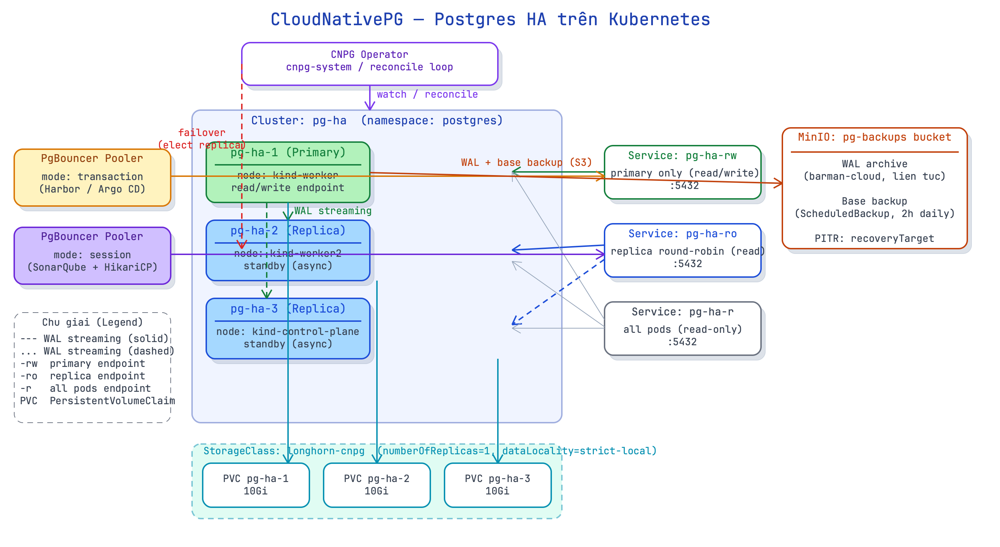

# 22 · Operator/CRD + CloudNativePG — Postgres HA trên K8s

> **Chặng Platform · ◻ chưa mở** — [◈ Bảng tiến độ](../../wiki/notebook/k8s/sessions/learning-plan.md) · trước: MinIO — S3 object storage · kế tiếp: Argo CD / GitOps · [course-catalog](../../wiki/notebook/k8s/course-catalog.md)

**Mục tiêu:** hiểu Operator pattern và CRD là gì; cài CloudNativePG (CNPG) qua Helm; tạo cụm Postgres HA 3 node (1 primary + 2 replica) với StorageClass Longhorn; dùng PgBouncer Pooler giảm connection; tạo nhiều database qua `Database` CRD; backup WAL + base về MinIO.
**Nền:** đã cài Longhorn (lab 20) với StorageClass `longhorn-cnpg`; đã cài MinIO (lab 21) với bucket `pg-backups`; hiểu StatefulSet và PVC.

> ⚠ **Lưu ý:** chạy trên **kind-lab 3-node** (nhẹ, hợp Mac Mini M4 24 GB — không cần multipass như lab 15-18). **Output là MẪU chuẩn theo hành vi thật — CHƯA chạy trên máy bạn; verify khi cài thật.**

## ⚙️ Tiền đề

Kiểm tra trước khi bắt đầu:

```bash
# kind-lab 3-node đang chạy
kubectl get nodes
# NAME                STATUS   ROLES           AGE
# kind-control-plane  Ready    control-plane   5d
# kind-worker         Ready    <none>          5d
# kind-worker2        Ready    <none>          5d

# StorageClass longhorn-cnpg có mặt (lab 20)
kubectl get storageclass longhorn-cnpg
# NAME            PROVISIONER             RECLAIMPOLICY   VOLUMEBINDINGMODE   ALLOWVOLUMEEXPANSION   AGE
# longhorn-cnpg   driver.longhorn.io      Delete          Immediate           true                   3d

# MinIO đang chạy, bucket pg-backups tồn tại (lab 21)
kubectl -n minio get pod -l app=minio
# NAME      READY   STATUS    RESTARTS   AGE
# minio-0   1/1     Running   0          2d
```

**✅ Đủ khi:** 3 node Ready, StorageClass `longhorn-cnpg` có, MinIO pod Running.

---

## 1. Operator pattern + CRD

**Chốt:** CRD (CustomResourceDefinition) **mở rộng API K8s bằng resource kiểu mới** — sau khi cài CNPG, `kubectl get cluster` hoạt động như `kubectl get pod`. Operator = controller chứa **domain-specific logic** (biết cách làm failover Postgres, backup WAL) kết hợp reconcile loop liên tục — "vận hành đóng gói thành code".

- **CRD** = schema đăng ký với API server; sau đó `kubectl` hiểu resource mới (`Cluster`, `Pooler`, `Database`, `Backup`…).
- **Operator** = Deployment chạy trong cluster, watch các CRD object, ra quyết định như DBA giỏi: tạo primary, replica, failover, checkpoint.
- **Reconcile loop:** `current state → desired state` — không ngừng; nếu primary chết, Operator elect replica lên primary trong giây.
- Operator pattern phổ biến nhất cho stateful app phức tạp: database (CNPG, Strimzi Kafka, Redis Operator), cert-manager, Istio, Prometheus Operator.

**Vì sao:** Postgres HA bằng tay cần quản lý: primary election, WAL shipping, promote replica, update `pg_hba.conf`, rotating password, `pg_rewind` sau split-brain. Operator bọc hết logic đó vào code Go, test tự động, upgrade cùng với K8s — thay vì runbook dài 50 trang.

**Cơ chế:**

1. `helm install` CNPG → Deployment `cnpg-controller-manager` + CRD đăng ký vào API server.
2. Bạn `kubectl apply -f cluster.yaml` (kind: `Cluster`) → API server lưu vào etcd.
3. CNPG controller watch: tạo StatefulSet + PVC, chạy `initdb`, setup WAL streaming giữa primary và replica.
4. Khi primary node chết: controller detect (endpoint health check), chọn replica có WAL tiên tiến nhất, `pg_ctl promote`, cập nhật Service `-rw` trỏ sang primary mới — trong vòng ~30 giây.

> 💡 **Ẩn dụ:** CRD = thêm từ mới vào từ điển Kubernetes. Operator = chuyên gia DBA sống trong cluster — biết từ điển đó và hành động theo đúng quy trình, 24/7, không nghỉ, không nhầm lẫn như người.

| Thành phần | Vai trò | Giống gì trong K8s thuần |
|---|---|---|
| CRD `Cluster` | Khai báo cụm Postgres muốn | Như `Deployment` spec |
| CRD `Pooler` | Khai báo PgBouncer trước cluster | Như Service + config |
| CRD `Database` | Tạo DB thứ 2, 3… với owner riêng | Như ConfigMap cho DB |
| CRD `Backup` | Kích hoạt base backup thủ công | Như Job một lần |
| Operator pod | Reconcile controller | Như kube-controller-manager nhưng cho Postgres |

**Dùng / không dùng:**
- Dùng Operator khi workload stateful phức tạp, có lifecycle cụ thể (failover, backup, upgrade).
- Không cần Operator cho app stateless đơn giản — overkill.
- **Phản đề:** Operator thêm CRD phức tạp vào cluster; nếu team không hiểu lifecycle CRD (version upgrade, migration), Operator bị update version sẽ break schema cũ. Cần đọc changelog trước khi upgrade Operator.

**Làm:**

```bash
# cài CNPG Operator qua Helm
helm repo add cnpg https://cloudnative-pg.github.io/charts
helm repo update

helm install cnpg cnpg/cloudnative-pg \
  --namespace cnpg-system \
  --create-namespace \
  --version 0.22.0

# đợi controller sẵn sàng
kubectl -n cnpg-system rollout status deployment/cnpg-controller-manager

# xem CRD được đăng ký
kubectl get crd | grep postgresql
```

**Kết quả:**

```text
$ helm install cnpg cnpg/cloudnative-pg \
    --namespace cnpg-system --create-namespace --version 0.22.0
NAME: cnpg
LAST DEPLOYED: Mon Aug 11 09:00:00 2026
NAMESPACE: cnpg-system
STATUS: deployed

$ kubectl -n cnpg-system rollout status deployment/cnpg-controller-manager
deployment "cnpg-controller-manager" successfully rolled out

$ kubectl get crd | grep postgresql
backups.postgresql.cnpg.io                    2026-08-11T02:00:01Z
clusters.postgresql.cnpg.io                   2026-08-11T02:00:01Z
databases.postgresql.cnpg.io                  2026-08-11T02:00:01Z
imagecatalogues.postgresql.cnpg.io            2026-08-11T02:00:01Z
poolers.postgresql.cnpg.io                    2026-08-11T02:00:01Z
scheduledbackups.postgresql.cnpg.io           2026-08-11T02:00:01Z
```

→ **Verify:** 6 CRD `*.postgresql.cnpg.io` đăng ký thành công; `kubectl cnpg` plugin hoạt động (cài qua `kubectl krew install cnpg`).



---

## 2. CNPG Cluster CRD — Postgres HA

**Chốt:** `kind: Cluster` với `instances: 3` tạo **1 primary + 2 replica** dùng streaming replication. CNPG tự expose 3 Service: `-rw` (primary, đọc-ghi), `-ro` (replica, read-only load-balance), `-r` (tất cả, read-only). Khi primary chết, Operator tự **failover** — elect replica lên primary, cập nhật Service `-rw` — mà không cần can thiệp thủ công.

- `instances: 3` → 3 pod: `<cluster>-1` (primary), `<cluster>-2`, `<cluster>-3` (replica).
- **Streaming replication**: replica nhận WAL liên tục từ primary qua `pg_basebackup` + `pg_receivexlog` — lag thấp (~ms).
- Service `-rw` → primary (write endpoint); `-ro` → replica round-robin (read scale-out); `-r` → tất cả node.
- **Automated failover:** Operator watch pod health; primary mất → elect replica, promote, redirect `-rw` trong ~30 giây.
- `superuserSecret` và `applicationSecret` tự sinh hoặc trỏ tới Secret có sẵn.

**Vì sao:** Postgres standalone (1 pod) dù có PVC vẫn có single point of failure — node die, PVC không accessible là downtime hoàn toàn. HA 3-node đảm bảo service tiếp tục kể cả khi 1 node crash; replica `-ro` giảm tải đọc cho primary.

**Cơ chế:**

1. CNPG controller tạo StatefulSet 3 pod, mỗi pod có PVC riêng (→ 3 PVC độc lập).
2. Pod `<cluster>-1` chạy `initdb`, trở thành primary; pod `-2`, `-3` `pg_basebackup` từ primary rồi stream WAL.
3. Endpoint controller cập nhật Service `-rw` trỏ đúng pod primary (dựa vào label `cnpg.io/instanceRole: primary`).
4. Nếu primary pod terminate: controller elect replica có LSN cao nhất, chạy `pg_ctl promote` trên pod đó, đổi label → Service `-rw` tự cập nhật endpoint.

> 💡 **Ẩn dụ:** 3 pod Postgres như tổ 3 người — 1 thủ lĩnh (primary) viết sổ chính, 2 phụ tá (replica) chép theo liên tục. Thủ lĩnh ngã → phụ tá có sổ cập nhật nhất lên thay, giải quyết đơn từ (Service -rw) không gián đoạn.

| Service | Trỏ tới | Dùng cho |
|---|---|---|
| `<cluster>-rw` | primary pod duy nhất | Write, DDL, migration |
| `<cluster>-ro` | replica pods (round-robin) | Đọc scale-out (analytics, report) |
| `<cluster>-r` | tất cả pods | Đọc tùy ý (không phân biệt lag) |

**Dùng / không dùng:**
- App viết: luôn kết nối `-rw`; đừng nhầm kết nối `-ro` (replica-only sẽ lỗi write).
- Đọc nặng (report, analytics): kết nối `-ro` để tránh tải primary.
- **Phản đề:** failover ~30 giây vẫn gây brief connection reset — app cần retry logic (HikariCP `connectionTimeout`, `keepaliveTime`). CNPG không ẩn hoàn toàn failover khỏi app.

**Làm:**

```bash
# Tạo namespace và secret credential (demo — đổi password thật khi dùng thật)
kubectl create namespace postgres

kubectl create secret generic cnpg-superuser \
  --from-literal=username=postgres \
  --from-literal=password=SuperSecretPass123 \
  --namespace postgres

kubectl create secret generic cnpg-app \
  --from-literal=username=appuser \
  --from-literal=password=AppSecretPass456 \
  --namespace postgres
```

```yaml
# cluster.yaml
apiVersion: postgresql.cnpg.io/v1
kind: Cluster
metadata:
  name: pg-ha
  namespace: postgres
spec:
  instances: 3
  imageName: ghcr.io/cloudnative-pg/postgresql:16.3

  superuserSecret:
    name: cnpg-superuser

  bootstrap:
    initdb:
      database: appdb
      owner: appuser
      secret:
        name: cnpg-app

  storage:
    size: 10Gi
    storageClass: longhorn-cnpg

  resources:
    requests:
      memory: "256Mi"
      cpu: "250m"
    limits:
      memory: "512Mi"
      cpu: "500m"
```

```bash
kubectl apply -f cluster.yaml

# theo dõi quá trình khởi tạo (~3-5 phút)
kubectl -n postgres get cluster -w
```

**Kết quả:**

```text
$ kubectl -n postgres get cluster -w
NAME    AGE   INSTANCES   READY   STATUS                    PRIMARY
pg-ha   10s   3           0       Setting up primary        pg-ha-1
pg-ha   45s   3           1       Creating replica          pg-ha-1
pg-ha   90s   3           2       Creating replica          pg-ha-1
pg-ha   2m    3           3       Cluster in healthy state  pg-ha-1

$ kubectl -n postgres get pods -o wide
NAME      READY   STATUS    RESTARTS   AGE    NODE
pg-ha-1   1/1     Running   0          3m     kind-worker
pg-ha-2   1/1     Running   0          2m     kind-worker2
pg-ha-3   1/1     Running   0          90s    kind-control-plane

$ kubectl -n postgres get svc
NAME         TYPE        CLUSTER-IP      EXTERNAL-IP   PORT(S)    AGE
pg-ha-r      ClusterIP   10.96.100.10    <none>        5432/TCP   3m
pg-ha-ro     ClusterIP   10.96.100.11    <none>        5432/TCP   3m
pg-ha-rw     ClusterIP   10.96.100.12    <none>        5432/TCP   3m

$ kubectl cnpg status pg-ha -n postgres
Cluster Summary
Name:              pg-ha
Namespace:         postgres
PostgreSQL Image:  ghcr.io/cloudnative-pg/postgresql:16.3
Primary instance:  pg-ha-1
Status:            Cluster in healthy state
Instances:         3
Ready instances:   3

Instances status
Name     Database Size  Current WAL  Replication role  Status  Node
----     -------------  -----------  ----------------  ------  ----
pg-ha-1  29 MB          0/5000060    Primary           OK      kind-worker
pg-ha-2  29 MB          0/5000060    Standby (async)   OK      kind-worker2
pg-ha-3  29 MB          0/5000060    Standby (async)   OK      kind-control-plane
```

→ **Verify:** `INSTANCES 3/3 READY`; `pg-ha-1` là Primary; 2 replica Standby; 3 Service `-r`/`-ro`/`-rw` tồn tại. Thử failover:

```bash
# xoá primary — Operator tự elect replica lên
kubectl -n postgres delete pod pg-ha-1

# theo dõi failover
kubectl -n postgres get cluster -w
# NAME    AGE   INSTANCES   READY   STATUS                            PRIMARY
# pg-ha   5m    3           2       Failing over (pg-ha-1 is dead)   pg-ha-1
# pg-ha   5m    3           3       Cluster in healthy state          pg-ha-2  ← primary mới

kubectl cnpg status pg-ha -n postgres
# Primary instance: pg-ha-2   ← đã đổi
```

→ **Verify:** sau failover ~30 giây, `PRIMARY` đổi thành `pg-ha-2`; Service `-rw` tự trỏ sang pod mới.

---

## 3. Storage — GOLDEN LESSON: replica-1 cho Longhorn-CNPG

**Chốt:** Dùng StorageClass Longhorn với `numberOfReplicas: 1` + `dataLocality: strict-local` cho Postgres CNPG. **CNPG đã tự replicate dữ liệu ở tầng DB (3 instance) — nếu Longhorn cũng replica 3 = 9 bản copy tổng, lãng phí storage và giảm IOPS.**

- **Tầng DB replication** (CNPG): primary → replica WAL streaming — đây là tầng bảo vệ data.
- **Tầng storage replication** (Longhorn `numberOfReplicas`): bao nhiêu bản copy PVC trên các node.
- Tổng bản copy = `DB instances × Longhorn replicas`: 3 × 3 = **9 bản** — hoàn toàn không cần thiết.
- `dataLocality: strict-local`: Longhorn ưu tiên đọc/ghi tại node chứa pod → tránh network hop → giảm latency I/O cho Postgres.
- `numberOfReplicas: 1` đủ an toàn vì CNPG đã có replica ở tầng trên; mất 1 PVC → pod restart, CNPG tự rebuild từ replica khác qua `pg_basebackup`.

**Vì sao:** Postgres IOPS-sensitive — mỗi write phải fsync, mỗi WAL record phải flush. Network hop thêm 1-2ms mỗi write → latency tích lũy, throughput giảm rõ ở tải cao. `strict-local` + replica-1 giữ I/O tại local disk của node.

**Cơ chế:**

Không có `strict-local`:
```
pg-ha-1 pod (kind-worker)
  └─ PVC → Longhorn replica-3:
       ├─ node kind-worker (local) ← write ack chờ 3 node
       ├─ node kind-worker2 (network hop)
       └─ node kind-control-plane (network hop)
```

Có `dataLocality: strict-local` + replica-1:
```
pg-ha-1 pod (kind-worker)
  └─ PVC → Longhorn replica-1:
       └─ node kind-worker (local) ← write ack ngay, không network
```

> 💡 **Ẩn dụ:** Longhorn replica-3 trên cluster CNPG như dùng RAID-1 trên mỗi ổ cứng của một mảng RAID-1 khác — bảo vệ chồng bảo vệ, không thêm an toàn, chỉ thêm phí và chậm.

| Scenario | DB instances | Longhorn replicas | Tổng bản copy | Ghi chú |
|---|---|---|---|---|
| CNPG standalone (không HA) | 1 | 3 | 3 | Longhorn giữ HA storage |
| CNPG HA 3-node + Longhorn-1 | 3 | 1 | 3 | Cân bằng, tiết kiệm I/O |
| CNPG HA 3-node + Longhorn-3 | 3 | 3 | **9** | Lãng phí, chậm |

**Dùng / không dùng:**
- CNPG HA ≥2 instance → dùng Longhorn `numberOfReplicas: 1` + `dataLocality: strict-local`.
- Postgres standalone (1 instance, không HA) → Longhorn `numberOfReplicas: 3` để storage tự HA.
- **Phản đề:** `strict-local` yêu cầu Longhorn manager trên node có đủ disk — nếu node nhỏ, thêm disk hoặc điều chỉnh capacity. Không phải default của Longhorn.

**Làm:**

```bash
# Xem StorageClass longhorn-cnpg (đã tạo ở lab 20)
kubectl get storageclass longhorn-cnpg -o yaml
```

```yaml
# longhorn-cnpg StorageClass (đã có từ lab 20 — hiển thị để đối chiếu)
apiVersion: storage.k8s.io/v1
kind: StorageClass
metadata:
  name: longhorn-cnpg
provisioner: driver.longhorn.io
parameters:
  numberOfReplicas: "1"
  dataLocality: "strict-local"
  staleReplicaTimeout: "30"
reclaimPolicy: Delete
volumeBindingMode: Immediate
allowVolumeExpansion: true
```

```bash
# Xác nhận PVC của cluster pg-ha dùng đúng StorageClass
kubectl -n postgres get pvc
```

**Kết quả:**

```text
$ kubectl -n postgres get pvc
NAME             STATUS   VOLUME                                     CAPACITY   ACCESS MODES   STORAGECLASS    AGE
pg-ha-1          Bound    pvc-a1b2c3d4-0001-0002-0003-000000000001   10Gi       RWO            longhorn-cnpg   5m
pg-ha-2          Bound    pvc-a1b2c3d4-0001-0002-0003-000000000002   10Gi       RWO            longhorn-cnpg   4m
pg-ha-3          Bound    pvc-a1b2c3d4-0001-0002-0003-000000000003   10Gi       RWO            longhorn-cnpg   3m

$ kubectl get storageclass longhorn-cnpg -o jsonpath='{.parameters}'
{"dataLocality":"strict-local","numberOfReplicas":"1","staleReplicaTimeout":"30"}
```

→ **Verify:** 3 PVC đều `STORAGECLASS=longhorn-cnpg`; `numberOfReplicas=1`; `dataLocality=strict-local`. Tổng bản copy data = 3 (DB layer) × 1 (storage layer) = 3.

---

## 4. PgBouncer Pooler — GOLDEN LESSON: transaction vs session mode

**Chốt:** CNPG `Pooler` CRD triển khai PgBouncer trước cluster. **Transaction mode** tiết kiệm connection nhất nhưng **phá prepared statements** — app dùng prepared statements + client-side pool (SonarQube + HikariCP) sẽ lỗi `prepared statement "S_1" does not exist`. App đó cần **session mode hoặc kết nối thẳng Service `-rw`**. App không dùng prepared statements (Harbor) → transaction mode OK.

- **Transaction mode**: PgBouncer giữ server connection chỉ trong thời gian 1 transaction; sau commit/rollback trả về pool → **N app client dùng M server connection (M << N)**, tiết kiệm nhất.
- **Session mode**: 1 client = 1 server connection trong suốt session → ít tiết kiệm hơn nhưng an toàn với mọi Postgres feature (prepared statements, `SET`, advisory lock, `LISTEN/NOTIFY`).
- **Lỗi `prepared statement does not exist`**: app tạo prepared statement trên 1 server connection, nhưng transaction mode đổi server connection giữa transaction → statement không tồn tại trên connection mới.
- HikariCP (connection pool Java): giữ prepared statement trong pool → kết hợp với PgBouncer transaction mode = double pool, conflict nhau.

**Vì sao:** PgBouncer transaction mode cho phép hàng ngàn app connection dùng chung vài chục Postgres connection — Postgres mỗi connection tốn ~5-10 MB RAM. Không có PgBouncer, 500 app connection = 500 Postgres backend process = ~2.5 GB RAM chỉ cho idle connection.

**Cơ chế:**

Transaction mode conflict:
```
HikariCP pool (app)          PgBouncer (transaction)      Postgres backend
  conn-A: PREPARE S_1    →   server-conn-1: PREPARE S_1
  conn-A: EXECUTE S_1    →   server-conn-2: EXECUTE S_1 ← ERROR: S_1 không tồn tại
                             (PgBouncer đổi server connection giữa 2 lệnh)
```

Session mode safe:
```
HikariCP pool (app)          PgBouncer (session)          Postgres backend
  conn-A: PREPARE S_1    →   server-conn-1: PREPARE S_1
  conn-A: EXECUTE S_1    →   server-conn-1: EXECUTE S_1 ← OK (cùng connection)
```

> 💡 **Ẩn dụ:** Transaction mode PgBouncer như tổng đài điện thoại tự động đổi máy trả lời mỗi câu nói — bạn giới thiệu tên ở câu đầu, câu sau máy khác không nhớ. Session mode = giữ cùng 1 người nghe suốt cuộc gọi.

| App | Pool mode đúng | Lý do |
|---|---|---|
| SonarQube | **session mode** hoặc kết nối thẳng `-rw` | Dùng prepared statements + HikariCP |
| Harbor | transaction mode OK | Không dùng prepared statements phức tạp |
| Argo CD | transaction mode OK | Kết nối đơn giản |
| PgAdmin | session mode | Interactive session, `SET` command |

**Dùng / không dùng:**
- Transaction mode: app thuần SQL đơn giản, không prepared statements, không `SET session`, không `LISTEN/NOTIFY`.
- Session mode: app Java/Python dùng connection pool + prepared statements; app cần session state.
- **Phản đề:** Session mode với nhiều app connection vẫn bị Postgres giới hạn `max_connections` (default 100) — nếu cần >100 concurrent DB session, transaction mode + sửa app để không dùng prepared statements là con đường đúng, hoặc tăng `max_connections` + RAM Postgres.

**Làm:**

```yaml
# pooler-transaction.yaml — Harbor/Argo CD (transaction mode)
apiVersion: postgresql.cnpg.io/v1
kind: Pooler
metadata:
  name: pg-ha-pooler-rw
  namespace: postgres
spec:
  cluster:
    name: pg-ha
  instances: 2
  type: rw
  pgbouncer:
    poolMode: transaction
    parameters:
      max_client_conn: "1000"
      default_pool_size: "20"
```

```yaml
# pooler-session.yaml — SonarQube (session mode)
apiVersion: postgresql.cnpg.io/v1
kind: Pooler
metadata:
  name: pg-ha-pooler-session
  namespace: postgres
spec:
  cluster:
    name: pg-ha
  instances: 2
  type: rw
  pgbouncer:
    poolMode: session
    parameters:
      max_client_conn: "200"
      default_pool_size: "50"
```

```bash
kubectl apply -f pooler-transaction.yaml
kubectl apply -f pooler-session.yaml

kubectl -n postgres get pooler
```

**Kết quả:**

```text
$ kubectl -n postgres get pooler
NAME                    AGE   INSTANCES   TYPE   INSTANCES
pg-ha-pooler-rw         30s   2           rw     2
pg-ha-pooler-session    25s   2           rw     2

$ kubectl -n postgres get pod | grep pooler
pg-ha-pooler-rw-6d4f9b-x2pk9      1/1   Running   0   45s
pg-ha-pooler-rw-6d4f9b-z8mn1      1/1   Running   0   45s
pg-ha-pooler-session-7c5f8a-j3kq2 1/1   Running   0   40s
pg-ha-pooler-session-7c5f8a-m9vt4 1/1   Running   0   40s

$ kubectl -n postgres get svc | grep pooler
pg-ha-pooler-rw       ClusterIP   10.96.200.10   <none>   5432/TCP   45s
pg-ha-pooler-session  ClusterIP   10.96.200.11   <none>   5432/TCP   40s
```

→ **Verify:** 2 Pooler, mỗi Pooler 2 pod PgBouncer; Service riêng cho mỗi Pooler. SonarQube kết nối `pg-ha-pooler-session:5432`; Harbor kết nối `pg-ha-pooler-rw:5432`.

---

## 5. Multi-database + backup S3

**Chốt:** `bootstrap.initdb` tạo **1 database** đầu tiên. Database thứ 2, 3 trở đi dùng `kind: Database` CRD (CNPG ≥ 1.24) với owner riêng — không cần `kubectl exec` vào pod chạy `psql`. Backup: CNPG dùng **Barman Cloud plugin** stream WAL liên tục + base backup định kỳ về MinIO bucket `pg-backups`, hỗ trợ **point-in-time recovery (PITR)**.

- `Database` CRD: khai báo declarative, Operator tạo DB + role owner trong Postgres; owner mỗi app độc lập (principle of least privilege).
- **WAL archiving**: mỗi WAL segment (~16MB) tự động upload MinIO → recovery về bất kỳ thời điểm nào.
- **Base backup**: snapshot toàn bộ `PGDATA`; kết hợp WAL = khôi phục chính xác.
- **ScheduledBackup** CRD: cron job base backup; WAL chạy liên tục riêng.
- PITR: `recovery.recoveryTarget.targetTime: "2026-08-11T15:30:00Z"` → Postgres apply WAL tới đúng điểm.

**Vì sao:** nhiều app (SonarQube, Harbor) cùng cluster Postgres — mỗi app cần DB riêng, owner riêng để cô lập. `Database` CRD thay thế hoàn toàn việc `exec` thủ công — declarative, idempotent, track được bằng Git. Backup WAL+base về S3 = tiêu chuẩn production: RPO phụ thuộc tần suất WAL flush (thường < 5 phút), RTO phụ thuộc network và kích thước cluster.

**Cơ chế:**

1. CNPG Operator watch `Database` object → gọi `CREATE DATABASE` + `CREATE ROLE` trên primary.
2. WAL archiving: `archive_command` trong Postgres gọi `barman-cloud-wal-archive` → upload segment lên MinIO.
3. Base backup: ScheduledBackup trigger `pg_basebackup` → stream đến MinIO bucket theo path `pg-backups/<cluster>/base/<timestamp>/`.
4. Recovery: tạo Cluster mới với `recovery.source` trỏ backup → CNPG restore base backup + apply WAL tới `targetTime`.

> 💡 **Ẩn dụ:** WAL archiving như ghi nhật ký từng hành động (mỗi dòng là 1 lệnh SQL); base backup là chụp ảnh toàn bộ sổ sách định kỳ. Phục hồi = lấy ảnh gần nhất rồi chạy lại nhật ký từ đó tới đúng phút muốn quay về.

| Thành phần | Tần suất | Mục đích |
|---|---|---|
| WAL archiving | Liên tục (mỗi segment ~16MB) | RPO thấp; nền tảng PITR |
| Base backup | Cron (vd mỗi ngày 2h sáng) | Base để restore nhanh; giảm WAL replay |
| ScheduledBackup | Khai báo bằng CRD | Quản lý lifecycle backup |

**Dùng / không dùng:**
- Dùng `Database` CRD cho mọi DB thứ 2 trở đi — không `exec psql` thủ công.
- Dùng ScheduledBackup + WAL archiving cho production; lab có thể bỏ qua WAL nếu MinIO chưa có.
- **Phản đề:** PITR cần WAL liên tục từ last base backup đến target time; nếu WAL gap (MinIO mất, pod restart mất segment) thì chỉ restore được về thời điểm base backup, không tới `targetTime`. Cần monitor WAL archiving lag trong production.

**Làm:**

```bash
# Tạo Secret MinIO credential cho backup
kubectl create secret generic minio-backup-creds \
  --from-literal=ACCESS_KEY_ID=minioadmin \
  --from-literal=ACCESS_SECRET_KEY=minioadmin123 \
  --namespace postgres
```

```yaml
# cluster-with-backup.yaml — thêm backup vào Cluster
apiVersion: postgresql.cnpg.io/v1
kind: Cluster
metadata:
  name: pg-ha
  namespace: postgres
spec:
  instances: 3
  imageName: ghcr.io/cloudnative-pg/postgresql:16.3

  superuserSecret:
    name: cnpg-superuser

  bootstrap:
    initdb:
      database: appdb
      owner: appuser
      secret:
        name: cnpg-app

  storage:
    size: 10Gi
    storageClass: longhorn-cnpg

  backup:
    barmanObjectStore:
      destinationPath: s3://pg-backups/pg-ha
      endpointURL: http://minio.minio.svc.cluster.local:9000
      s3Credentials:
        accessKeyId:
          name: minio-backup-creds
          key: ACCESS_KEY_ID
        secretAccessKey:
          name: minio-backup-creds
          key: ACCESS_SECRET_KEY
      wal:
        compression: gzip
      data:
        compression: gzip
    retentionPolicy: "7d"

  resources:
    requests:
      memory: "256Mi"
      cpu: "250m"
    limits:
      memory: "512Mi"
      cpu: "500m"
```

```yaml
# database-sonarqube.yaml — Database CRD cho SonarQube
apiVersion: postgresql.cnpg.io/v1
kind: Database
metadata:
  name: sonarqube-db
  namespace: postgres
spec:
  cluster:
    name: pg-ha
  name: sonarqube
  owner: sonarqube
  ensure: present
```

```yaml
# database-harbor.yaml — Database CRD cho Harbor
apiVersion: postgresql.cnpg.io/v1
kind: Database
metadata:
  name: harbor-db
  namespace: postgres
spec:
  cluster:
    name: pg-ha
  name: harbor
  owner: harbor
  ensure: present
```

```yaml
# scheduled-backup.yaml
apiVersion: postgresql.cnpg.io/v1
kind: ScheduledBackup
metadata:
  name: pg-ha-daily
  namespace: postgres
spec:
  schedule: "0 2 * * *"      # 2h sáng hàng ngày
  backupOwnerReference: self
  cluster:
    name: pg-ha
  method: barmanObjectStore
```

```bash
kubectl apply -f cluster-with-backup.yaml
kubectl apply -f database-sonarqube.yaml
kubectl apply -f database-harbor.yaml
kubectl apply -f scheduled-backup.yaml

# đợi Database CRD ready
kubectl -n postgres get database
```

**Kết quả:**

```text
$ kubectl -n postgres get database
NAME            AGE   CLUSTER   PG NAME     READY   MESSAGE
harbor-db       45s   pg-ha     harbor      True    Database "harbor" is up
sonarqube-db    50s   pg-ha     sonarqube   True    Database "sonarqube" is up

$ kubectl -n postgres get scheduledbackup
NAME           AGE   CLUSTER   LAST BACKUP
pg-ha-daily    30s   pg-ha     <none>        ← chưa có backup (chưa tới 2h sáng)

# Trigger backup thủ công để test
kubectl cnpg backup pg-ha -n postgres

# Đợi ~1 phút
kubectl -n postgres get backup
NAME                    AGE   CLUSTER   METHOD              PHASE       ERROR
pg-ha-20260811-090001   90s   pg-ha     barmanObjectStore   completed

# Xem WAL archiving status
kubectl cnpg status pg-ha -n postgres | grep -A5 "Continuous Backup"
# Continuous Backup status
#   First Point of Recoverability:  2026-08-11T09:00:01Z
#   Working WAL archiving:          OK
#   WALs waiting to be archived:    0
#   Last Archived WAL:              000000010000000000000005
#   Last Archived WAL Time:         2026-08-11T09:01:30Z

# Verify database tồn tại trong Postgres
kubectl -n postgres exec -it pg-ha-1 -- psql -U postgres -c '\l'
```

**Kết quả psql:**

```text
                                  List of databases
   Name    |   Owner    | Encoding |   Collate   |    Ctype    
-----------+------------+----------+-------------+-------------
 appdb     | appuser    | UTF8     | en_US.UTF-8 | en_US.UTF-8
 harbor    | harbor     | UTF8     | en_US.UTF-8 | en_US.UTF-8
 postgres  | postgres   | UTF8     | en_US.UTF-8 | en_US.UTF-8
 sonarqube | sonarqube  | UTF8     | en_US.UTF-8 | en_US.UTF-8
(4 rows)
```

→ **Verify:** `Database` CRD status `True`; backup `completed`; WAL archiving `OK`; `\l` trong psql thấy `sonarqube` + `harbor` với owner riêng biệt.

---

## 🧹 Dọn dẹp

```bash
# Xoá theo thứ tự: Backup → ScheduledBackup → Pooler → Database → Cluster → Secret
kubectl -n postgres delete scheduledbackup pg-ha-daily
kubectl -n postgres delete pooler pg-ha-pooler-rw pg-ha-pooler-session
kubectl -n postgres delete database sonarqube-db harbor-db
kubectl -n postgres delete cluster pg-ha

# Đợi PVC tự xoá (reclaimPolicy: Delete)
kubectl -n postgres get pvc -w

# Xoá namespace
kubectl delete namespace postgres

# Gỡ CNPG operator (nếu không dùng lab 23+)
helm uninstall cnpg -n cnpg-system
kubectl delete namespace cnpg-system
```

---

## ✅ Đủ khi

① Giải thích được CRD là gì và Operator pattern khác controller thuần K8s chỗ nào · ② Biết 3 Service CNPG (`-rw`/`-ro`/`-r`) dùng cho trường hợp nào · ③ Giải thích được vì sao Longhorn `numberOfReplicas: 1` với CNPG HA là đúng, không phải 3 · ④ Phân biệt transaction vs session mode PgBouncer và biết app nào cần mode nào · ⑤ Biết dùng `Database` CRD thay vì `exec psql` thủ công + WAL archiving là nền tảng PITR.

---

## 🧠 Recall

1. CRD là gì? Sau khi cài CNPG, `kubectl get cluster` hoạt động nhờ cơ chế nào?
2. Operator khác controller thuần K8s (Deployment/ReplicaSet controller) chỗ nào?
3. CNPG `instances: 3` tạo ra mấy pod? Pod nào là primary? Cách K8s biết redirect Service `-rw` tới đúng primary?
4. 3 Service CNPG (`-rw`, `-ro`, `-r`) — app write nên kết nối đâu? App report nặng nên kết nối đâu?
5. Failover CNPG: khi primary pod bị xoá, Operator làm gì và mất bao lâu?
6. Vì sao dùng Longhorn `numberOfReplicas: 1` với CNPG 3-node thay vì replica-3? Tổng bản copy data là mấy?
7. `dataLocality: strict-local` giải quyết vấn đề gì về I/O?
8. PgBouncer transaction mode lỗi gì với app dùng prepared statements? Tại sao?
9. SonarQube + HikariCP nên dùng Pooler mode nào? Harbor thì sao?
10. `Database` CRD (CNPG ≥1.24) làm gì? Tại sao tốt hơn `exec psql` thủ công?

### Đáp án

1. CRD = CustomResourceDefinition — đăng ký schema resource mới (`Cluster`, `Pooler`…) vào API server. `kubectl get cluster` hoạt động vì CRD đã đăng ký, API server biết route request về CNPG controller.
2. Controller thuần K8s (built-in) biết generic logic (replicas, rolling update). Operator chứa **domain-specific logic** (biết cách promote replica Postgres, WAL archiving, `pg_rewind` sau split-brain) — logic đó không thể viết bằng YAML thuần.
3. Tạo 3 pod: `pg-ha-1` (primary ban đầu), `pg-ha-2`, `pg-ha-3` (replica). Operator gán label `cnpg.io/instanceRole: primary` cho pod primary; Service `-rw` selector dùng label đó → tự update endpoint khi failover.
4. Write: kết nối `-rw` (primary). Report/analytics: kết nối `-ro` (replica round-robin, không tải primary).
5. Operator phát hiện primary pod không phản hồi → elect replica có LSN cao nhất → chạy `pg_ctl promote` → cập nhật label → Service `-rw` đổi endpoint. Khoảng ~30 giây.
6. CNPG 3-node đã replicate ở tầng DB; Longhorn replica-3 thêm 3 bản storage cho mỗi instance = 9 bản tổng — lãng phí. `numberOfReplicas: 1` → tổng 3 × 1 = **3 bản** — vừa đủ bảo vệ, ít I/O overhead.
7. `dataLocality: strict-local`: Longhorn giữ PVC data trên cùng node với pod → tránh network hop cho I/O → giảm latency write/read Postgres.
8. App PREPARE statement trên connection A → PgBouncer transaction mode đổi sang server-connection B → EXECUTE trên B → lỗi `prepared statement "S_1" does not exist`. Nguyên nhân: prepared statement bind với 1 server connection, transaction mode phá binding.
9. SonarQube: **session mode** (hoặc kết nối thẳng `-rw` bỏ qua Pooler). Harbor: **transaction mode** OK.
10. `Database` CRD khai báo declarative → Operator tạo `CREATE DATABASE` + `CREATE ROLE` trong Postgres tự động. Tốt hơn `exec psql`: idempotent, track được bằng Git, không cần biết pod name, không risk typo trong psql interactive.

---

## Bắc cầu sang production

Trên cụm thật (production):

- **StorageClass**: dùng `longhorn-cnpg` với `numberOfReplicas: 1` + `dataLocality: strict-local` — nguyên tắc giống hệt lab; thay đổi duy nhất là disk size lớn hơn.
- **Backup**: WAL archiving + ScheduledBackup về S3/MinIO là baseline. Kiểm tra `kubectl cnpg status` hàng ngày xem `Working WAL archiving: OK` — WAL gap là silent failure không hiện alert nếu không monitor.
- **Pooler**: cân nhắc kỹ mode cho từng app. App Java với HikariCP thường cần session mode hoặc bypass pooler. Document rõ app nào kết nối đâu.
- **PITR drill**: định kỳ thử `kubectl apply` Cluster recovery với `targetTime` → verify data tại điểm đó — không thử là không biết backup có thật sự dùng được.
- **Operator upgrade**: đọc changelog CRD schema trước — major version có thể cần migrate CRD. Không upgrade Operator như upgrade Helm chart bình thường.
- **`max_connections`**: CNPG default 100; nếu PgBouncer session mode nhiều app → dễ vượt. Tăng `max_connections` trong `postgresql.parameters` của Cluster + tăng RAM limit tương ứng (~5MB/connection).

---

## 📎 Nguồn

- [CloudNativePG Documentation](https://cloudnative-pg.io/documentation/)
- [CNPG Helm Chart](https://cloudnative-pg.github.io/charts/)
- [CNPG Database CRD (v1.24+)](https://cloudnative-pg.io/documentation/current/database_management/)
- [Barman Cloud backup to S3](https://cloudnative-pg.io/documentation/current/backup_barmanobjectstore/)
- [PgBouncer pool modes](https://www.pgbouncer.org/config.html#pool-mode)
- [Longhorn data locality](https://longhorn.io/docs/latest/references/settings/#default-data-locality)
