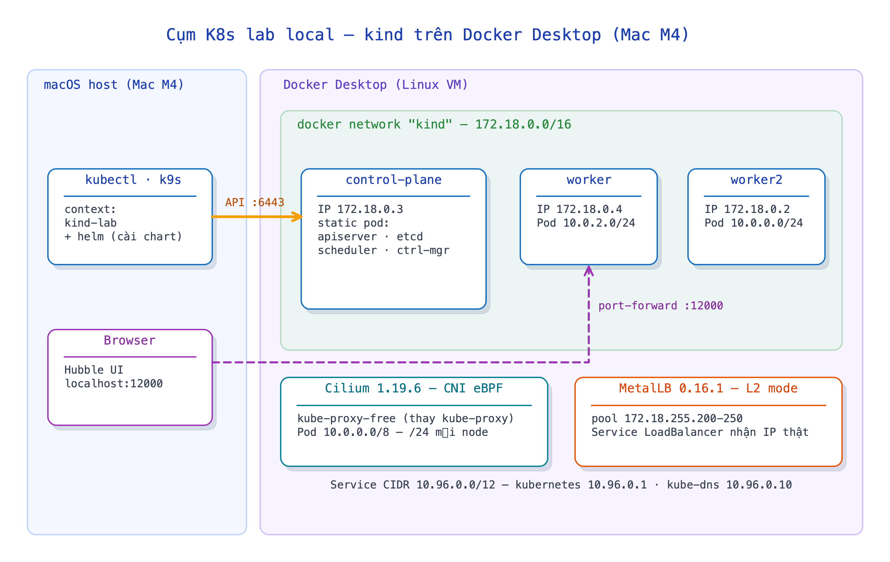

# k8s-labs

Runbook + nhật ký thực hành Kubernetes trên máy local (Mac M4, 10 core, 24 GB RAM).
Cụm lab chính: **kind `lab`** — 3 node, stack Cilium kube-proxy-free + MetalLB + Hubble.

## Lộ trình module

Mỗi thư mục đánh số là một module học tập độc lập (runbook + manifest/app + notes tự kiểm). Đi theo thứ tự số — mạch bài nối tiếp nhau từ Docker nền tảng đến vận hành K8s.

| # | Module | Chủ đề |
|---|---|---|
| 01 | [01-docker-images](01-docker-images/) | Docker: build/run + multi-stage & registry |
| 02 | [02-docker-swarm](02-docker-swarm/) | Swarm — trực giác desired-state/self-healing |
| 03 | [03-k8s-pod](03-k8s-pod/) | Pod, health probe, lệnh soi/debug |
| 04 | [04-k8s-deployment](04-k8s-deployment/) | ReplicaSet & Deployment |
| 05 | [05-k8s-service](05-k8s-service/) | Service |
| 06 | [06-k8s-configmap-secret](06-k8s-configmap-secret/) | ConfigMap/Secret & Probes |
| 07 | [07-k8s-storage](07-k8s-storage/) | Volume/PV/PVC/StorageClass |
| 08 | [08-k8s-multicontainer-sa](08-k8s-multicontainer-sa/) | Multi-container & ServiceAccount |
| 09 | [09-k8s-deploy-strategies](09-k8s-deploy-strategies/) | Chiến lược deploy |
| 10 | [10-k8s-jobs-troubleshoot](10-k8s-jobs-troubleshoot/) | Jobs/CronJob, HPA & troubleshoot |
| 11 | [11-k8s-compose-to-k8s](11-k8s-compose-to-k8s/) | Compose → Kubernetes |
| 12 | [12-k8s-networking](12-k8s-networking/) | Networking nâng cao — Ingress, NetworkPolicy, CNI, DNS |
| 13 | [13-k8s-scheduling](13-k8s-scheduling/) | Scheduling — nodeSelector, taint/toleration, affinity, static Pod |
| 14 | [14-k8s-rbac-security](14-k8s-rbac-security/) | RBAC & Security — ServiceAccount, Role/ClusterRole, SecurityContext |
| 15 | [15-k8s-kubeadm-cluster](15-k8s-kubeadm-cluster/) | kubeadm — dựng cụm HA (3 master + 3 worker, stacked etcd) |
| 16 | [16-k8s-etcd-backup-restore](16-k8s-etcd-backup-restore/) | etcd backup & restore |
| 17 | [17-k8s-cluster-upgrade](17-k8s-cluster-upgrade/) | Cluster upgrade + node maintenance (drain/PDB) |
| 18 | [18-k8s-troubleshooting](18-k8s-troubleshooting/) | Troubleshooting cụm (node/control-plane/network) |
| 19 | [19-k8s-ingress-stack](19-k8s-ingress-stack/) | Ingress stack — MetalLB + ingress-nginx + cert-manager |
| 20 | [20-k8s-longhorn](20-k8s-longhorn/) | Longhorn — block storage phân tán |
| 21 | [21-k8s-minio](21-k8s-minio/) | MinIO — S3 object storage (erasure coding) |
| 22 | [22-k8s-cloudnativepg](22-k8s-cloudnativepg/) | Operator/CRD + CloudNativePG (Postgres HA) |
| 23 | [23-k8s-argocd-gitops](23-k8s-argocd-gitops/) | Argo CD / GitOps — App-of-Apps |
| 24 | [24-k8s-app-tier](24-k8s-app-tier/) | Deploy app tier — Harbor + SonarQube + Jenkins |
| 25 | [25-k8s-observability-dr](25-k8s-observability-dr/) | Observability + HA hardening + DR |

## Kiến trúc



## Cấu trúc

| Đường dẫn | Là gì |
|---|---|
| [runbook.md](runbook.md) | As-built cụm lab, cách truy cập (kubectl/k9s/Hubble UI), vòng đời dựng/xoá/dựng lại, gotcha |
| [cluster/kind-lab.yaml](cluster/kind-lab.yaml) | Config kind 3-node (CNI mặc định tắt, kube-proxy tắt — nhường Cilium) |
| [scripts/up.sh](scripts/up.sh) | Dựng lại cụm từ đầu một phát (kind + Cilium + Hubble + MetalLB, tự dò subnet) |
| [notes/setup.md](notes/setup.md) | Hướng dẫn setup môi trường lab từ số 0 trên macOS |
| `notes/` | Note theo ngày trong quá trình học, tên `YYMMDD-<chủ-đề>.md` |
| `assets/` | Sơ đồ kiến trúc (`.excalidraw` nguồn + PNG/SVG đã render) |

## Truy cập nhanh

```bash
kubectl config use-context kind-lab   # trỏ vào cụm lab
k9s                                        # TUI xem pod/log/exec
kubectl -n kube-system port-forward svc/hubble-ui 12000:80   # → http://localhost:12000
```